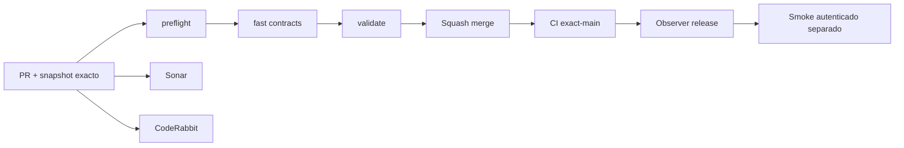

# GrindFlow — Último deploy

> **Snapshot v0.1.37: protección de vistas privadas Symfony S1 en desarrollo, no desplegada.** Base `main` v0.1.36 `429532ca177998c26a2a7de49722ee4639140237`, CI exact-main verde. El selector y el admin Symfony no permiten caché del HTML privado, y React retira el panel si se revoca la sesión o membresía durante un guardado. Laravel continúa como runtime público; **Symfony no está desplegado ni se migraron cuentas**.

## Progress convention
- ✅ ~~Completado~~ = verificado; 🚧 Pendiente = en curso; ⛔ bloqueado = dependencia externa.

## Fuentes de verdad
[AGENTS.md](AGENTS.md) · [Spec](docs/GRINDFLOW-SPEC.md) · [Requisitos](docs/REQUIREMENTS.md) · [Transición](docs/STACK-TRANSITION-SYMFONY.md) · [Roadmap #2](https://github.com/pl0n3r/GrindFlow/issues/2)

## Estado del deploy
| Señal | Estado | Evidencia |
| --- | --- | --- |
| Version objetivo | 🚧 **v0.1.37** | `config/version.php` |
| Base exacta | ✅ ~~main v0.1.36~~ | `429532ca177998c26a2a7de49722ee4639140237` |
| CI del PR | 🚧 Head final pendiente | `GrindFlow CI / validate` |
| Sonar | 🚧 Pendiente | SonarCloud PR |
| CodeRabbit | 🚧 Revisión por comprobar | PR |
| CI del SHA exacto de main | 🚧 Después del merge | CI PR no lo sustituye |
| Deploy Observer | 🚧 Release humano por observar | No prueba Symfony en remoto |
| Production Smoke | ⛔ Credencial E2E productiva pendiente | [Issue #1](https://github.com/pl0n3r/GrindFlow/issues/1) |
| Symfony S1 en Hostinger | ⛔ NO desplegado | Solo entorno aislado CI |
| Migraciones | ✅ ~~Ningún esquema productivo modificado~~ | DB Symfony descartable |

## Huella del cambio
<!-- grindflow:git-delta -->
| Archivos | Inserciones | Eliminaciones | Neto |
| ---: | ---: | ---: | ---: |
| **14** | **+439** | **−64** | **+375** |

## Calidad y entrega
<!-- grindflow:gate-plan -->
| Control | Estado / contrato |
| --- | --- |
| Gates seleccionados | **preflight · fast[contracts] · php-quality · PHPUnit · MariaDB · browser · real-stack · legacy · symfony-preview** |
| Alcance | CI completo por cambios al core; prueba de selección de gates, grupo DB, cache Chromium y reporte diario |
| Revisiones | CI/Sonar/CodeRabbit, exact-main y Hostinger son independientes |

## Flujo de entrega

## Qué se hizo
- Selector y panel privados Symfony envían `Cache-Control: no-store, private` para impedir que el navegador reutilice HTML de otra sesión.
- React retira el panel y los datos de organización cuando un guardado devuelve 401/403/409 por sesión o permisos cambiados.
- Test de integración Symfony verifica cabeceras de selector, panel y contexto JSON; CI valida PHP, TypeScript y navegador.
- No hay cutover ni escritura sobre bases de datos productivas.

## Archivos modificados en este deploy
- `symfony/src/Http/Controller/AdminController.php`
- `symfony/src/Http/Controller/OrganizationController.php`
- `symfony/frontend/admin/AdminApp.tsx`
- `symfony/tests/php/IdentityLoginTest.php`
- `config/version.php`
- `README.md`

## Validación
- CI del PR y Sonar pendientes en este snapshot; comprobar exact-main tras fusionar.
- Symfony S1 sigue aislado de Hostinger y sin cuentas productivas.

## Qué sigue
| Lane | Trabajo |
| --- | --- |
| **NOW** | 🚧 Protección de sesión Symfony S1 v0.1.37, [roadmap #2](https://github.com/pl0n3r/GrindFlow/issues/2) |
| **NEXT** | 🚧 Vault móvil real con contexto tenant-safe |
| **LATER** | 🚧 Vault móvil → reglas → distribución autorizada → piloto |
| **BLOCKED / EXTERNAL** | ⛔ Cutover sin paridad/datos migrados; Smoke sin credencial |

## Panorama general pendiente
| Lane | Frente | Estado |
| --- | --- | --- |
| **DONE** | ✅ ~~Dashboard Laravel v0.1.30~~ | ✅ ~~Esquema Symfony S1 v0.1.31~~ |
| **NOW** | 🚧 Protección de vistas privadas Symfony v0.1.37 | 🚧 CI y revisión |
| **NEXT** | 🚧 Vault móvil | 🚧 S2 |
| **LATER** | 🚧 Automatización de contenido | 🚧 S2–S5 |
| **BLOCKED / EXTERNAL** | ⛔ Sin cutover Symfony | ⛔ Sin credencial Smoke |
