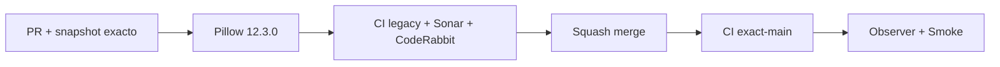

# GrindFlow — Último deploy

> **Candidato v0.1.127: actualización de seguridad de Pillow en workers.** Base exacta `main` v0.1.126 `8c59ea017b5cb8f90985cf9aae8e32d59f93c65c`, con CI #35989657390, Deploy Observer #35989657416 y Production Smoke #35989657379 en `success`; producción quedó verde antes de esta candidata. #139 prioriza Pillow porque procesa archivos en workers y concentra 13 alertas altas.

## Progress convention
- ✅ ~~Completado~~ = verificado; 🚧 Pendiente = en curso; ⛔ bloqueado = dependencia externa.

## Fuentes de verdad
[AGENTS.md](AGENTS.md) · [Spec](docs/GRINDFLOW-SPEC.md) · [Requisitos](docs/REQUIREMENTS.md) · [Roadmap #2](https://github.com/pl0n3r/GrindFlow/issues/2)

## Estado del deploy
| Señal | Estado | Evidencia |
| --- | --- | --- |
| Version objetivo | 🚧 **v0.1.127** | `config/version.php`; candidata |
| Base exacta | ✅ ~~main v0.1.126~~ | `8c59ea017b5cb8f90985cf9aae8e32d59f93c65c` |
| CI/Sonar/CodeRabbit del PR | 🚧 pendiente | exigen HEAD final |
| CI del SHA exacto de main (base) | ✅ ~~success~~ | #35989657390 |
| Deploy Observer base | ✅ ~~success~~ | #35989657416 |
| Production Smoke base | ✅ ~~success~~ | #35989657379 |
| Producción objetivo | 🚧 pendiente | actualizar worker y validar gates/release |

## Huella del cambio
<!-- grindflow:git-delta -->
| Archivos | Inserciones | Eliminaciones | Neto |
| ---: | ---: | ---: | ---: |
| **5** | **+128** | **−46** | **+82** |

## Calidad y entrega
<!-- grindflow:gate-plan -->
| Control | Estado / contrato |
| --- | --- |
| Gates seleccionados | **preflight · fast[operational contracts + automation syntax + README dashboard] · php-quality · PHPUnit · MariaDB · browser · real-stack · legacy · symfony-preview** |
| Gate agregador obligatorio | **validate**: todos los seleccionados; Sonar y CodeRabbit aparte |
| Alcance | #139: Pillow 11.0.0 → 12.3.0 en workers |
| Rol del PR | **Application Security · Python/Workers · Release Engineering** |
| Revisiones | CodeRabbit terminal del HEAD; CI/Sonar obligatorios antes de merge |

## Flujo de entrega

## Qué se hizo
- Actualiza el pin de Pillow de 11.0.0 a 12.3.0 en `workers/requirements.txt`.
- Mantiene sin cambios psycopg y boto3; no toca código de negocio, datos ni secretos.
- Recupera la PR de Dependabot sobre el `main` real y la adapta al contrato actual de releases.
- El gate `legacy` instala `workers/requirements.txt` en un venv descartable y prueba sanitización EXIF, WEBP y watermark con Pillow real.

## Archivos modificados en esta entrega candidata
Inventario del diff exacto:
<!-- grindflow:changed-files -->
- `.github/workflows/grindflow-ci.yml`
- `README.md`
- `config/version.php`
- `workers/requirements.txt`
- `workers/test_image_pipeline.py`

## Validación
- El gate `legacy` instala dependencias Python del worker y ejecuta `workers/test_image_pipeline.py`: EXIF/orientación, conversión WEBP y watermark sin servicios externos.
- Sonar y CodeRabbit deben revisar el HEAD final; la actualización no se considera desplegada por existir en rama.
- Tras merge se exige CI exact-main y las señales operativas normales antes de declarar v0.1.127 validada en producción.

## Qué sigue
[Roadmap canónico #2](https://github.com/pl0n3r/GrindFlow/issues/2)

## Panorama general pendiente
| Lane | Frente | Estado |
| --- | --- | --- |
| **NOW** | 🚧 #139 · Pillow 12.3.0 | 🚧 candidata v0.1.127 |
| **NEXT** | 🚧 #139 · vitest/vite/postcss y alertas npm | 🚧 después de Pillow |
| **BLOCKED / EXTERNAL** | ⛔ ninguno conocido | ⛔ sin bloqueo externo |
| **LATER** | 🚧 roadmap de producto y arquitectura | 🚧 después de seguridad crítica |
