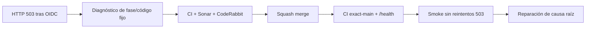

# GrindFlow — Último deploy

> **Candidato v0.1.124: diagnóstico acotado del HTTP 503 del bootstrap sintético.** `main` v0.1.123 SHA `88bc1ba66658ff9208540db4f7c04545bbfbbe3d`: CI exact-main #35974051468 y Observer #35974051489 pasaron; `/health` expuso SHA exacto; Smoke #35974051526 falló **antes del login** al reconciliar identidad con HTTP 503.

## Progress convention
- ✅ ~~Completado~~ = verificado; 🚧 Pendiente = en curso; ⛔ bloqueado = dependencia externa.

## Fuentes de verdad
[AGENTS.md](AGENTS.md) · [Spec](docs/GRINDFLOW-SPEC.md) · [Requisitos](docs/REQUIREMENTS.md) · [Roadmap #2](https://github.com/pl0n3r/GrindFlow/issues/2)

## Estado del deploy
| Señal | Estado | Evidencia |
| --- | --- | --- |
| Version objetivo | 🚧 **v0.1.124** | `config/version.php`; candidata |
| Base exacta | ✅ ~~main v0.1.123~~ | `88bc1ba66658ff9208540db4f7c04545bbfbbe3d` |
| CI/Sonar/CodeRabbit del PR | 🚧 pendiente | exigen HEAD final |
| CI exact-main base | ✅ ~~success~~ | #35974051468 |
| Health productivo base | ✅ ~~SHA exacto~~ | Smoke #35974051526 |
| Deploy Observer base | ✅ ~~success~~ | #35974051489 |
| Production Smoke base | ⛔ #73 · HTTP 503 bootstrap | #35974051526; no hubo login |
| Producción objetivo | 🚧 pendiente | diagnosticar etapa segura y resolver causa raíz

## Huella del cambio
<!-- grindflow:git-delta -->
| Archivos | Inserciones | Eliminaciones | Neto |
| ---: | ---: | ---: | ---: |
| **7** | **+183** | **−51** | **+132** |

## Calidad y entrega
<!-- grindflow:gate-plan -->
| Control | Estado / contrato |
| --- | --- |
| Gates seleccionados | **preflight · fast[operational contracts + automation syntax + README dashboard] · php-quality · PHPUnit · browser · real-stack** |
| Gate agregador obligatorio | **validate**: todos los seleccionados; Sonar y CodeRabbit aparte |
| Alcance | #121/#73: sincronizar el secreto sintético sin acceso SSH y recuperar Smoke |
| Rol del PR | **SRE · Backend Laravel · Application Security** |
| Revisiones | máximo 3 rondas automáticas por PR; sin polling; sucesora de #133 |

## Flujo de entrega

## Qué se hizo
- Smoke #35974051526 confirmó SHA exacto de Hostinger, pero OIDC bootstrap alcanzó la reconciliación y obtuvo HTTP 503; el login no se intentó.
- El controller solo tras OIDC válido devuelve fase fija (`environment`, `config-clear`, `provision-user`) y código operacional de lista cerrada.
- Los errores inesperados se clasifican `unexpected`; nunca se devuelve texto de excepción, contraseña, token ni cuerpo remoto.
- El workflow extrae exclusivamente dos cabeceras autorizadas de un 503, valida sus valores antes de escribir el reporte seguro al Issue #73 y evita repetir la reconciliación determinista.
- Pruebas parametrizadas verifican fallo de filesystem/backup, excepción sensible inesperada y comandos config/provision; contrato de Smoke exige reporte seguro sin secretos.
- No se cambian cuentas de clientes, roles, SQL ni variables reales: telemetría para reparar el prerrequisito correcto en la siguiente iteración.

## Archivos modificados en esta entrega candidata
Inventario del diff exacto:
<!-- grindflow:changed-files -->
- `.github/workflows/production-smoke.yml`
- `README.md`
- `app/Http/Controllers/Operations/ProductionSmokeBootstrapController.php`
- `config/version.php`
- `docs/DEPLOY-HOSTINGER.md`
- `scripts/production-smoke-contract.sh`
- `tests/Feature/ProductionSmokeBootstrapTest.php`

## Validación
- PHPUnit cubre fases y códigos conocidos/desconocidos después de OIDC firmado.
- El contrato shell asegura whitelist y conserva reporte pre-login.
- CI/Sonar/CodeRabbit deben aprobar HEAD final antes de fusionar. Production Smoke verificará el SHA exacto y aislará la causa, sin confundir CI verde con producción verde.

## Qué sigue
[Roadmap canónico #2](https://github.com/pl0n3r/GrindFlow/issues/2)

## Panorama general pendiente
| Lane | Frente | Estado |
| --- | --- | --- |
| **NOW** | 🚧 #121 / #73 · HTTP 503 en reconciliación | 🚧 v0.1.124 diagnóstico |
| **NEXT** | 🚧 aplicar reparación según código y validar login | 🚧 tras nueva evidencia |
| **BLOCKED / EXTERNAL** | ⛔ datos exactos del runtime del 503 | ⛔ etapa desconocida en v0.1.123 |
| **LATER** | 🚧 Roadmap de producto | 🚧 tras producción verde |
