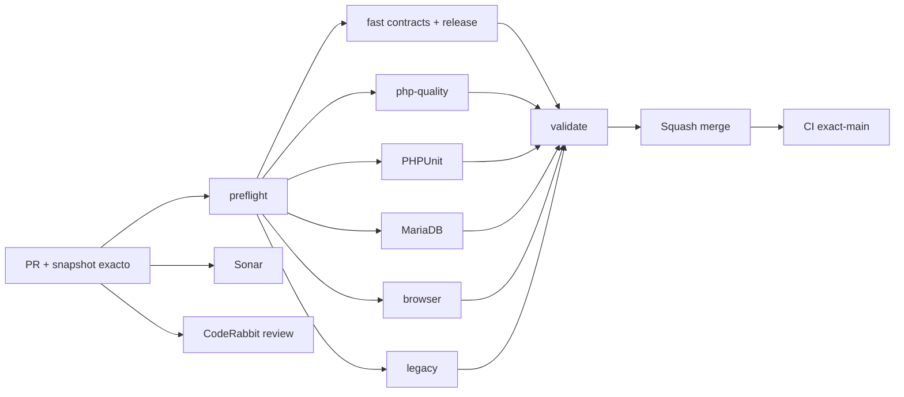

# GrindFlow — Último deploy

  
  
  

> **Snapshot del candidato v0.1.7; solo el deploy actual se verifica con evidencia del entorno.** `main` v0.1.6 (`f6e46c8cf07800df2bdc3ce730572a6f4ae5639b`) paso CI #35452780637. La migracion de audit v0.1.6 fue aplicada en produccion (1→0) #35452844884 y Smoke #35452780703 attempt 2 paso.

## Progress convention
- ✅ ~~Completado~~ = concluido y verificado por las compuertas aplicables.
- 🚧 Pendiente = por hacer o en curso, sin tachado.

## Estado del deploy
| Señal | Estado | Evidencia |
| --- | --- | --- |
| Work line | 🚧 **GF-FR-006B · Traffic daily CSV export** | [Roadmap #88](https://github.com/drpipe1098-commits/GrindFlow/issues/88) |
| Base exacta | ✅ **v0.1.6 · PR #95 fusionado** | `f6e46c8cf07800df2bdc3ce730572a6f4ae5639b` |
| Version | 🚧 **v0.1.7** | exportacion filtrada de metricas diarias |
| CI del PR | 🚧 **pendiente** | validar SHA candidato |
| Sonar | 🚧 **pendiente** | Quality Gate por SHA |
| CodeRabbit | 🚧 **pendiente** | full review head estable |
| CI del SHA exacto de main | ✅ **v0.1.6 validado** | validate #35452780637 |
| Production Smoke | ✅ **schema v0.1.6 sin pendientes** | #35452780703 attempt 2 |
| Migraciones | ✅ **ledger v0.1.6 aplicado** | #35452844884: 1 → 0 |
| Deploy v0.1.7 | 🚧 **no confirmado** | CSV validado solo en codigo hasta su entrega |

## Huella del cambio
<!-- grindflow:git-delta -->
| Archivos | Inserciones | Eliminaciones | Neto |
| ---: | ---: | ---: | ---: |
| **9** | **+0** | **−0** | **+0** |

## Calidad y entrega
<!-- grindflow:gate-plan -->
| Control | Estado / contrato |
| --- | --- |
| Gates seleccionados | **preflight · fast[contracts] · php-quality · PHPUnit · browser** |
| Reporte | GET autenticado tenant-scoped con los mismos filtros del dashboard |
| Escala | CSV por link/dia sin limite artificial de 100; maximo 366 dias |
| Seguridad | no visitor-level datos, no destino original, proteccion formula CSV |
| Schema | GET export 503 si las tablas de trafico faltan; sin migracion nueva |

## Flujo de entrega

## Qué se hizo
- Traffic exporta CSV UTF-8 por enlace/dia con fecha UTC, nombre, enlace rastreable, canal, campana, estado y clicks agregados.
- Filtrado consistente con el dashboard; incluye todos los enlaces coincidentes, no solo los 100 visibles.
- Conteo del panel refleja el total real de enlaces filtrados, distingue preview de 100.
- Exportacion segura para hojas de calculo y descargable sin cache; 366 dias maximos.
- Consultas CSV incluyen organizacion explicita en ambas tablas, sin depender del contexto tenant durante streaming.
- PHPUnit cubre filtros, tenants, privilegios, schema ausente, export completo y valores con formula.

## Archivos modificados en este deploy
- `AGENTS.md` — invariantes CSV, contexto tenant y privacidad.
- `README.md` — snapshot exacto de entrega v0.1.7.
- `app/Http/Controllers/Traffic/TrafficController.php` — consulta, export y conteo.
- `config/version.php` — version 0.1.7.
- `docs/GRINDFLOW-SPEC.md` — contrato de export.
- `docs/REQUIREMENTS.md` — requisito GF-FR-006B.
- `resources/views/traffic/index.blade.php` — boton de CSV, conteo real.
- `routes/web.php` — ruta GET autenticada y migration-safe.
- `tests/Feature/TrafficAttributionTest.php` — cobertura funcional/seguridad.

## Validación
- `main` v0.1.6 validado: CI #35452780637; migration #35452844884; Smoke #35452780703 attempt 2.
- CSV v0.1.7: CI/Sonar/CodeRabbit pendientes para este SHA candidato; no declarar desplegado hasta observarlo.
- Sin nueva migracion SQL ni publicacion en proveedores externos.

## Qué sigue
| Lane | Trabajo |
| --- | --- |
| **NOW** | 🚧 Entregar Traffic CSV v0.1.7; [roadmap #88](https://github.com/drpipe1098-commits/GrindFlow/issues/88). |
| **NEXT** | 🚧 S3/CORS y FFmpeg configurados en Hostinger #40. |
| **LATER** | 🚧 E2E de modulos y paridad del legado. |
| **BLOCKED / EXTERNAL** | 🚧 Identidad exacta del checkout Hostinger sin marcador verificable. |

## Panorama general pendiente
| Lane | Frente | Estado |
| --- | --- | --- |
| **DONE** | ✅ ~~Audit Distribution #95 y migracion autorizada~~ | ✅ ~~CI exact-main y Smoke v0.1.6~~ |
| **NOW** | 🚧 Reporte Traffic CSV | 🚧 v0.1.7 |
| **NEXT** | 🚧 Object storage y FFmpeg de produccion | 🚧 #40 |
| **LATER** | 🚧 Mejoras operativas y paridad legado | 🚧 roadmap #88 |
| **BLOCKED / EXTERNAL** | 🚧 Observabilidad del SHA realmente desplegado | 🚧 Hostinger |
