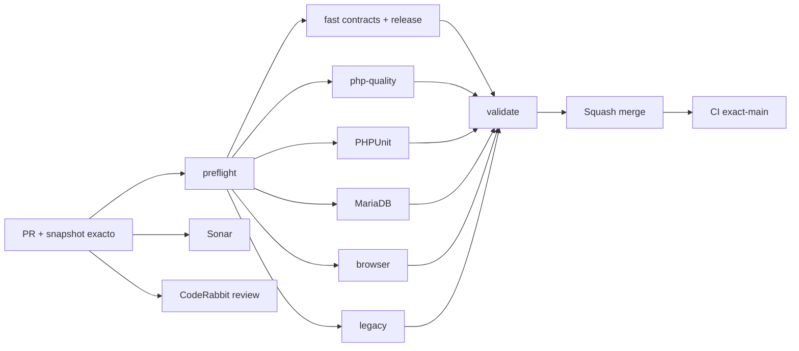

# GrindFlow — Último deploy

  
  
  

> **Snapshot del PR candidato v0.1.10; no demuestra despliegue en Hostinger.** Base `main` v0.1.9 `e897cea488356d6b9543a3bac0b7da4e5e684612`: CI #35455531632 success, authenticated Production Smoke #35455531712 success (Scheduler, Distribution, Traffic, Finance y CSV). SHA del checkout Hostinger aun sin marcador verificable.

## Progress convention
- ✅ ~~Completado~~ = concluido y verificado por las compuertas aplicables.
- 🚧 Pendiente = por hacer o en curso, sin tachado.

## Estado del deploy
| Señal | Estado | Evidencia |
| --- | --- | --- |
| Work line | 🚧 **GF-FR-004C · Edicion de tracked links en Scheduler** | [Roadmap #88](https://github.com/drpipe1098-commits/GrindFlow/issues/88) |
| Base exacta | ✅ **v0.1.9 · PR #99 fusionado** | `e897cea488356d6b9543a3bac0b7da4e5e684612` |
| Version | 🚧 **v0.1.10** | asociacion editada desde Scheduler |
| CI del PR | 🚧 **pendiente** | validar SHA estable |
| Sonar | 🚧 **pendiente** | Quality Gate por SHA |
| CodeRabbit | 🚧 **pendiente** | full review del head final |
| CI del SHA exacto de main | ✅ **v0.1.9 validado** | validate #35455531632 |
| Production Smoke | ✅ **v0.1.9 observado** | #35455531712, checks read-only de modulos |
| Deploy v0.1.10 | 🚧 **no confirmado** | no afirmar deploy por GitHub CI |
| Migraciones | ✅ **sin SQL nuevo** | reutiliza scheduled_publication_links |

## Huella del cambio
<!-- grindflow:git-delta -->
| Archivos | Inserciones | Eliminaciones | Neto |
| ---: | ---: | ---: | ---: |
| **10** | **+567** | **−44** | **+523** |

## Calidad y entrega
<!-- grindflow:gate-plan -->
| Control | Estado / contrato |
| --- | --- |
| Gates seleccionados | **preflight · fast[contracts] · php-quality · PHPUnit · browser** |
| Workflow | Crear schedule → anadir/cambiar/retirar enlace de Traffic antes del delivery |
| Seguridad | rol y tenant HTTP + dominio, lock transaccional de schedule y enlace |
| Concurrencia | no cambios si cancelado, vencido o con delivery existente |
| Historico | conserva URL corta, métricas y schedule; detach borra solo asociacion |
| Schema | GET Scheduler y scheduling normal seguros sin migracion de links |

## Flujo de entrega

## Qué se hizo
- Scheduler permite asignar, reemplazar o desvincular un enlace de Traffic a una programacion existente, aun si fue creada sin link.
- El nuevo formulario aparece solo en programaciones futuras, activas y aun no entregadas; el enlace actualmente deshabilitado puede separarse pero no reasignarse.
- La transaccion revalida rol, organizacion, elegibilidad temporal, delivery y estado del enlace bajo locks; IDs de otras organizaciones no son visibles.
- Repetir una asignacion o detach no duplica filas; metricas acumuladas y URLs de campañas sobreviven.
- PHPUnit cubre lifecycle, schema faltante, rol Model, links disabled/foreign, schedule foreign/cancelled/claimed y valores omitidos.
- Contratos y regla durable en docs y AGENTS.md; sin SQL nuevo ni publicacion a proveedores.

## Archivos modificados en este deploy
- `AGENTS.md` — reglas durables del Scheduler ↔ Traffic.
- `README.md` — snapshot exacto v0.1.10.
- `app/Http/Controllers/Scheduling/SchedulerController.php` — PATCH de enlace.
- `app/Services/Scheduling/ContentScheduler.php` — transaccion de asociacion.
- `config/version.php` — version 0.1.10.
- `docs/GRINDFLOW-SPEC.md` — asociacion editable antes de entrega.
- `docs/REQUIREMENTS.md` — GF-FR-004C.
- `resources/views/scheduling/index.blade.php` — selector por schedule.
- `routes/web.php` — nueva ruta protegida PATCH.
- `tests/Feature/ScheduleTrackedLinkTest.php` — pruebas de comportamiento.

## Validación
- Base v0.1.9: exact-main CI #35455531632 y Production Smoke #35455531712 passed.
- v0.1.10: CI/Sonar/CodeRabbit de la PR pendientes; no se declara deploy ni comportamiento de escritura probado en produccion.
- Production Smoke sigue siendo de solo lectura, no modifica links ni schedules reales.

## Qué sigue
| Lane | Trabajo |
| --- | --- |
| **NOW** | 🚧 Integrar Scheduler ↔ Traffic editable v0.1.10. [Roadmap #88](https://github.com/drpipe1098-commits/GrindFlow/issues/88). |
| **NEXT** | 🚧 Media Storage S3/CORS y FFmpeg runtime #40. |
| **LATER** | 🚧 UI para mas de 100 schedules y Finance reconciliation. |
| **BLOCKED / EXTERNAL** | 🚧 SHA exacto desplegado por Hostinger sin marcador publico. |

## Panorama general pendiente
| Lane | Frente | Estado |
| --- | --- | --- |
| **DONE** | ✅ ~~Traffic lifecycle #98 y Production Smoke #99~~ | ✅ ~~v0.1.9 CI + Smoke real~~ |
| **NOW** | 🚧 Editar asignacion Scheduler ↔ Traffic | 🚧 v0.1.10 |
| **NEXT** | 🚧 Media runtime y CORS | 🚧 #40 |
| **LATER** | 🚧 E2E escritura controlada y paginacion | 🚧 roadmap #88 |
| **BLOCKED / EXTERNAL** | 🚧 Identidad exacta checkout Hostinger | 🚧 observabilidad |
