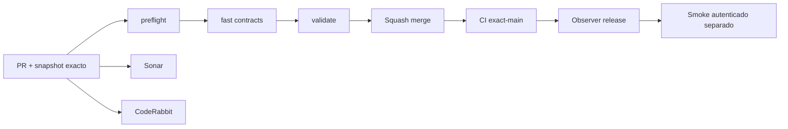

# GrindFlow — Último deploy

> **Snapshot v0.1.27: solo el deploy actual.** Base `main` v0.1.26 `f444475020c9310a71530af3174cfa69db26e9be`. Entrega pequeña y verificable: dashboard con recuentos reales tenant-safe de contenido listo y publicaciones programadas. CSS cache-busting de v0.1.26 preservado. Symfony S0 continúa aislado y Laravel atiende el sitio remoto; **no se infiere despliegue Hostinger del merge**.

## Progress convention
- ✅ ~~Completado~~ = verificado; 🚧 Pendiente = en curso; ⛔ bloqueado = dependencia externa.

## Fuentes de verdad
[AGENTS.md](AGENTS.md) · [Spec](docs/GRINDFLOW-SPEC.md) · [Requisitos](docs/REQUIREMENTS.md) · [Transición](docs/STACK-TRANSITION-SYMFONY.md) · [Roadmap #2](https://github.com/pl0n3r/GrindFlow/issues/2)

## Estado del deploy
| Señal | Estado | Evidencia |
| --- | --- | --- |
| Version objetivo | 🚧 **v0.1.27** | `config/version.php` |
| Base exacta | ✅ ~~main v0.1.26~~ | `f444475020c9310a71530af3174cfa69db26e9be` |
| CI del PR | 🚧 Pendiente de head final | `GrindFlow CI / validate` |
| Sonar | 🚧 Pendiente de head final | SonarCloud PR |
| CodeRabbit | 🚧 Pendiente | PR de dashboard |
| CI del SHA exacto de main | 🚧 Después del merge | No inferir del PR |
| Deploy Observer | ⛔ Release remoto v0.1.27 no observado | Hostinger independiente |
| Production Smoke | ⛔ Credencial de lectura E2E pendiente | [Issue #1](https://github.com/pl0n3r/GrindFlow/issues/1) |
| Producción v0.1.27 | ⛔ No verificada | CI ≠ deploy |
| Migraciones | ✅ ~~Ningún cambio de esquema~~ | Solo consultas de lectura |

## Huella del cambio
<!-- grindflow:git-delta -->
| Archivos | Inserciones | Eliminaciones | Neto |
| ---: | ---: | ---: | ---: |
| **6** | **+0** | **−0** | **+0** |

## Calidad y entrega
<!-- grindflow:gate-plan -->
| Control | Estado / contrato |
| --- | --- |
| Gates seleccionados | **preflight · fast[contracts] · php-quality · PHPUnit · browser · real-stack** |
| Alcance | Consultas tenant-safe de dashboard + UI de métricas + navegador y pruebas PHP |
| Revisiones | CI/Sonar/CodeRabbit y exact-main independientes |

## Flujo de entrega

## Qué se hizo
- Dashboard deja de mostrar métricas técnicas como si fueran datos de negocio y ahora cuenta media ready y schedules pendientes de las organizaciones visibles.
- Los contadores usan explícitamente IDs de organizaciones visibles del usuario, con fallback «—/Módulo no disponible» cuando el esquema falla; sin tocar contenido real.
- Se preserva CSS versionado de v0.1.26 y se incrementa patch **0.1.26 → 0.1.27** con versión ya visible en el footer.

## Archivos modificados en este deploy
- `README.md`
- `app/Http/Controllers/DashboardController.php`
- `config/version.php`
- `resources/views/dashboard.blade.php`
- `scripts/browser-smoke.sh`
- `tests/Feature/OrganizationVisibilityTest.php`

## Validación
- CI y Sonar PR, CI exact-main postmerge y observación Hostinger son pruebas separadas.
- Dashboard es Laravel existente, no paridad del nuevo Symfony. No afirmar publicación externa real.

## Qué sigue
| Lane | Trabajo |
| --- | --- |
| **NOW** | 🚧 Validar dashboard v0.1.27, [roadmap #2](https://github.com/pl0n3r/GrindFlow/issues/2) |
| **NEXT** | 🚧 S1 autenticación/tenant Symfony en slice pequeño |
| **LATER** | 🚧 Vault móvil → reglas → distribución real autorizada → piloto |
| **BLOCKED / EXTERNAL** | ⛔ Observar Hostinger y configurar smoke de solo lectura |

## Panorama general pendiente
| Lane | Frente | Estado |
| --- | --- | --- |
| **DONE** | ✅ ~~Home SaaS + footer visible v0.1.25~~ | ✅ ~~CSS cache-busting v0.1.26~~ |
| **NOW** | 🚧 Dashboard con datos reales v0.1.27 | 🚧 CI/observación remota |
| **NEXT** | 🚧 Identidad real Symfony | 🚧 S1 |
| **LATER** | 🚧 Automatización completa | 🚧 S2–S5 |
| **BLOCKED / EXTERNAL** | ⛔ Producción v0.1.27 | ⛔ Sin verificar |
