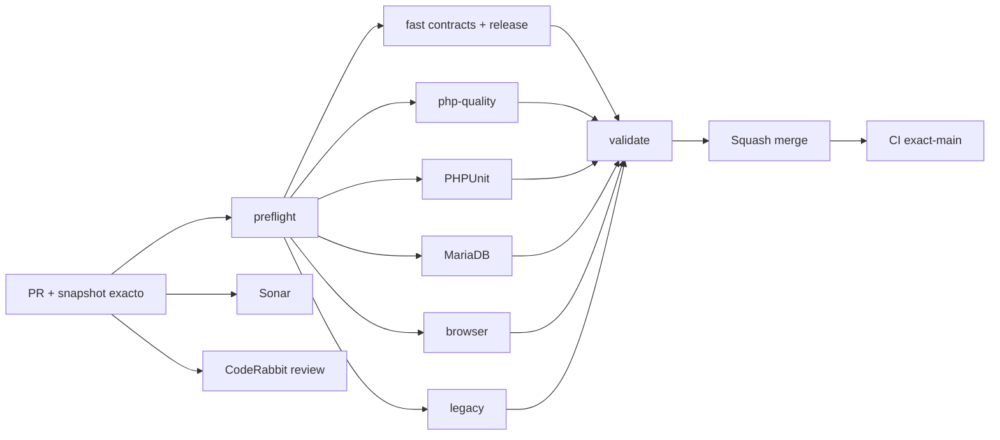

# GrindFlow — Último deploy

  
  
  

> **Snapshot PR v0.1.15: solo el deploy actual, no el historial acumulado.** Base `main` v0.1.14 `416f3f476d8d1358d26548131a36291682ac8460`: exact-main CI #35460562559 y Production Smoke #35460562558 success. No se ha verificado el SHA checkout Hostinger de manera independiente.

## Progress convention
- ✅ ~~Completado~~ = concluido y verificado por las compuertas aplicables.
- 🚧 Pendiente = por hacer o en curso, sin tachado.

## Estado del deploy
| Señal | Estado | Evidencia |
| --- | --- | --- |
| Work line | 🚧 **GF-NFR-006 · Browser E2E Scheduler → Traffic → Finance** | [Roadmap #88](https://github.com/drpipe1098-commits/GrindFlow/issues/88) |
| Base exacta | ✅ **v0.1.14 · PR #104 fusionado** | `416f3f476d8d1358d26548131a36291682ac8460` |
| Version | 🚧 **v0.1.15** | recorrido real de formularios bajo Chrome + CI |
| CI del PR | 🚧 **pendiente** | validar head final |
| Sonar | 🚧 **pendiente** | Quality Gate |
| CodeRabbit | 🚧 **pendiente** | full review candidato estable |
| CI del SHA exacto de main | ✅ **v0.1.14 validado** | #35460562559 |
| Production Smoke | ✅ **v0.1.14 observado** | #35460562558 |
| Deploy v0.1.15 | 🚧 **no confirmado** | Smoke tras merge |
| Migraciones | ✅ **sin SQL nuevo** | fixture SQLite testing-only |

## Huella del cambio
<!-- grindflow:git-delta -->
| Archivos | Inserciones | Eliminaciones | Neto |
| ---: | ---: | ---: | ---: |
| **10** | **+658** | **−44** | **+614** |

## Calidad y entrega
<!-- grindflow:gate-plan -->
| Control | Estado / contrato |
| --- | --- |
| Gates seleccionados | **preflight · fast[contracts] · php-quality · PHPUnit · MariaDB · browser** |
| Browser | Chromium + auth session y formularios reales con CSRF |
| Scheduler | Deep search, POST schedule, pagina 2, detach/reattach |
| Traffic | Edit target, pause/resume token, CSV privado |
| Finance | Create/reverse append-only, CSV reconciliacion |
| Fixtures | 106 media y 106 links, 27 schedules, 7 clicks y 2500 COP |
| Seguridad | APP_ENV local/testing, sin /l ni provider, DOM sin password |

## Flujo de entrega

## Qué se hizo
- La compuerta browser ya no solo abre dashboard: Chrome ejecuta una sesion autenticada de punta a punta sobre Scheduler, Traffic y Finance.
- Seeder de CI local/testing genera 106 assets elegibles y 106 links, 27 schedules para pagina 2, 7 clicks agregados y asiento inicial de Finance de 2500 COP; idempotente y sin subir objetos externos.
- Browser busca recursos antiguos, programa realmente con formulario CSRF, pagina a la segunda hoja, separa/reasocia link de la publicacion.
- Edita destino de Traffic, pausa/reactiva sin rotar token, lee CSV de metricas agregadas sin generar click /l.
- Finance crea allocation, reversa y verifica CSV total 3800 asignado /1300 reversado /2500 neto.
- Bootstrap temporal elimina JS con password del DOM y el archivo publico tras ejecutar; si aparece password en artifact descarta archivo sin imprimirlo.
- Diferencia CI de escritura solo en base descartable de Production Smoke GET solo lectura; no se requieren secretos de proveedores o migraciones.

## Archivos modificados en este deploy
- `AGENTS.md` — limite E2E y proteccion de credenciales.
- `README.md` — foto exacta v0.1.15.
- `config/version.php` — release humana.
- `database/seeders/E2eSeeder.php` — fixtures aislados idempotentes.
- `docs/DEVELOPMENT-MODEL.md` — E2E vs Production Smoke.
- `docs/GRINDFLOW-SPEC.md` — contrato navegador.
- `docs/REQUIREMENTS.md` — GF-NFR-006.
- `scripts/browser-smoke.sh` — integra gate de flujo.
- `scripts/browser-workflow.sh` — ejecutor Chromium y sanitizacion DOM.
- `tests/Browser/workflow-template.html` — aserciones de formularios reales.

## Validación
- Base v0.1.14: CI #35460562559 y Production Smoke #35460562558 success.
- v0.1.15: CI/PHPUnit/MariaDB/browser/Sonar/CodeRabbit pendientes; exact-main/Smoke tras merge.
- El browser CI usa SQLite desechable y metadatos simulados; no sube bytes a S3,
  no ejecuta proveedores externos ni valida POST real de Hostinger.

## Qué sigue
| Lane | Trabajo |
| --- | --- |
| **NOW** | 🚧 Entregar browser E2E completo v0.1.15. [Roadmap #88](https://github.com/drpipe1098-commits/GrindFlow/issues/88). |
| **NEXT** | 🚧 Media Storage/CORS/FFmpeg runtime #40 (dependencias externas). |
| **LATER** | 🚧 Mejorar E2E de errores/tenant y descargar Media real en fixture local. |
| **BLOCKED / EXTERNAL** | 🚧 SHA exacto del checkout Hostinger. |

## Panorama general pendiente
| Lane | Frente | Estado |
| --- | --- | --- |
| **DONE** | ✅ ~~Scheduler searchable pickers~~ | ✅ ~~v0.1.14 CI+Smoke~~ |
| **NOW** | 🚧 Browser E2E del flujo operativo | 🚧 v0.1.15 |
| **NEXT** | 🚧 Media Storage / FFmpeg | 🚧 #40 |
| **LATER** | 🚧 Browser E2E extras + resiliencia | 🚧 roadmap #88 |
| **BLOCKED / EXTERNAL** | 🚧 Git SHA Hostinger | 🚧 observabilidad |
