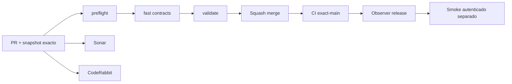

# GrindFlow — Último deploy

> **Candidato v0.1.70: shell de navegación unificado y responsive.** El runtime productivo continúa siendo Laravel en Hostinger mientras Symfony migra por slices. Base exacta `main` v0.1.69 `0632dc89a30b95e3d8b00ce82f3f380644dde9e0`. Este cambio corrige la navegación inconsistente entre páginas y el rail vacío en ventanas medianas sin ampliar permisos.

## Progress convention
- ✅ ~~Completado~~ = verificado; 🚧 Pendiente = en curso; ⛔ bloqueado = dependencia externa.

## Fuentes de verdad
[AGENTS.md](AGENTS.md) · [Spec](docs/GRINDFLOW-SPEC.md) · [Requisitos](docs/REQUIREMENTS.md) · [Transición](docs/STACK-TRANSITION-SYMFONY.md) · [Roadmap #2](https://github.com/pl0n3r/GrindFlow/issues/2)

## Estado del deploy
| Señal | Estado | Evidencia |
| --- | --- | --- |
| Version objetivo | 🚧 **v0.1.70** | `config/version.php` |
| Base exacta | ✅ ~~main v0.1.69~~ | `0632dc89a30b95e3d8b00ce82f3f380644dde9e0` |
| CI del PR | 🚧 Head v0.1.70 por validar | `GrindFlow CI / validate` |
| Sonar | 🚧 Pendiente | SonarCloud PR |
| CodeRabbit | 🚧 Pendiente | PR |
| CI del SHA exacto de main | 🚧 v0.1.69 por observar | SHA `0632dc89a30b95e3d8b00ce82f3f380644dde9e0` |
| Deploy Observer | 🚧 v0.1.69 por observar | No prueba SHA remoto ni Symfony |
| Production Smoke | ⛔ Credencial E2E productiva pendiente | [Issue #1](https://github.com/pl0n3r/GrindFlow/issues/1) |
| Symfony S3 en Hostinger | ⛔ NO desplegado | Solo entorno aislado CI |
| Migraciones | ✅ ~~Sin migración nueva en este candidato~~ | Producción intacta |

## Huella del cambio
<!-- grindflow:git-delta -->
| Archivos | Inserciones | Eliminaciones | Neto |
| ---: | ---: | ---: | ---: |
| **16** | **+479** | **−514** | **-35** |

## Calidad y entrega
<!-- grindflow:gate-plan -->
| Control | Estado / contrato |
| --- | --- |
| Gates seleccionados | **preflight · fast[contracts] · php-quality · PHPUnit · browser · real-stack** |
| Alcance | Shell Laravel compartido + responsive 820 px + consistencia entre módulos |
| Revisiones | CI/Sonar/CodeRabbit, exact-main y Hostinger independientes |

## Flujo de entrega

## Qué se hizo
- Un único componente Blade define la navegación de Dashboard, Biblioteca, Programación, Distribución, Tráfico, Finanzas, Sistema y Diagnósticos.
- El rail entre 681–960 px conserva iconos visibles y nombres accesibles; el cierre de sesión ya no parte texto ni deja botones vacíos.
- En móvil continúa la barra inferior horizontal con icono + texto; los módulos sin permiso/ruta/organización muestran estado deshabilitado con razón accesible.
- Se añadió prueba de contrato para impedir que las vistas vuelvan a copiar sidebars privados y smoke real de navegador a 820 px para el fallo reportado.

## Archivos modificados en este deploy
Inventario de solo el deploy actual: cambio candidato en PR, NO prueba de deploy en Hostinger.
- `README.md`
- `app/Http/Controllers/Admin/DiagnosticsController.php`
- `config/version.php`
- `docs/REQUIREMENTS.md`
- `public/css/grindflow.css`
- `resources/views/admin/diagnostics.blade.php`
- `resources/views/admin/system.blade.php`
- `resources/views/components/workspace-sidebar.blade.php`
- `resources/views/dashboard.blade.php`
- `resources/views/distribution/index.blade.php`
- `resources/views/finance/index.blade.php`
- `resources/views/scheduling/index.blade.php`
- `resources/views/traffic/index.blade.php`
- `resources/views/vault/index.blade.php`
- `scripts/browser-smoke.sh`
- `tests/Feature/WorkspaceSidebarTest.php`

## Validación
- CI/Sonar/CodeRabbit del candidato v0.1.70 por verificar; la base v0.1.69 está fusionada.
- El cambio exige PHPUnit, análisis PHP, navegador Laravel y real-stack MariaDB; el smoke de navegador incluye el breakpoint de 820 px. Producción no se modifica desde esta rama.

## Qué sigue
[Roadmap canónico #2](https://github.com/pl0n3r/GrindFlow/issues/2)

| Lane | Trabajo | Estado |
| --- | --- | --- |
| **NOW** | 🚧 Validar shell unificado v0.1.70 | 🚧 CI y revisión |
| **NEXT** | 🚧 Scheduler Symfony persistido tenant-safe | 🚧 S3, sin publicación externa |
| **LATER** | 🚧 Scheduler Symfony + distribución autorizada + Traffic | 🚧 S3–S5 |
| **BLOCKED / EXTERNAL** | ⛔ Cutover sin paridad/datos migrados; Smoke sin credencial | ⛔ Dependencia externa |

## Panorama general pendiente
| Lane | Frente | Estado |
| --- | --- | --- |
| **DONE** | ✅ ~~Dashboard Laravel v0.1.30~~ | ✅ ~~Vault Symfony clasificación v0.1.63~~ |
| **NOW** | 🚧 Shell de navegación unificado v0.1.70 | 🚧 CI y revisión |
| **NEXT** | 🚧 Scheduler Symfony persistido tenant-safe | 🚧 S3 |
| **LATER** | 🚧 Paridad del monolito modular | 🚧 S3–S5 |
| **BLOCKED / EXTERNAL** | ⛔ Sin cutover Symfony | ⛔ Sin credencial Smoke |
