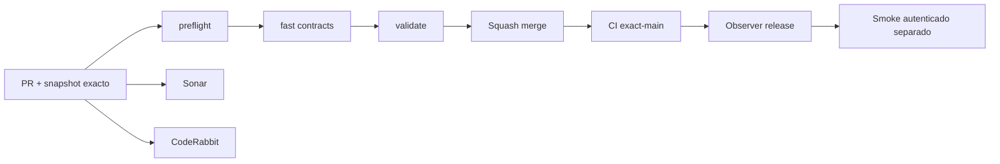

# GrindFlow — Último deploy

> **Snapshot v0.1.34: solo el deploy actual.** Base `main` v0.1.33 `1a923542151da0897d0b883815c5cf4145663a34`. S1 aislado: admin React protegido, API JSON tenant-safe y permisos derivados de membresía revalidada. Laravel sigue siendo runtime de Hostinger. **Symfony no se ha desplegado ni se han importado cuentas.**

## Progress convention
- ✅ ~~Completado~~ = verificado; 🚧 Pendiente = en curso; ⛔ bloqueado = dependencia externa.

## Fuentes de verdad
[AGENTS.md](AGENTS.md) · [Spec](docs/GRINDFLOW-SPEC.md) · [Requisitos](docs/REQUIREMENTS.md) · [Transición](docs/STACK-TRANSITION-SYMFONY.md) · [Roadmap #2](https://github.com/pl0n3r/GrindFlow/issues/2)

## Estado del deploy
| Señal | Estado | Evidencia |
| --- | --- | --- |
| Version objetivo | 🚧 **v0.1.34** | `config/version.php` |
| Base exacta | ✅ ~~main v0.1.33~~ | `1a923542151da0897d0b883815c5cf4145663a34` |
| CI del PR | 🚧 Head final pendiente | `GrindFlow CI / validate` |
| Sonar | 🚧 Pendiente | SonarCloud PR |
| CodeRabbit | 🚧 Revisión por comprobar | PR |
| CI del SHA exacto de main | 🚧 Después del merge | CI PR no lo sustituye |
| Deploy Observer | 🚧 Release humano por observar | No prueba Symfony en remoto |
| Production Smoke | ⛔ Credencial E2E productiva pendiente | [Issue #1](https://github.com/pl0n3r/GrindFlow/issues/1) |
| Symfony S1 en Hostinger | ⛔ NO desplegado | Solo entorno aislado CI |
| Migraciones | ✅ ~~Ningún esquema productivo modificado~~ | DB Symfony descartable |

## Huella del cambio
<!-- grindflow:git-delta -->
| Archivos | Inserciones | Eliminaciones | Neto |
| ---: | ---: | ---: | ---: |
| **14** | **+000** | **−000** | **+000** |

## Calidad y entrega
<!-- grindflow:gate-plan -->
| Control | Estado / contrato |
| --- | --- |
| Gates seleccionados | **preflight · fast[contracts] · symfony-preview** |
| Alcance | Admin React protegido, contexto API tenant-safe, permisos por rol y pruebas negativas |
| Revisiones | CI/Sonar/CodeRabbit, exact-main y Hostinger son independientes |

## Flujo de entrega

## Qué se hizo
- Admin React privado y responsive, montado desde el manifiesto Vite existente, con estados claros de carga/error y navegación S2+ rotulada como pendiente.
- `GET /api/admin/context` revalida sesión, usuario, organización y membresía en cada petición; entrega solo nombre visible, organización, rol y permisos conservadores.
- Permisos por acción para `admin`, `studio`, `editor` y `model`; roles desconocidos y membresías revocadas fallan cerrados sin exponer otro tenant.
- Versión humana consecutiva **0.1.33 → 0.1.34**. Sin migraciones, datos productivos, credenciales externas ni despliegue Symfony.

## Archivos modificados en este deploy
- `README.md`
- `config/version.php`
- `symfony/README.md`
- `symfony/config/packages/security.yaml`
- `symfony/frontend/admin/AdminApp.tsx`
- `symfony/frontend/admin/admin.css`
- `symfony/frontend/admin/main.tsx`
- `symfony/src/Http/Controller/AdminContextController.php`
- `symfony/src/Http/Controller/AdminController.php`
- `symfony/src/Identity/Application/MembershipContext.php`
- `symfony/templates/identity/admin.html.twig`
- `symfony/tests/e2e/preview.spec.mjs`
- `symfony/tests/php/IdentityLoginTest.php`
- `symfony/tests/php/PreviewTest.php`

## Validación
- Gates seleccionados: contratos de gobernanza y corte Symfony completo con PHP 8.5, MariaDB descartable, TypeScript/Vite, PHPUnit, smoke HTTP y Chromium.
- CI/Sonar/CodeRabbit del PR, CI exact-main y estado productivo se verifican por separado. Este cambio no autoriza cutover ni migraciones productivas.

## Qué sigue
| Lane | Trabajo |
| --- | --- |
| **NOW** | 🚧 Validar admin React S1 v0.1.34, [roadmap #2](https://github.com/pl0n3r/GrindFlow/issues/2) |
| **NEXT** | 🚧 Vault móvil real sobre el contexto tenant-safe |
| **LATER** | 🚧 Vault móvil → reglas → distribución autorizada → piloto |
| **BLOCKED / EXTERNAL** | ⛔ Cutover sin paridad/datos migrados; Smoke sin credencial |

## Panorama general pendiente
| Lane | Frente | Estado |
| --- | --- | --- |
| **DONE** | ✅ ~~Dashboard Laravel v0.1.30~~ | ✅ ~~Esquema Symfony S1 v0.1.31~~ |
| **NOW** | 🚧 Admin React S1 v0.1.34 | 🚧 Validación y revisión |
| **NEXT** | 🚧 Vault móvil | 🚧 S2 |
| **LATER** | 🚧 Automatización de contenido | 🚧 S2–S5 |
| **BLOCKED / EXTERNAL** | ⛔ Sin cutover Symfony | ⛔ Sin credencial Smoke |
