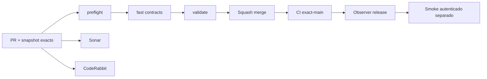

# GrindFlow — Último deploy

> **Snapshot v0.1.44: solo el deploy actual, duplicados privados de imágenes en Vault S2.** Base `main` v0.1.43 `58088963e695d71608c2349db133d6a53a10365a`. Evita guardar el mismo SHA-256 dos veces dentro de una organización, distingue duplicado activo/en papelera, limpia el intento rechazado y ofrece restaurar sin duplicar almacenamiento. Symfony aún no desplegado en Hostinger.

## Progress convention
- ✅ ~~Completado~~ = verificado; 🚧 Pendiente = en curso; ⛔ bloqueado = dependencia externa.

## Fuentes de verdad
[AGENTS.md](AGENTS.md) · [Spec](docs/GRINDFLOW-SPEC.md) · [Requisitos](docs/REQUIREMENTS.md) · [Transición](docs/STACK-TRANSITION-SYMFONY.md) · [Roadmap #2](https://github.com/pl0n3r/GrindFlow/issues/2)

## Estado del deploy
| Señal | Estado | Evidencia |
| --- | --- | --- |
| Version objetivo | 🚧 **v0.1.44** | `config/version.php` |
| Base exacta | ✅ ~~main v0.1.43~~ | `58088963e695d71608c2349db133d6a53a10365a` |
| CI del PR | 🚧 Head final pendiente | `GrindFlow CI / validate` |
| Sonar | 🚧 Pendiente | SonarCloud PR |
| CodeRabbit | 🚧 Revisión por comprobar | PR |
| CI del SHA exacto de main | 🚧 Después del merge | CI PR no lo sustituye |
| Deploy Observer | 🚧 Release humano por observar | No prueba Symfony en remoto |
| Production Smoke | ⛔ Credencial E2E productiva pendiente | [Issue #1](https://github.com/pl0n3r/GrindFlow/issues/1) |
| Symfony S1 en Hostinger | ⛔ NO desplegado | Solo entorno aislado CI |
| Migraciones | ✅ ~~Ningún esquema productivo modificado~~ | DB Symfony descartable |

## Huella del cambio
<!-- grindflow:git-delta -->
| Archivos | Inserciones | Eliminaciones | Neto |
| ---: | ---: | ---: | ---: |
| **7** | **+305** | **−29** | **+276** |

## Calidad y entrega
<!-- grindflow:gate-plan -->
| Control | Estado / contrato |
| --- | --- |
| Gates seleccionados | **preflight · fast[contracts] · symfony-preview** |
| Alcance | Vault S2: rechazar bytes duplicados con respuesta específica y acceso móvil a restaurar |
| Revisiones | CI/Sonar/CodeRabbit, exact-main y Hostinger son independientes |

## Flujo de entrega

## Qué se hizo
- La subida revalida permiso dentro de la transacción, toma el bloqueo por organización y comprueba SHA-256 entre imágenes activas y papelera solo de ese tenant.
- Dos respuestas 409 distintas: duplicado ya activo o duplicado retenido en papelera; nunca copia blobs ni expone hashes/IDs de otros tenants.
- Un intento duplicado descarta su blob privado temporal, conserva el original y mantiene la cuota física. Cuando procede, React ofrece «Ver papelera para restaurar».
- Test PHP/MariaDB aislado cubre cambio de nombre con bytes idénticos, no contaminación entre organizaciones, rol revocado y limpieza; Chromium cubre el flujo móvil.

## Archivos modificados en este deploy
- `README.md`
- `config/version.php`
- `symfony/README.md`
- `symfony/frontend/admin/VaultPanel.tsx`
- `symfony/src/Http/Controller/VaultController.php`
- `symfony/tests/e2e/preview.spec.mjs`
- `symfony/tests/php/VaultDeduplicationTest.php`

## Validación
- El CI Symfony PHP/MariaDB y Chromium, Sonar del head, CI exact-main y Hostinger se comprueban como señales separadas.
- No se añadió migración ni se modificaron el runtime Laravel o los datos productivos.

## Qué sigue
[Roadmap canónico #2](https://github.com/pl0n3r/GrindFlow/issues/2)

| Lane | Trabajo | Estado |
| --- | --- | --- |
| **NOW** | 🚧 Validar deduplicación Vault S2 v0.1.44 | 🚧 CI y revisión |
| **NEXT** | 🚧 Almacenamiento durable, backup y purga con política explícita | 🚧 Después de validar deduplicación |
| **LATER** | 🚧 Vault móvil → reglas → distribución autorizada → piloto | 🚧 Planificado |
| **BLOCKED / EXTERNAL** | ⛔ Cutover sin paridad/datos migrados; Smoke sin credencial | ⛔ Dependencia externa |

## Panorama general pendiente
| Lane | Frente | Estado |
| --- | --- | --- |
| **DONE** | ✅ ~~Dashboard Laravel v0.1.30~~ | ✅ ~~Esquema Symfony S1 v0.1.31~~ |
| **NOW** | 🚧 Validar deduplicación Vault S2 v0.1.44 | 🚧 CI y revisión |
| **NEXT** | 🚧 Gestión durable de storage, backup y retención | 🚧 Después de validar deduplicación |
| **LATER** | 🚧 Automatización de contenido | 🚧 S2–S5 |
| **BLOCKED / EXTERNAL** | ⛔ Sin cutover Symfony | ⛔ Sin credencial Smoke |
