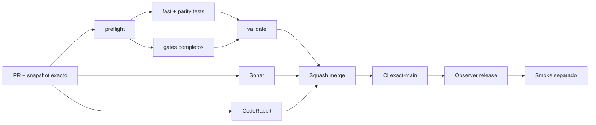

# GrindFlow — Último deploy

> **Candidato v0.1.101: acotar las solicitudes de cambio de contraseña en Symfony.** Base exacta `main` v0.1.100 `61ae4dae188f685dacdf15d7caf2b5bb959ce53d`; rechaza JSON excesivo con salida genérica y sin cambiar contraseñas.

## Progress convention
- ✅ ~~Completado~~ = verificado; 🚧 Pendiente = en curso; ⛔ bloqueado = dependencia externa.

## Fuentes de verdad
[AGENTS.md](AGENTS.md) · [Spec](docs/GRINDFLOW-SPEC.md) · [Requisitos](docs/REQUIREMENTS.md) · [Transición](docs/STACK-TRANSITION-SYMFONY.md) · [Roadmap #2](https://github.com/pl0n3r/GrindFlow/issues/2)

## Estado del deploy
| Señal | Estado | Evidencia |
| --- | --- | --- |
| Version objetivo | 🚧 **v0.1.101** | `config/version.php`; no publicada |
| Base exacta | ✅ ~~main v0.1.100~~ | `61ae4dae188f685dacdf15d7caf2b5bb959ce53d` |
| CI del PR | 🚧 Pendiente | Exigir `validate` del HEAD final |
| Sonar del PR | 🚧 Pendiente | Exigir Quality Gate del HEAD final |
| CodeRabbit del PR | 🚧 Pendiente | Exigir full review del HEAD final |
| CI del SHA exacto de main | ✅ **VALIDATED IN CODE** | `35801200020` success sobre `61ae4dae188f685dacdf15d7caf2b5bb959ce53d` |
| Deploy Observer | 🚧 Pendiente | No inferir checkout remoto |
| Production Smoke | ⛔ Login E2E no validado | `35801200045` failure, #73; independiente de esta mejora |
| Symfony en Hostinger | ⛔ NO desplegado | Sin cutover |
| Datos productivos | ✅ ~~No tocados~~ | Pruebas en Symfony/MariaDB descartable; sin cambio de cuentas reales |

## Huella del cambio
<!-- grindflow:git-delta -->
| Archivos | Inserciones | Eliminaciones | Neto |
| ---: | ---: | ---: | ---: |
| **5** | **+234** | **−48** | **+186** |

## Calidad y entrega
<!-- grindflow:gate-plan -->
| Control | Estado / contrato |
| --- | --- |
| Gates seleccionados | **preflight · fast[operational contracts + automation syntax + README dashboard] · symfony-preview** |
| Gate agregador obligatorio | **validate**: todos los seleccionados; Sonar y CodeRabbit aparte |
| Alcance | GF-SEC-005: validar tamaño/profundidad del JSON de cambio de contraseña |
| Revisiones | CI/Sonar/CodeRabbit HEAD; exact-main, Observer y Smoke separados |

## Flujo de entrega

## Qué se hizo
- `AccountSecurityController` rechaza `Content-Length` válido superior a 4.096 bytes antes de cargar el JSON; lee como máximo 4.097 bytes del stream y coteja la longitud real aun si la cabecera miente o falta.
- La profundidad de decodificación se limita a 16; cuerpos fuera de contrato reciben HTTP 422 genérico sin eco, tras consumir el cupo por identidad si su CSRF era válido.
- Regresiones PHPUnit con usuario, organización y MariaDB descartables: longitud declarada y real, frontera exacta de 4 KiB, anidación excesiva y contraseña sin mutaciones inesperadas.
- Actualizado el contrato GF-SEC-005 sin cambiar Laravel, secretos, usuarios productivos, Hostinger ni llamadas externas.

## Archivos modificados en esta entrega candidata
Inventario de solo esta entrega candidata: no constituye evidencia de publicación:
<!-- grindflow:changed-files -->
- `README.md`
- `config/version.php`
- `docs/REQUIREMENTS.md`
- `symfony/src/Http/Controller/AccountSecurityController.php`
- `symfony/tests/php/AccountSecurityTest.php`

## Validación
- Exigir `validate`, Sonar y full review CodeRabbit sobre el HEAD final del PR; luego CI exact-main.
- El gate `symfony-preview` ejecuta PHP/MariaDB y Chromium en un entorno aislado; las pruebas cubren 4.096 bytes y profundidad 16.
- Este candidato no cambia el login productivo ni resuelve por sí solo el Production Smoke #73.

## Qué sigue
[Roadmap canónico #2](https://github.com/pl0n3r/GrindFlow/issues/2)

| Lane | Trabajo | Estado |
| --- | --- | --- |
| **NOW** | 🚧 Guardas del cambio de contraseña Symfony | 🚧 v0.1.101 candidata |
| **NEXT** | 🚧 Verificación autorizada de cuenta E2E | 🚧 #2 |
| **LATER** | 🚧 Conmutación Symfony por módulo | 🚧 Sin deploy |
| **BLOCKED / EXTERNAL** | ⛔ Resolver login E2E productivo | ⛔ #2 |

## Panorama general pendiente
| Lane | Frente | Estado |
| --- | --- | --- |
| **DONE** | ✅ ~~v0.1.100 fusionada~~ | ✅ ~~diagnóstico redacted del Production Smoke~~ |
| **NOW** | 🚧 Límite JSON para cambio de contraseña | 🚧 v0.1.101 |
| **NEXT** | 🚧 Evidencia revisada fuera de banda + autorización separada | 🚧 GF-ARCH-002 sin cutover |
| **LATER** | 🚧 Symfony en Hostinger | 🚧 No desplegado |
| **BLOCKED / EXTERNAL** | ⛔ Smoke autenticado Laravel | ⛔ #2 |
