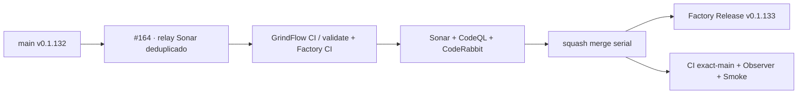

# GrindFlow — Último deploy

> **Candidata v0.1.133 · PR #164.** Reduce procesamientos redundantes del relay Sonar; v0.1.132 ya tiene tag anotado y GitHub Release del SHA de main. Sin modificaciones de datos ni producción en esta PR.

## Progress convention
- ✅ ~~Completado~~ = verificado; 🚧 Pendiente = en curso; ⛔ bloqueado = dependencia externa.

## Fuentes de verdad
[AGENTS.md](AGENTS.md) · [Spec](docs/GRINDFLOW-SPEC.md) · [Requisitos](docs/REQUIREMENTS.md) · [Roadmap #2](https://github.com/pl0n3r/GrindFlow/issues/2)

## Estado del deploy
| Señal | Estado | Evidencia |
| --- | --- | --- |
| SHA exacto de main (base) | ✅ **aeac12c0a13d0d26e6599e8f7b05a899b080155a** | v0.1.132 fusionada (#162) |
| Tag y GitHub Release (base) | ✅ **v0.1.132** | tag anotado del SHA exacto y Release Factory publicados |
| CI del SHA exacto de main (base) | 🚧 ejecución en progreso | no inferir verde de PR anterior |
| Deploy Observer base | ✅ **success** | observación release; no representa por sí sola paridad funcional |
| Production Smoke base | ✅ **success** | check del commit base; revisar evidencia exacta por ejecución |
| Version objetivo | 🚧 **v0.1.133** | PHP, npm y lock en paridad |
| CI/Sonar/CodeRabbit del PR | 🚧 pendiente | HEAD final de PR #164 |
| Producción objetivo | 🚧 pendiente | tras merge y comprobaciones independientes |

## Huella del cambio
<!-- grindflow:git-delta -->
| Archivos | Inserciones | Eliminaciones | Neto |
| ---: | ---: | ---: | ---: |
| **7** | **+94** | **−35** | **+59** |

## Calidad y entrega
<!-- grindflow:gate-plan -->
| Control | Estado / contrato |
| --- | --- |
| Gates seleccionados | **preflight · fast[operational contracts + automation syntax + README dashboard] · php-quality · PHPUnit · MariaDB · browser · real-stack · legacy · symfony-preview** |
| PR + snapshot exacto | **PR #164 / Issue #123 · v0.1.133**; diff y README deben coincidir con HEAD final |
| Gate agregador obligatorio | **validate** conserva gates seleccionados + privacidad; Sonar, CodeQL y CodeRabbit separados |
| Release Factory v1 | Solo push main; tag anotado y GitHub Release sin deploy productivo |
| CI local canónico | `GrindFlow CI / validate` sigue obligatorio, Factory CI corre en paralelo |
| Rol del PR | **Infraestructura · SRE · QA** |

## Flujo de entrega

## Qué se hizo
- Conserva caller Factory Release v1 y test de adopción de v0.1.132 ya integrados; no reintroduce el caller anterior.
- Añade timeout de cinco minutos y `concurrency` por `check_run.id` al relay Sonar; mantiene filtro de aplicación y nombre del check antes del runner.
- Ejecuta test negativo del relay en `fast`; preserva el gate `validate` y toda la matriz aplicable.
- Sincroniza v0.1.133 en PHP, npm y raíz del lock sin modificar resoluciones.
- Limita el beneficio declarado a deduplicar relays del mismo check; no se ha demostrado reducción de la cantidad total de workflow runs.

## Archivos modificados en esta entrega candidata
<!-- grindflow:changed-files -->
- `.github/workflows/grindflow-ci.yml`
- `.github/workflows/sonar-pr-details.yml`
- `README.md`
- `config/version.php`
- `package-lock.json`
- `package.json`
- `tests/test_sonar_event_load.py`

## Validación
- Regresiones de filtro de eventos, timeout, concurrencia por check y mutaciones negativas integradas en fast.
- No confundir CI de PR con producción ni tag/Release con SHA de Hostinger.
- Se requieren CI, Factory, Sonar, CodeQL, CodeRabbit y evidencia de main/deploy independientes.

## Qué sigue
[Roadmap canónico #2](https://github.com/pl0n3r/GrindFlow/issues/2)

## Panorama general pendiente
| Lane | Frente | Estado |
| --- | --- | --- |
| **NOW** | 🚧 #123 · relay Sonar deduplicado | 🚧 candidata v0.1.133 |
| **NEXT** | 🚧 #125/#129 · etiquetas y despliegue con rollback | 🚧 después de integración serial |
| **BLOCKED / EXTERNAL** | ⛔ #139 Dependabot + #146 media storage | ⛔ evidencia/configuración externa |
| **LATER** | 🚧 #122 helper CodeRabbit + #138 Sentry | 🚧 preservados tras TANDA 2 |
