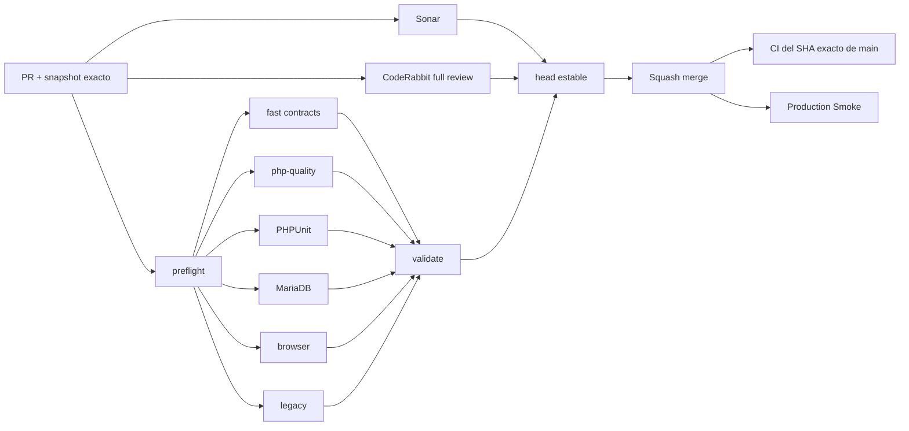

# GrindFlow — Último deploy

  
  
  

> **Development dashboard** · snapshot profesional de **solo el deploy actual**. CI, deploy y validacion en produccion son evidencias distintas.

## Estado del deploy

| Señal | Estado actual | Evidencia |
| --- | --- | --- |
| Work line | 🟡 **BRVTAL delivery parity** | preflight + fan-out + dashboard exacto |
| Base exacta | ✅ **main** | `c074f0195247d80ee15005196dbb4abf628a2795` · media processing foundation #58 |
| Cambio | ⚡ **CI lead-time** | elimina serializacion de gates pesados detras de `fast` |
| Produccion | 🔒 **separada** | Production Smoke autenticado sigue independiente del source CI |
| Migraciones | ✅ **ninguna** | cambio exclusivo de delivery/tooling |

## Huella del cambio

<!-- grindflow:git-delta -->

| Archivos | Inserciones | Eliminaciones | Neto |
| ---: | ---: | ---: | ---: |
| **8** | **+0** | **−0** | **+0** |

La huella se calcula con `git diff --numstat`; CI rechaza este dashboard si queda desactualizado.

## Calidad y entrega

<!-- grindflow:gate-plan -->

| Control | Estado / contrato |
| --- | --- |
| Gates seleccionados | **preflight · fast[contracts] · php-quality · PHPUnit · MariaDB · browser · legacy** |
| GrindFlow CI | `validate` exige success real para cada gate seleccionado |
| Sonar | Automatic Analysis + comentario estable **SonarQube Cloud · Full PR details** |
| CodeRabbit | incremental desactivado; full review sobre el head estable |
| Exact-main | CI vuelve a validar el SHA exacto despues del squash merge |
| Produccion | Production Smoke es independiente y no convierte CI verde en VALIDATED IN PRODUCTION |

## Flujo de entrega

## Qué se hizo

- Relee el `main` actual de BRVTAL y porta su optimizacion de delivery a GrindFlow.
- Separa `preflight` del `fast`: el primero calcula scope y los gates pesados salen en paralelo inmediatamente.
- Centraliza el clasificador de paths en `scripts/ci-scope.sh` con contrato ejecutable.
- `validate` distingue un skip intencional de un gate seleccionado que no ejecuto correctamente.
- Convierte README en dashboard machine-checked con archivos, inserciones, eliminaciones, neto y gate plan exactos.
- Desactiva CodeRabbit incremental para evitar revisiones solapadas durante pushes intermedios.
- Conserva el reporter Sonar existente de GrindFlow, que ya publica detalles completos en GitHub.
- No copia el deploy observer de BRVTAL: GrindFlow no expone aun un marcador publico seguro del SHA desplegado y ya posee Production Smoke autenticado.

## Archivos modificados en este deploy

- `.coderabbit.yaml` — revision solo sobre heads estables.
- `.github/workflows/grindflow-ci.yml` — preflight, fan-out concurrente y validate estricto.
- `AGENTS.md` — reglas durables de CI, dashboard, Git writes y CodeRabbit.
- `README.md` — dashboard exacto de desarrollo.
- `docs/DEVELOPMENT-MODEL.md` — topologia y ciclo de entrega actualizado.
- `scripts/ci-scope-contract.sh` — regresiones del clasificador.
- `scripts/ci-scope.sh` — clasificador reusable de changed files.
- `scripts/readme-dashboard.py` — validador exacto del snapshot.

## Validación

- Estado actual: **IMPLEMENTED**, pendiente del primer run completo del CI nuevo.
- El cambio del workflow fuerza la matriz completa: php-quality, PHPUnit, MariaDB, browser y legacy.
- SonarQube Cloud y CodeRabbit deben revisarse sobre el mismo head previsto para merge.
- No se toca produccion ni se ejecutan migraciones desde este PR.
- Tras squash merge se exige nuevamente `GrindFlow CI / validate` sobre el SHA real de `main`.

## Qué sigue

| Lane | Trabajo |
| --- | --- |
| **NOW** | Abrir PR del CI nuevo, pasar matriz completa, Sonar y full review de CodeRabbit; medir el critical path. |
| **NEXT** | Continuar GF-FR-003 con derivados/probe multimedia/FFmpeg detras de `ProcessMediaAsset`. |
| **BLOCKED / EXTERNAL** | Branch protection sigue requiriendo configuracion GitHub fuera del conector actual; object storage/credenciales reales siguen operacionales. |
| **LATER** | P2 distribucion, trafico/atribucion y finanzas despues de cerrar P1. |

## Panorama general pendiente

| Lane | Frente | Estado |
| --- | --- | --- |
| **NOW** | Delivery / CI | portar y medir mejoras BRVTAL |
| **NEXT** | Media processing | foundation VALIDATED IN CODE; derivados/FFmpeg pendientes |
| **NEXT** | Media Vault produccion | Dropbox/Google VALIDATED IN CODE; configuracion real pendiente |
| **BLOCKED / EXTERNAL** | Branch protection / storage | requiere controles externos de GitHub/hosting |
| **LATER** | Operacion | queues, scheduler, retries y backups |
| **LATER** | Legacy retirement | solo tras GF-MIG-003 / GF-MIG-004 |
| **LATER** | Producto P2 | distribucion, atribucion y finanzas |
