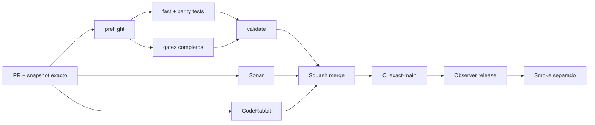

# GrindFlow — Último deploy

> **Candidato v0.1.112: compatibilidad anticipada con Symfony Security.** Base exacta `main` v0.1.111 `9aec23b74ff46c5b99dce39d4c1813415fa5a42a`; elimina deprecations propias conocidas sin cambiar autenticación.

## Progress convention
- ✅ ~~Completado~~ = verificado; 🚧 Pendiente = en curso; ⛔ bloqueado = dependencia externa.

## Fuentes de verdad
[AGENTS.md](AGENTS.md) · [Spec](docs/GRINDFLOW-SPEC.md) · [Requisitos](docs/REQUIREMENTS.md) · [Transición](docs/STACK-TRANSITION-SYMFONY.md) · [Roadmap #2](https://github.com/pl0n3r/GrindFlow/issues/2)

## Estado del deploy
| Señal | Estado | Evidencia |
| --- | --- | --- |
| Version objetivo | 🚧 **v0.1.112** | `config/version.php`; no publicada |
| Base exacta | ✅ ~~main v0.1.111~~ | `9aec23b74ff46c5b99dce39d4c1813415fa5a42a` |
| CI del PR | 🚧 Pendiente | Exigir `validate` del HEAD final |
| Sonar del PR | 🚧 Pendiente | Exigir Quality Gate del HEAD final |
| CodeRabbit del PR | 🚧 Pendiente | Exigir revisión CodeRabbit completada del HEAD final |
| CI del SHA exacto de main | ✅ **VALIDATED IN CODE** | `35843977573` success sobre `9aec23b74ff46c5b99dce39d4c1813415fa5a42a` |
| Deploy Observer | ✅ ~~Marcador humano observado~~ | `35843977579` success; no acredita SHA remoto |
| Production Smoke | ⛔ Login E2E no validado | `35843977571` failure, #73; independiente |
| Symfony en Hostinger | ⛔ NO desplegado | Sin cutover |
| Datos productivos | ✅ ~~No tocados~~ | PHPUnit/reflexión; sin cuentas reales |

## Huella del cambio
<!-- grindflow:git-delta -->
| Archivos | Inserciones | Eliminaciones | Neto |
| ---: | ---: | ---: | ---: |
| **6** | **+61** | **−22** | **+39** |

## Calidad y entrega
<!-- grindflow:gate-plan -->
| Control | Estado / contrato |
| --- | --- |
| Gates seleccionados | **preflight · fast[operational contracts + automation syntax + README dashboard] · symfony-preview** |
| Gate agregador obligatorio | **validate**: todos los seleccionados; Sonar y CodeRabbit aparte |
| Alcance | GF-OPS-011: compatibilidad anticipada de identidad con contratos Symfony Security |
| Revisiones | CI/Sonar/CodeRabbit HEAD; exact-main, Observer y Smoke separados |

## Flujo de entrega

## Qué se hizo
- `ActiveUserChecker::checkPostAuth()` acepta el segundo parámetro opcional `?TokenInterface $token = null` anunciado por Symfony para la siguiente versión mayor y conserva la misma validación de cuenta activa.
- `IdentityUser::eraseCredentials()` se marca `#[\Deprecated]` porque el método está vacío y no almacena credenciales en texto plano.
- Una prueba de reflexión fija la firma, opcionalidad/tipo del token y el atributo de deprecación para impedir regresiones silenciosas.
- GF-OPS-011 documenta el alcance: no cambia roles, hashes, sesiones, membresías, autorización, Laravel, Hostinger ni datos persistidos.

## Archivos modificados en esta entrega candidata
Inventario exclusivo de esta entrega candidata; no prueba publicación:
<!-- grindflow:changed-files -->
- `README.md`
- `config/version.php`
- `docs/REQUIREMENTS.md`
- `symfony/src/Identity/Entity/IdentityUser.php`
- `symfony/src/Identity/Security/ActiveUserChecker.php`
- `symfony/tests/php/IdentityCompatibilityTest.php`

## Validación
- Exigir `validate`, Sonar y revisión CodeRabbit completada del HEAD final; después CI exact-main.
- `symfony-preview` debe dejar de reportar las deprecations propias de `checkPostAuth()` y `eraseCredentials()` observadas en main v0.1.111.
- Deprecations de Node/actions o dependencias externas se mantienen separadas; la versión humana no acredita deploy Symfony ni resuelve Production Smoke #73.

## Qué sigue
[Roadmap canónico #2](https://github.com/pl0n3r/GrindFlow/issues/2)

| Lane | Trabajo | Estado |
| --- | --- | --- |
| **NOW** | 🚧 Compatibilidad Symfony Security | 🚧 v0.1.112 candidata |
| **NEXT** | 🚧 Verificación autorizada de cuenta E2E | 🚧 #2 |
| **LATER** | 🚧 Conmutación Symfony por módulo | 🚧 Sin deploy |
| **BLOCKED / EXTERNAL** | ⛔ Resolver login E2E productivo | ⛔ #73 |

## Panorama general pendiente
| Lane | Frente | Estado |
| --- | --- | --- |
| **DONE** | ✅ ~~v0.1.111 fusionada~~ | ✅ ~~HSTS condicionado a HTTPS confiable~~ |
| **NOW** | 🚧 Compatibilidad anticipada Symfony Security | 🚧 GF-OPS-011, v0.1.112 |
| **NEXT** | 🚧 Evidencia revisada fuera de banda + autorización separada | 🚧 GF-ARCH-002 sin cutover |
| **LATER** | 🚧 Symfony en Hostinger | 🚧 No desplegado |
| **BLOCKED / EXTERNAL** | ⛔ Smoke autenticado Laravel | ⛔ #73 |
