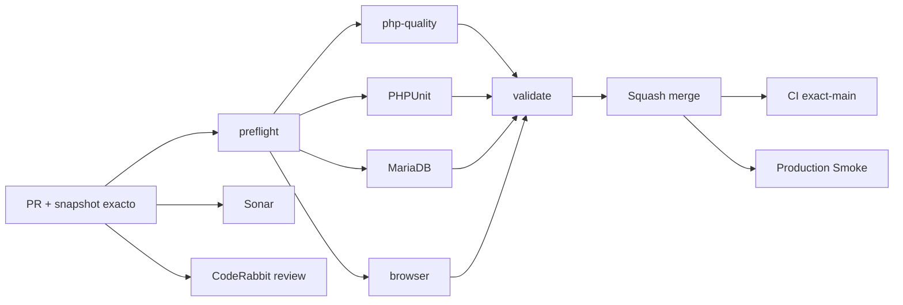

# GrindFlow — Último deploy

  
  
  

> **Development dashboard** · snapshot profesional de **solo el deploy actual**. Implementación, CI, despliegue y producción son evidencias distintas.

## Estado del deploy

| Señal | Estado actual | Evidencia |
| --- | --- | --- |
| Work line | 🟡 **GF-FR-004/005/006 · Workflow integrado** | rama feature; PR pendiente |
| Feature merge SHA | ⚪ **no fusionado** | `main` permanece en `1a33be163ca6e223dfd46650b3ad6fed5a66c74b` |
| CI del PR | ⚪ **pendiente** | se ejecutará sobre el head publicado |
| Sonar | ⚪ **pendiente** | Quality Gate requerido antes de merge |
| CodeRabbit | ⚪ **pendiente** | full review sobre head estable |
| CI del SHA exacto de main | ⚪ **no aplica todavía** | se verifica después del merge |
| Production Smoke | 🟠 **bloqueado por migraciones previas** | no se ejecutan migraciones en esta entrega |
| Migraciones | 🟠 **no ejecutadas en producción** | nueva migración requiere backup, lote revisado y aprobación |

## Huella del cambio

<!-- grindflow:git-delta -->

| Archivos | Inserciones | Eliminaciones | Neto |
| ---: | ---: | ---: | ---: |
| **20** | **+947** | **−77** | **+870** |

La huella se calcula con `git diff --numstat`; CI rechaza este dashboard si queda desactualizado.

## Calidad y entrega

<!-- grindflow:gate-plan -->

| Control | Estado / contrato |
| --- | --- |
| Gates seleccionados | **preflight · fast[contracts] · php-quality · PHPUnit · MariaDB · browser** |
| Local | Node: 206 pruebas, ESLint y build pasaron; PHP no está instalado localmente |
| GrindFlow CI | requerido para Pint, PHPStan, PHPUnit, MariaDB y browser |
| Sonar / CodeRabbit | controles separados, pendientes del PR |
| Migración | solo código y CI; ninguna ejecución productiva autorizada |
| Producción | providers externos, secretos y publicaciones reales permanecen deshabilitados |

## Flujo de entrega

## Qué se hizo

- Scheduling programa un asset en varios destinos de forma atómica e idempotente, revalida destinos bajo lock, filtra por estado/fecha/destino, muestra calendario y permite editar o cancelar trabajos futuros sin entrega.
- Distribution incorpora dashboard tenant-scoped, filtros, KPIs, gestión de destinos y reintento manual con la misma clave de idempotencia.
- El provider `sandbox` es determinista y no usa red, credenciales ni plataformas reales.
- Traffic incorpora filtros por período/canal/campaña, KPIs completos, serie diaria visual y asociaciones a publicaciones marcadas como métrica compartida.
- Se añadieron regresiones para multi-destino/doble envío, edición/cancelación y analítica filtrada.
- La migración nueva solo agrega `request_key`; no se ejecutó en producción.

## Archivos modificados en este deploy

- `README.md` — dashboard exacto.
- `app/Http/Controllers/Distribution/DistributionController.php` — dashboard, destinos y retry.
- `app/Http/Controllers/Scheduling/SchedulerController.php` — filtros y operaciones.
- `app/Http/Controllers/Traffic/TrafficController.php` — analítica filtrada.
- `app/Http/Middleware/RequireDistributionSchema.php` — guardia de schema.
- `app/Http/Requests/Distribution/StoreDestinationRequest.php` — alta validada.
- `app/Http/Requests/Distribution/UpdateDestinationRequest.php` — cambios validados.
- `app/Http/Requests/Scheduling/StoreScheduledPublicationRequest.php` — lote e idempotencia.
- `app/Models/ScheduledPublication.php` — request key.
- `app/Providers/AppServiceProvider.php` — registro sandbox.
- `app/Services/Distribution/SandboxDistributionProvider.php` — adapter sin I/O.
- `app/Services/Scheduling/ContentScheduler.php` — lote, locks, edición y cancelación.
- `database/migrations/2026_09_19_120000_extend_scheduling_workflow.php` — índice aditivo.
- `public/css/grindflow.css` — calendario y gráfica.
- `resources/views/distribution/index.blade.php` — interfaz Distribution.
- `resources/views/scheduling/index.blade.php` — calendario y acciones.
- `resources/views/traffic/index.blade.php` — analítica y asociaciones.
- `routes/web.php` — rutas protegidas.
- `tests/Feature/SchedulingTest.php` — regresiones Scheduling.
- `tests/Feature/TrafficAttributionTest.php` — regresión Traffic.

## Validación

- `npm test`: 206 pruebas aprobadas.
- `npm run lint`: aprobado.
- `npm run build`: aprobado.
- `git diff --check`: aprobado.
- PHP/Pint/PHPStan/PHPUnit/MariaDB/browser: pendientes de GrindFlow CI por ausencia local de PHP/Docker.

## Qué sigue

| Lane | Trabajo |
| --- | --- |
| **NOW** | Publicar PR, corregir CI/Sonar y solicitar CodeRabbit full review. |
| **NEXT** | Fusionar solo con gates verdes y comprobar CI exacto de `main`. |
| **NEXT** | Revisar lote de migraciones; producción exige backup y aprobación explícita. |
| **BLOCKED / EXTERNAL** | Providers reales, credenciales, object storage S3 y FFmpeg. |
| **LATER** | Historial append-only por intento y campaña relacional. |

## Panorama general pendiente

| Lane | Frente | Estado |
| --- | --- | --- |
| **NOW** | Workflow integrado | código implementado; CI remoto pendiente |
| **NEXT** | Entrega | PR, Sonar, CodeRabbit, merge y exact-main |
| **NEXT** | Producción | migraciones solo con backup, lote exacto y aprobación |
| **BLOCKED / EXTERNAL** | Publicación real | providers y credenciales no configurados |
| **LATER** | Métricas avanzadas | campaign entity e historial de intentos |
