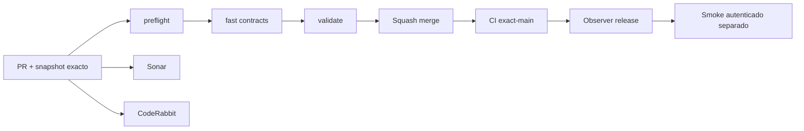

# GrindFlow — Último deploy

> **Candidato v0.1.76: navegación coherente en Symfony.** Base exacta `main` v0.1.75 `6edf72165b45785f9b0acb023347ce157266aab4`. Interfaz aislada; NO implica deploy ni cutover en Hostinger.

## Progress convention
- ✅ ~~Completado~~ = verificado; 🚧 Pendiente = en curso; ⛔ bloqueado = dependencia externa.

## Fuentes de verdad
[AGENTS.md](AGENTS.md) · [Spec](docs/GRINDFLOW-SPEC.md) · [Requisitos](docs/REQUIREMENTS.md) · [Transición](docs/STACK-TRANSITION-SYMFONY.md) · [Roadmap #2](https://github.com/pl0n3r/GrindFlow/issues/2)

## Estado del deploy
| Señal | Estado | Evidencia |
| --- | --- | --- |
| Version objetivo | 🚧 **v0.1.76** | `config/version.php` |
| Base exacta | ✅ ~~main v0.1.75~~ | `6edf72165b45785f9b0acb023347ce157266aab4` |
| CI del PR | 🚧 Head v0.1.76 por validar | `GrindFlow CI / validate` |
| Sonar | 🚧 Pendiente del head estable | SonarCloud PR |
| CodeRabbit | 🚧 Pendiente del head estable | PR |
| CI del SHA exacto de main | ✅ ~~v0.1.75 success~~ | run `35662263071` |
| Deploy Observer | ✅ ~~v0.1.75 release observado~~ | run `35662263082`; versión humana, NO SHA Hostinger |
| Production Smoke | ⛔ Credencial E2E productiva pendiente | run `35662263001`; [Issue #1](https://github.com/pl0n3r/GrindFlow/issues/1) |
| Symfony en Hostinger | ⛔ NO desplegado | Solo entorno aislado CI |
| Migraciones | 🚧 Ninguna migración nueva en este candidato | Producción intacta |

## Huella del cambio
<!-- grindflow:git-delta -->
| Archivos | Inserciones | Eliminaciones | Neto |
| ---: | ---: | ---: | ---: |
| **9** | **+196** | **−62** | **+134** |

## Calidad y entrega
<!-- grindflow:gate-plan -->
| Control | Estado / contrato |
| --- | --- |
| Gates seleccionados | **preflight · fast[contracts] · symfony-preview** |
| Alcance | GF-UX-001: componente único de navegación React + escritorio/tablet/móvil + foco y skip link |
| Revisiones | CI/Sonar/CodeRabbit, exact-main y Hostinger independientes |

## Flujo de entrega

## Qué se hizo
- Componente `WorkspaceNavigation` compartido por preview conceptual y admin real: marca, etiqueta de espacio, números, secciones, estados activos y pie contextual.
- Menús sincronizados a breakpoint de 900 px, con barra horizontal desplazable dentro del menú a 820/360 px y rail más compacto a 901–1120 px, sin agrandar el documento.
- Admin: accesos «Biblioteca» y «Programación» conservan anclas reales, «Resumen» expone página activa, y «Saltar al contenido» llega al `main` correcto.
- Acciones de sesión fuera de posicionamiento absoluto sobre la cabecera. Estados accesibles en preview mediante `aria-pressed`, en admin mediante `aria-current`; pruebas Chromium a 820 y 360 px.
- No hay publicación externa ni cambios productivos. Los módulos S4 y la biblioteca no alteran sus contratos.

## Archivos modificados en este deploy
Inventario de solo el deploy actual candidato; no prueba despliegue Symfony en Hostinger.
- `README.md`
- `config/version.php`
- `docs/REQUIREMENTS.md`
- `symfony/frontend/admin/AdminApp.tsx`
- `symfony/frontend/admin/PreviewApp.tsx`
- `symfony/frontend/admin/WorkspaceNavigation.tsx`
- `symfony/frontend/admin/main.tsx`
- `symfony/frontend/admin/workspace-navigation.css`
- `symfony/tests/e2e/preview.spec.mjs`

## Validación
- CI/Sonar/CodeRabbit del candidato v0.1.76 aún sin confirmar.
- `symfony-preview` debe ejecutar PHPUnit/MariaDB, TypeScript/Vite y Chromium real a 360/820 px. No se ha probado el proyecto localmente en esta entrega.

## Qué sigue
[Roadmap canónico #2](https://github.com/pl0n3r/GrindFlow/issues/2)

| Lane | Trabajo | Estado |
| --- | --- | --- |
| **NOW** | 🚧 Validar navegación consistente v0.1.76 | 🚧 CI y revisión |
| **NEXT** | 🚧 Seguir S4 con evidencia interna y preparación operativa | 🚧 Sin proveedor real |
| **LATER** | 🚧 Distribution + Traffic Symfony | 🚧 Sin cutover |
| **BLOCKED / EXTERNAL** | ⛔ Cutover sin paridad/datos migrados; Smoke sin credencial | ⛔ Dependencia externa |

## Panorama general pendiente
| Lane | Frente | Estado |
| --- | --- | --- |
| **DONE** | ✅ ~~S4 cola y destinos manuales v0.1.74~~ | ✅ ~~CI exact-main v0.1.75~~ |
| **NOW** | 🚧 Navegación unificada v0.1.76 | 🚧 Pruebas y revisión |
| **NEXT** | 🚧 S4 preparación operativa | 🚧 Sin proveedor real |
| **LATER** | 🚧 Distribución + Traffic Symfony | 🚧 S4–S5 |
| **BLOCKED / EXTERNAL** | ⛔ Sin cutover Symfony | ⛔ Sin credencial Smoke |
