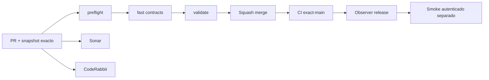

# GrindFlow — Último deploy

> **Snapshot v0.1.43: corrección visual del menú Laravel, sin fuentes de iconos ni glifos decorativos.** Base `main` v0.1.42 `58cbc80153eb2492d1db33f3b57595b10cbea86c`. Los ocho menús de workspace usan etiquetas legibles en español; versión de stylesheet renovada por `config/version.php`. Symfony permanece aislado; el release humano no prueba un deploy remoto.

## Progress convention
- ✅ ~~Completado~~ = verificado; 🚧 Pendiente = en curso; ⛔ bloqueado = dependencia externa.

## Fuentes de verdad
[AGENTS.md](AGENTS.md) · [Spec](docs/GRINDFLOW-SPEC.md) · [Requisitos](docs/REQUIREMENTS.md) · [Transición](docs/STACK-TRANSITION-SYMFONY.md) · [Roadmap #2](https://github.com/pl0n3r/GrindFlow/issues/2)

## Estado del deploy
| Señal | Estado | Evidencia |
| --- | --- | --- |
| Version objetivo | 🚧 **v0.1.43** | `config/version.php` |
| Base exacta | ✅ ~~main v0.1.42~~ | `58cbc80153eb2492d1db33f3b57595b10cbea86c` |
| CI del PR | 🚧 Head final pendiente | `GrindFlow CI / validate` |
| Sonar | 🚧 Pendiente | SonarCloud PR |
| CodeRabbit | 🚧 Revisión por comprobar | PR |
| CI del SHA exacto de main | 🚧 Después del merge | CI PR no lo sustituye |
| Deploy Observer | 🚧 Release humano por observar | No prueba Symfony en remoto |
| Production Smoke | ⛔ Credencial E2E productiva pendiente | [Issue #1](https://github.com/pl0n3r/GrindFlow/issues/1) |
| Symfony S1 en Hostinger | ⛔ NO desplegado | Solo entorno aislado CI |
| Migraciones | ✅ ~~Ningún esquema productivo modificado~~ | DB Symfony descartable |

## Huella del cambio
<!-- grindflow:git-delta -->
| Archivos | Inserciones | Eliminaciones | Neto |
| ---: | ---: | ---: | ---: |
| **13** | **+000** | **−000** | **+000** |

## Calidad y entrega
<!-- grindflow:gate-plan -->
| Control | Estado / contrato |
| --- | --- |
| Gates seleccionados | **preflight · fast[contracts] · php-quality · PHPUnit · browser · real-stack** |
| Alcance | Laravel: etiquetas de navegación textuales en todas las vistas del workspace; sin glifos dependientes de fuentes |
| Revisiones | CI/Sonar/CodeRabbit, exact-main y Hostinger son independientes |

## Flujo de entrega

## Qué se hizo
- Se retiraron los caracteres usados como iconos del menú lateral Laravel en Dashboard, Vault, Scheduling, Distribution, Traffic, Finance, System y Diagnostics, también en opciones sin permiso.
- Menú exclusivamente textual y en español: Resumen, Biblioteca, Programación, Distribución, Tráfico, Finanzas, Sistema y Diagnósticos.
- CSS de navegación simplificado con blancos de 44 px y tipografía legible; no se agregó ningún paquete ni fuente externa.
- PHPUnit comprueba las ocho plantillas y sus etiquetas; el navegador E2E autenticado verifica los textos del Dashboard y la ausencia de iconos Unicode. Sin cambios en rutas, permisos ni bases de datos.

## Archivos modificados en este deploy
- `README.md`
- `config/version.php`
- `public/css/grindflow.css`
- `resources/views/admin/diagnostics.blade.php`
- `resources/views/admin/system.blade.php`
- `resources/views/dashboard.blade.php`
- `resources/views/distribution/index.blade.php`
- `resources/views/finance/index.blade.php`
- `resources/views/scheduling/index.blade.php`
- `resources/views/traffic/index.blade.php`
- `resources/views/vault/index.blade.php`
- `tests/Browser/workflow-template.html`
- `tests/Feature/NavigationLabelsTest.php`

## Validación
- CI PHPUnit/Blade, navegador real y Sonar del PR; CI exact-main y Hostinger se comprueban por separado.
- El cambio afecta las vistas del runtime Laravel, no Symfony ni datos productivos.

## Qué sigue
[Roadmap canónico #2](https://github.com/pl0n3r/GrindFlow/issues/2)

| Lane | Trabajo | Estado |
| --- | --- | --- |
| **NOW** | 🚧 Validar menú textual Laravel v0.1.43 | 🚧 CI y revisión |
| **NEXT** | 🚧 Almacenamiento durable, backup y purga con política explícita | 🚧 Después de corregir navegación |
| **LATER** | 🚧 Vault móvil → reglas → distribución autorizada → piloto | 🚧 Planificado |
| **BLOCKED / EXTERNAL** | ⛔ Cutover sin paridad/datos migrados; Smoke sin credencial | ⛔ Dependencia externa |

## Panorama general pendiente
| Lane | Frente | Estado |
| --- | --- | --- |
| **DONE** | ✅ ~~Dashboard Laravel v0.1.30~~ | ✅ ~~Esquema Symfony S1 v0.1.31~~ |
| **NOW** | 🚧 Validar menú textual Laravel v0.1.43 | 🚧 CI y revisión |
| **NEXT** | 🚧 Deduplicación y gestión de retención | 🚧 Después de validar papelera |
| **LATER** | 🚧 Automatización de contenido | 🚧 S2–S5 |
| **BLOCKED / EXTERNAL** | ⛔ Sin cutover Symfony | ⛔ Sin credencial Smoke |
