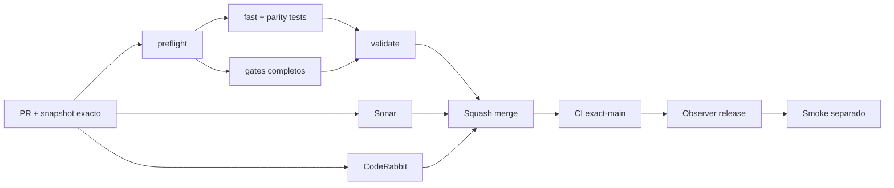

# GrindFlow — Último deploy

> **Candidato v0.1.102: límites JSON reutilizables en renombres Symfony.** Base exacta `main` v0.1.101 `42774544eb1ff24f710eade753c7ba1dd95e66b4`; conserva permisos y CSRF y rechaza cargas excesivas sin mutar nombres.

## Progress convention
- ✅ ~~Completado~~ = verificado; 🚧 Pendiente = en curso; ⛔ bloqueado = dependencia externa.

## Fuentes de verdad
[AGENTS.md](AGENTS.md) · [Spec](docs/GRINDFLOW-SPEC.md) · [Requisitos](docs/REQUIREMENTS.md) · [Transición](docs/STACK-TRANSITION-SYMFONY.md) · [Roadmap #2](https://github.com/pl0n3r/GrindFlow/issues/2)

## Estado del deploy
| Señal | Estado | Evidencia |
| --- | --- | --- |
| Version objetivo | 🚧 **v0.1.102** | `config/version.php`; no publicada |
| Base exacta | ✅ ~~main v0.1.101~~ | `42774544eb1ff24f710eade753c7ba1dd95e66b4` |
| CI del PR | 🚧 Pendiente | Exigir `validate` del HEAD final |
| Sonar del PR | 🚧 Pendiente | Exigir Quality Gate del HEAD final |
| CodeRabbit del PR | 🚧 Pendiente | Exigir full review del HEAD final |
| CI del SHA exacto de main | ✅ **VALIDATED IN CODE** | `35806401819` success sobre `42774544eb1ff24f710eade753c7ba1dd95e66b4` |
| Deploy Observer | 🚧 Pendiente | No inferir checkout remoto |
| Production Smoke | ⛔ Login E2E no validado | `35806401786` failure, #73; independiente de esta mejora |
| Symfony en Hostinger | ⛔ NO desplegado | Sin cutover |
| Datos productivos | ✅ ~~No tocados~~ | Pruebas en Symfony/MariaDB descartable; sin cambio de cuentas reales |

## Huella del cambio
<!-- grindflow:git-delta -->
| Archivos | Inserciones | Eliminaciones | Neto |
| ---: | ---: | ---: | ---: |
| **8** | **+0** | **−0** | **+0** |

## Calidad y entrega
<!-- grindflow:gate-plan -->
| Control | Estado / contrato |
| --- | --- |
| Gates seleccionados | **preflight · fast[operational contracts + automation syntax + README dashboard] · symfony-preview** |
| Gate agregador obligatorio | **validate**: todos los seleccionados; Sonar y CodeRabbit aparte |
| Alcance | GF-SEC-007: límites JSON para renombres de perfil/organización |
| Revisiones | CI/Sonar/CodeRabbit HEAD; exact-main, Observer y Smoke separados |

## Flujo de entrega

## Qué se hizo
- Nuevo lector `BoundedJsonBody`: rechaza `Content-Length` decimal superior a 4.096 bytes; lee máximo 4.097 bytes reales y limita la profundidad JSON a 16.
- Los endpoints Symfony de renombre personal y organización lo reutilizan **después** de las comprobaciones de identidad, rol/tenant y CSRF ya existentes.
- Regresiones PHPUnit con cuentas y organizaciones descartables: 4.097 bytes con cabecera falsa, longitud declarada excesiva, anidación >16 con clave duplicada, límite de 4.096 bytes y ausencia de modificaciones tras rechazos.
- Requisito GF-SEC-007 independiente del login y de GF-SEC-005; sin cambios en Laravel, secretos, usuarios reales, Hostinger o migraciones productivas.

## Archivos modificados en esta entrega candidata
Inventario de solo esta entrega candidata: no constituye evidencia de publicación:
<!-- grindflow:changed-files -->
- `README.md`
- `config/version.php`
- `docs/REQUIREMENTS.md`
- `symfony/src/Http/BoundedJsonBody.php`
- `symfony/src/Http/Controller/AdminContextController.php`
- `symfony/src/Http/Controller/ProfileController.php`
- `symfony/tests/php/OrganizationSettingsTest.php`
- `symfony/tests/php/ProfileSettingsTest.php`

## Validación
- Exigir `validate`, Sonar y full review CodeRabbit del HEAD final; después, CI exact-main.
- El gate `symfony-preview` incluye PHPUnit HTTP contra MariaDB descartable y Chromium aislado.
- El release no demuestra deployment de Symfony ni resuelve el Production Smoke de Laravel #73.

## Qué sigue
[Roadmap canónico #2](https://github.com/pl0n3r/GrindFlow/issues/2)

| Lane | Trabajo | Estado |
| --- | --- | --- |
| **NOW** | 🚧 Límites del renombre personal y organizacional | 🚧 v0.1.102 candidata |
| **NEXT** | 🚧 Verificación autorizada de cuenta E2E | 🚧 #2 |
| **LATER** | 🚧 Conmutación Symfony por módulo | 🚧 Sin deploy |
| **BLOCKED / EXTERNAL** | ⛔ Resolver login E2E productivo | ⛔ #2 |

## Panorama general pendiente
| Lane | Frente | Estado |
| --- | --- | --- |
| **DONE** | ✅ ~~v0.1.101 fusionada~~ | ✅ ~~guardas JSON de contraseña Symfony~~ |
| **NOW** | 🚧 Límites JSON para renombres | 🚧 v0.1.102 |
| **NEXT** | 🚧 Evidencia revisada fuera de banda + autorización separada | 🚧 GF-ARCH-002 sin cutover |
| **LATER** | 🚧 Symfony en Hostinger | 🚧 No desplegado |
| **BLOCKED / EXTERNAL** | ⛔ Smoke autenticado Laravel | ⛔ #2 |
