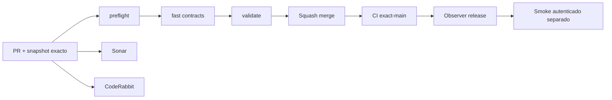

# GrindFlow — Último deploy

> **Snapshot v0.1.37: solo el deploy actual, perfil personal Symfony S1 en código, aún sin despliegue Symfony.** Base `main` v0.1.36 `429532ca177998c26a2a7de49722ee4639140237`. Usuario autenticado puede editar el nombre de su perfil sin permisos sobre su organización; CSRF propio, validación servidor y datos reales en MariaDB aislada. Laravel sigue como runtime; **Symfony no está desplegado ni se migraron cuentas**.

## Progress convention
- ✅ ~~Completado~~ = verificado; 🚧 Pendiente = en curso; ⛔ bloqueado = dependencia externa.

## Fuentes de verdad
[AGENTS.md](AGENTS.md) · [Spec](docs/GRINDFLOW-SPEC.md) · [Requisitos](docs/REQUIREMENTS.md) · [Transición](docs/STACK-TRANSITION-SYMFONY.md) · [Roadmap #2](https://github.com/pl0n3r/GrindFlow/issues/2)

## Estado del deploy
| Señal | Estado | Evidencia |
| --- | --- | --- |
| Version objetivo | 🚧 **v0.1.37** | `config/version.php` |
| Base exacta | ✅ ~~main v0.1.36~~ | `429532ca177998c26a2a7de49722ee4639140237` |
| CI del PR | 🚧 Head final pendiente | `GrindFlow CI / validate` |
| Sonar | 🚧 Pendiente | SonarCloud PR |
| CodeRabbit | 🚧 Revisión por comprobar | PR |
| CI del SHA exacto de main | 🚧 Después del merge | CI PR no lo sustituye |
| Deploy Observer | 🚧 Release humano por observar | No prueba Symfony en remoto |
| Production Smoke | ⛔ Credencial E2E productiva pendiente | [Issue #1](https://github.com/pl0n3r/GrindFlow/issues/1) |
| Symfony S1 en Hostinger | ⛔ NO desplegado | Solo entorno aislado CI |
| Migraciones | ✅ ~~Ningún esquema productivo modificado~~ | DB Symfony descartable |

## Huella del cambio
<!-- grindflow:git-delta -->
| Archivos | Inserciones | Eliminaciones | Neto |
| ---: | ---: | ---: | ---: |
| **10** | **+374** | **−29** | **+345** |

## Calidad y entrega
<!-- grindflow:gate-plan -->
| Control | Estado / contrato |
| --- | --- |
| Gates seleccionados | **preflight · fast[contracts] · symfony-preview** |
| Alcance | Perfil propio React y API real con CSRF, pruebas de usuario ajeno/revocación y móvil |
| Revisiones | CI/Sonar/CodeRabbit, exact-main y Hostinger son independientes |

## Flujo de entrega

## Qué se hizo
- Formulario real de perfil propio visible en panel React incluso con rol editor, sin otorgar permisos de administración de organización.
- POST JSON solo con `name`: actor derivado de sesión, CSRF independiente, 401/403/422 explícitos y cuenta activa revalidada en SQL.
- Contexto Symfony consulta el nombre vigente para evitar mostrar identidad desactualizada después de guardar.
- Pruebas PHPUnit/Chromium para CSRF, IDs ajenos, cuentas revocadas y experiencia móvil y navegación responsive sin desborde horizontal. Sin migraciones ni cutover.

## Archivos modificados en este deploy
- `README.md`
- `config/version.php`
- `symfony/README.md`
- `symfony/frontend/admin/AdminApp.tsx`
- `symfony/frontend/admin/admin.css`
- `symfony/src/Http/Controller/AdminContextController.php`
- `symfony/src/Http/Controller/ProfileController.php`
- `symfony/src/Identity/Application/MembershipContext.php`
- `symfony/tests/e2e/preview.spec.mjs`
- `symfony/tests/php/ProfileSettingsTest.php`

## Validación
- PHPUnit aislado comprueba cuenta propia/ajena, CSRF, nombre inválido, sesión revocada y persistencia. Chromium comprueba formulario y API anónima.
- CI de PR, Sonar/CodeRabbit, CI exact-main y Hostinger se verifican independientemente.

## Qué sigue
| Lane | Trabajo |
| --- | --- |
| **NOW** | 🚧 Validar perfil personal S1 v0.1.37, [roadmap #2](https://github.com/pl0n3r/GrindFlow/issues/2) |
| **NEXT** | 🚧 Vault móvil real con contexto tenant-safe |
| **LATER** | 🚧 Vault móvil → reglas → distribución autorizada → piloto |
| **BLOCKED / EXTERNAL** | ⛔ Cutover sin paridad/datos migrados; Smoke sin credencial |

## Panorama general pendiente
| Lane | Frente | Estado |
| --- | --- | --- |
| **DONE** | ✅ ~~Dashboard Laravel v0.1.30~~ | ✅ ~~Esquema Symfony S1 v0.1.31~~ |
| **NOW** | 🚧 Perfil personal S1 v0.1.37 | 🚧 CI y revisión |
| **NEXT** | 🚧 Vault móvil | 🚧 S2 |
| **LATER** | 🚧 Automatización de contenido | 🚧 S2–S5 |
| **BLOCKED / EXTERNAL** | ⛔ Sin cutover Symfony | ⛔ Sin credencial Smoke |
