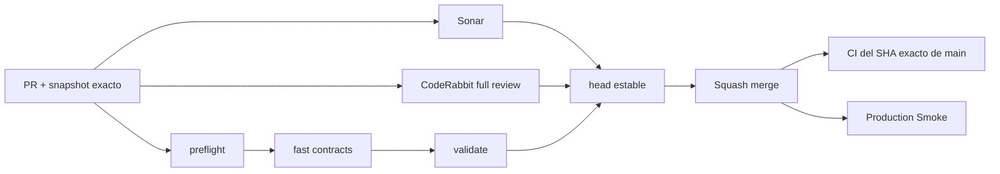

# GrindFlow — Último deploy

  
  
  

> **Development dashboard** · snapshot profesional de **solo el deploy actual**. CI, deploy y validacion en produccion son evidencias distintas.

## Estado del deploy

| Señal | Estado actual | Evidencia |
| --- | --- | --- |
| Work line | 🟠 **Production Smoke 403 diagnostics** | smoke endurecido; PR/CI pendientes |
| Base exacta | ✅ **main** | `aa9d3b0fd634b9b49834638d5014a29ab5feb4c5` |
| CI de main | ✅ **verde** | run #217 completo sobre el SHA exacto |
| Migraciones | ✅ **0 pendientes** | bridge #35397783306: `pending_before=1`, `pending_after=0` |
| Produccion | 🟠 **no validada aun** | rerun del smoke llega a HTTP 403 en `/up` y `/login` |

## Huella del cambio

<!-- grindflow:git-delta -->

| Archivos | Inserciones | Eliminaciones | Neto |
| ---: | ---: | ---: | ---: |
| **2** | **+119** | **−57** | **+62** |

La huella se calcula con `git diff --numstat`; CI rechaza este dashboard si queda desactualizado.

## Calidad y entrega

<!-- grindflow:gate-plan -->

| Control | Estado / contrato |
| --- | --- |
| Gates seleccionados | **preflight · fast[contracts]** |
| GrindFlow CI | `validate` exige success real para cada gate seleccionado |
| Sonar | reporter estable de detalles completos del PR cuando aplica |
| CodeRabbit | revision full sobre el head estable |
| Exact-main | CI vuelve a validar el SHA exacto despues del squash merge |
| Produccion | Production Smoke sigue separado del source CI |

## Flujo de entrega

## Qué se hizo

- Confirma que la migracion de produccion termino con cero pendientes.
- Separa los incidentes Laravel historicos del bloqueo HTTP 403 actual.
- Centraliza todas las llamadas HTTP del smoke en `curl_common`.
- Usa un User-Agent compatible con navegador e identificable como `GrindFlowProductionSmoke/1.0`.
- Hace fail-fast en `/up` y en el GET de `/login` en vez de continuar con errores encadenados.
- Cuando falla un endpoint publico, conserva solo headers seguros y una muestra corta del body en el artefacto privado de diagnostico.
- Mantiene fuera del issue publico cookies, credenciales y payloads sensibles.

## Archivos modificados en este deploy

- `README.md` — snapshot exacto del diagnostico y delivery actual.
- `scripts/production-smoke.sh` — requests consistentes, fail-fast y diagnostico HTTP seguro.

## Validación

- Estado actual: **IMPLEMENTED** en la rama `fix/production-smoke-403-diagnostics`.
- Base: `aa9d3b0fd634b9b49834638d5014a29ab5feb4c5`.
- La migracion de produccion ya esta aplicada y reporta cero pendientes.
- El rerun anterior del Production Smoke fallo 15/15 veces por HTTP 403 antes de llegar a las comprobaciones autenticadas.
- Este cambio no modifica esquema, datos, autenticacion ni reglas tenant.
- Antes del merge se exige `preflight + fast[contracts]`, revision externa aplicable y recheck del SHA de `main`.

## Qué sigue

| Lane | Trabajo |
| --- | --- |
| **NOW** | Validar el smoke endurecido en PR y usar su artefacto para identificar la capa exacta que devuelve 403. |
| **NEXT** | Si el User-Agent resuelve el bloqueo, merge + Production Smoke sobre el SHA exacto; si no, usar headers/body seguros para aislar WAF/hosting. |
| **BLOCKED / EXTERNAL** | Acceso directo al panel/WAF de Hostinger no esta disponible desde este conector; object storage real sigue operacional. |
| **LATER** | Continuar GF-FR-003 con derivados/probe multimedia/FFmpeg y despues P2. |

## Panorama general pendiente

| Lane | Frente | Estado |
| --- | --- | --- |
| **NOW** | Production Smoke | diagnostico 403 endurecido |
| **NEXT** | Media processing | foundation VALIDATED IN CODE; derivados/FFmpeg pendientes |
| **NEXT** | Media Vault produccion | migraciones al dia; smoke de produccion pendiente |
| **BLOCKED / EXTERNAL** | Hosting / storage | WAF/acceso y object storage requieren evidencia/configuracion externa |
| **LATER** | Operacion | queues, scheduler, retries y backups |
| **LATER** | Legacy retirement | solo tras GF-MIG-003 / GF-MIG-004 |
| **LATER** | Producto P2 | distribucion, atribucion y finanzas |
