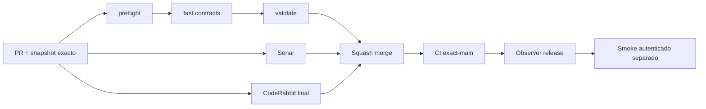

# GrindFlow — Último deploy

> **Candidato v0.1.84: continuidad anónima tras un intento E2E rechazado.** Base exacta `main` v0.1.83 `2c6ab470ae941aff183049dd493e781a9b3afba6`; no modifica usuarios, secretos, MariaDB ni despliega Symfony.

## Progress convention
- ✅ ~~Completado~~ = verificado; 🚧 Pendiente = en curso; ⛔ bloqueado = dependencia externa.

## Fuentes de verdad
[AGENTS.md](AGENTS.md) · [Spec](docs/GRINDFLOW-SPEC.md) · [Requisitos](docs/REQUIREMENTS.md) · [Transición](docs/STACK-TRANSITION-SYMFONY.md) · [Roadmap #2](https://github.com/pl0n3r/GrindFlow/issues/2)

## Estado del deploy
| Señal | Estado | Evidencia |
| --- | --- | --- |
| Version objetivo | 🚧 **v0.1.84** | `config/version.php` |
| Base exacta | ✅ ~~main v0.1.83~~ | `2c6ab470ae941aff183049dd493e781a9b3afba6` |
| CI / Sonar / CodeRabbit del PR | 🚧 Pendientes para HEAD final | No heredar gates previos |
| CI del SHA exacto de main | ✅ ~~v0.1.83 success~~ | run `35689866959` |
| Deploy Observer | ✅ ~~v0.1.83 observado~~ | run `35689866963`, versión humana; NO SHA Hostinger |
| Production Smoke | ⛔ Login E2E devuelve /login | run `35689866922`, [#73](https://github.com/pl0n3r/GrindFlow/issues/73) |
| Symfony en Hostinger | ⛔ NO desplegado | Solo CI aislado |
| Migraciones | ✅ ~~Sin cambio de esquema~~ | Producción intacta |

## Huella del cambio
<!-- grindflow:git-delta -->
| Archivos | Inserciones | Eliminaciones | Neto |
| ---: | ---: | ---: | ---: |
| **4** | **+0** | **−0** | **+0** |

## Calidad y entrega
<!-- grindflow:gate-plan -->
| Control | Estado / contrato |
| --- | --- |
| Gates seleccionados | **preflight · fast[contracts]** |
| Gate agregador obligatorio | **validate**: todos los seleccionados; Sonar y CodeRabbit aparte |
| Alcance | Un GET seguro después de redirect /login, sin repetir el POST |
| Revisiones | CI/Sonar/CodeRabbit del mismo HEAD, CI exact-main, Observer y Smoke separados |

## Flujo de entrega

## Qué se hizo
- El [Smoke v0.1.83](https://github.com/pl0n3r/GrindFlow/actions/runs/35689866922) confirmó dos GET anónimos con CSRF consistente, luego un único POST que retornó a `/login`. Esto no identifica la causa ni demuestra que el login funcione.
- Solo si el POST retorna 302/303 al `/login` local, el smoke hace **un GET adicional sin credenciales** con la misma cookie jar. Compara en privado el CSRF posterior con el usado en el POST y emite exclusivamente `LOGIN_FAILURE_SESSION_CHECK=stable|changed|unavailable`. La ausencia/cambio de token **no demuestra** contraseña incorrecta o sesión rota por sí solo.
- Se preservan salida 7, un único POST, cero accesos al dashboard después del rechazo y ninguna impresión de CSRF, cookies, URL privadas o cuerpos remotos. Ninguna operación productiva de usuario/DB.
- Contratos mock verifican los tres resultados, 3 GET solo en esa rama, 2 GET en las otras y que solo se emite un marcador por fallo sin revelar tokens ni reintentar credenciales.

## Archivos modificados en este deploy
Inventario del candidato v0.1.84, no evidencia de publicación; solo el deploy actual.
- `README.md`
- `config/version.php`
- `scripts/production-smoke-contract.sh`
- `scripts/production-smoke.sh`

## Validación
- CI/Sonar/CodeRabbit de v0.1.84 deben ejecutarse en su HEAD final; la CI exact-main 35689866959 solo prueba v0.1.83. El contrato nunca usa credenciales productivas.
- El Smoke posterior al merge, incluso con `stable`, seguirá bloqueado si el POST regresa a `/login`; el estado de cuenta y secretos requiere revisión por operador autorizado sin reintentos ciegos.

## Qué sigue
[Roadmap canónico #2](https://github.com/pl0n3r/GrindFlow/issues/2)

| Lane | Trabajo | Estado |
| --- | --- | --- |
| **NOW** | 🚧 Diagnóstico CSRF tras fallo v0.1.84 | 🚧 PR/gates |
| **NEXT** | 🚧 Verificar origen de rechazo E2E #73 | 🚧 No inferir causa de marcador |
| **LATER** | 🚧 Paridad Symfony en entorno aislado | 🚧 Sin cutover |
| **BLOCKED / EXTERNAL** | ⛔ Smoke autenticado #73 | ⛔ Revisión autorizada de cuenta/configuración |

## Panorama general pendiente
| Lane | Frente | Estado |
| --- | --- | --- |
| **DONE** | ✅ ~~v0.1.83 fusionada y CI exact-main success~~ | ✅ ~~Observer v0.1.83 humana success~~ |
| **NOW** | 🚧 Una lectura adicional tras login rechazado | 🚧 Candidato v0.1.84 |
| **NEXT** | 🚧 Diagnóstico de autenticación E2E | 🚧 Sin modificar credenciales |
| **LATER** | 🚧 Transición Symfony | 🚧 No desplegada |
| **BLOCKED / EXTERNAL** | ⛔ Validación productiva autenticada | ⛔ Causa login pendiente |
