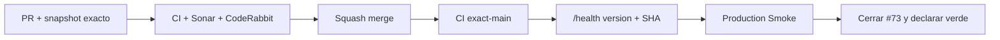

# GrindFlow — Último deploy

> **Candidato v0.1.121: recuperación de Production Smoke y prueba exacta de despliegue.** Base exacta main v0.1.120 `cd871630d427f97a09d9e6e8befdd4e85e1d7a05`. #121 corrige el aprovisionamiento de la identidad sintética y #73 sigue abierto hasta que producción quede validada.

## Progress convention
- ✅ ~~Completado~~ = verificado; 🚧 Pendiente = en curso; ⛔ bloqueado = dependencia externa.

## Fuentes de verdad
[AGENTS.md](AGENTS.md) · [Spec](docs/GRINDFLOW-SPEC.md) · [Requisitos](docs/REQUIREMENTS.md) · [Transición](docs/STACK-TRANSITION-SYMFONY.md) · [Roadmap #2](https://github.com/pl0n3r/GrindFlow/issues/2)

## Estado del deploy
| Señal | Estado | Evidencia |
| --- | --- | --- |
| Version objetivo | 🚧 **v0.1.121** | `config/version.php`; candidata |
| Base exacta | ✅ ~~main v0.1.120~~ | `cd871630d427f97a09d9e6e8befdd4e85e1d7a05` |
| CI del PR | 🚧 pendiente | validar HEAD final |
| Sonar del PR | 🚧 pendiente | Quality Gate del HEAD final |
| CodeRabbit del PR | 🚧 pendiente | máximo 3 rondas |
| CI del SHA exacto de main | ✅ ~~success~~ | #35917304166 sobre `cd871630…` |
| Production Smoke base | ⛔ #73 | #35917304261 failure |
| Producción objetivo | 🚧 pendiente | /health exacto + flujo autenticado |

## Huella del cambio
<!-- grindflow:git-delta -->
| Archivos | Inserciones | Eliminaciones | Neto |
| ---: | ---: | ---: | ---: |
| **16** | **+820** | **−68** | **+752** |

## Calidad y entrega
<!-- grindflow:gate-plan -->
| Control | Estado / contrato |
| --- | --- |
| Gates seleccionados | **preflight · fast[operational contracts + automation syntax + README dashboard] · php-quality · PHPUnit · MariaDB · browser · real-stack · legacy** |
| Gate agregador obligatorio | **validate**: todos los seleccionados; Sonar y CodeRabbit aparte |
| Alcance | #121/#73: identidad sintética, post-deploy, health exacto y Smoke |
| Rol del PR | **SRE · Backend Laravel · Application Security** |
| Revisiones | máximo 3 rondas automáticas; sin polling |

## Flujo de entrega

## Qué se hizo
- `grindflow:provision-smoke-user` reconcilia solo `@grindflow.test`, exige `APP_PHASE=construccion`, toma lock de filesystem y realiza backup cifrado privado antes de crear o mutar la fila sintética.
- La cuenta no recibe memberships; usa `platform_role=admin` únicamente porque `/admin/system` exige ese rol. Contraseña/hash/email nunca se imprimen.
- El comando corre en `deploy-hostinger.sh`, en el primer request que observa un release nuevo y como reconciliación del scheduler productivo.
- `/health` responde 200 solo si puede demostrar versión y SHA Git exactos; Production Smoke compara ese SHA con `main` antes de gastar un intento de login y valida también home, login y dashboard.
- Contrato de entorno: `SMOKE_USER_PASSWORD` en Hostinger debe coincidir con el secret GitHub `PRODUCTION_E2E_PASSWORD`.

## Archivos modificados en esta entrega candidata
Inventario del diff exacto:
<!-- grindflow:changed-files -->
- `.env.example`
- `.github/workflows/production-smoke.yml`
- `README.md`
- `app/Console/Commands/ProvisionSmokeUser.php`
- `app/Support/Deployment/CheckoutIdentity.php`
- `config/grindflow.php`
- `config/version.php`
- `docs/DEPLOY-HOSTINGER.md`
- `public/index.php`
- `routes/console.php`
- `routes/web.php`
- `scripts/deploy-hostinger.sh`
- `scripts/production-smoke-contract.sh`
- `scripts/production-smoke.sh`
- `tests/Feature/HealthIdentityTest.php`
- `tests/Feature/ProvisionSmokeUserCommandTest.php`

## Validación
- Tests del comando: ausencia de secreto, dominio sintético, creación, idempotencia, backup cifrado previo y redacción de salida.
- Tests de health: refs loose/packed/detached, 200 exacto sin DB y 503 fail-closed sin SHA.
- Contrato Smoke: health exacto, home y flujo autenticado; fallos de identidad no consumen login.
- Producción solo se declara verde con evidencia de los cinco criterios del dueño.

## Qué sigue
[Roadmap canónico #2](https://github.com/pl0n3r/GrindFlow/issues/2)

## Panorama general pendiente
| Lane | Frente | Estado |
| --- | --- | --- |
| **NOW** | 🚧 #121 + #73: recuperar Production Smoke | 🚧 v0.1.121 |
| **NEXT** | 🚧 CI exact-main + validación productiva | 🚧 tras merge |
| **BLOCKED / EXTERNAL** | ⛔ Ninguno asumido | ⛔ se determina por evidencia |
| **LATER** | 🚧 Roadmap de producto | 🚧 solo después de producción verde |
