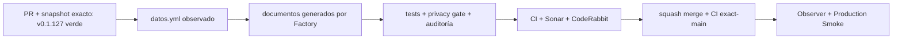

# GrindFlow — Último deploy

> **Candidato v0.1.128: privacidad como código.** Base productiva exacta `main` v0.1.127 `9a166705781835a9caa4bfb00573b4290cb29f23`, con CI exact-main, CodeQL, Sonar, Deploy Observer y Production Smoke en `success`. #149 incorpora un mapa técnico auditable sin declarar aprobación jurídica.

## Progress convention
- ✅ ~~Completado~~ = verificado; 🚧 Pendiente = en curso; ⛔ bloqueado = dependencia externa.

## Fuentes de verdad
[AGENTS.md](AGENTS.md) · [Spec](docs/GRINDFLOW-SPEC.md) · [Requisitos](docs/REQUIREMENTS.md) · [Roadmap #2](https://github.com/pl0n3r/GrindFlow/issues/2)

## Estado del deploy
| Señal | Estado | Evidencia |
| --- | --- | --- |
| Version objetivo | 🚧 **v0.1.128** | `config/version.php`; candidata |
| Base exacta | ✅ ~~main v0.1.127~~ | `9a166705781835a9caa4bfb00573b4290cb29f23` |
| CI del SHA exacto de main (base) | ✅ ~~success~~ | GrindFlow CI `36027875895` |
| Deploy Observer base | ✅ ~~success~~ | run `36027875891` |
| Production Smoke base | ✅ ~~success~~ | run `36027875912`; versión/SHA exactos |
| CI/Sonar/CodeRabbit del PR | 🚧 pendiente | exigen HEAD final |
| Producción objetivo | 🚧 pendiente | merge, exact-main, observer y smoke |

## Huella del cambio
<!-- grindflow:git-delta -->
| Archivos | Inserciones | Eliminaciones | Neto |
| ---: | ---: | ---: | ---: |
| **9** | **+612** | **−33** | **+579** |

## Calidad y entrega
<!-- grindflow:gate-plan -->
| Control | Estado / contrato |
| --- | --- |
| Gates seleccionados | **preflight · fast[operational contracts + automation syntax + README dashboard] · php-quality · PHPUnit · MariaDB · browser · real-stack · legacy** |
| Gate agregador obligatorio | **validate**: todos los seleccionados; Sonar y CodeRabbit aparte |
| Alcance | #149: `datos.yml`, documentos generados, callers de Factory y pruebas de tratamientos observados |
| Rol del PR | **Legal-Privacidad · Ingeniería de Software · Infraestructura · QA** |
| Revisiones | Factory privacy gate + CI/Sonar/CodeRabbit terminal del HEAD; revisión jurídica humana permanece separada |

## Flujo de entrega

## Qué se hizo
- Documenta identidad/membresías, credenciales, conexiones Google Drive/Dropbox, Media Vault y tráfico sin PII real.
- Separa el dedupe de tráfico (`visitor_hash`, retención técnica `dedupe_24h`) del legado Supabase que sí registra IP cruda en la bitácora de subidas.
- Mantiene responsable, bases, consentimientos y retenciones no demostradas como `review_required` / `[COMPLETAR POR EL DUEÑO]`.
- Añade callers mínimos, sin secretos, fijados a Factory `a14f38d5b4b1bb0db21101021375c76f1e36699c`.

## Archivos modificados en esta entrega candidata
Inventario del diff exacto:
<!-- grindflow:changed-files -->
- `.github/workflows/auditoria-privacidad.yml`
- `.github/workflows/privacidad.yml`
- `README.md`
- `config/version.php`
- `datos.yml`
- `docs/privacidad/politica-tratamiento.md`
- `docs/privacidad/registro-tratamientos.md`
- `docs/privacidad/retencion.md`
- `tests/Feature/PrivacyAsCodeTest.php`

## Validación
- `PrivacyAsCodeTest` enlaza cada tratamiento/proveedor con código real y distingue `visitor_hash` de la IP cruda del flujo legado.
- Los tres documentos quedan congelados contra la salida determinista del kit y el workflow reutilizable vuelve a verificar `datos.yml` contra Factory.
- Ningún documento se presenta como cumplimiento o revisión jurídica aprobada.

## Qué sigue
[Roadmap canónico #2](https://github.com/pl0n3r/GrindFlow/issues/2)

## Panorama general pendiente
| Lane | Frente | Estado |
| --- | --- | --- |
| **NOW** | 🚧 #149 · privacidad como código | 🚧 candidata v0.1.128 |
| **NEXT** | 🚧 Factory#54 → BRVTAL#654 | 🚧 adopción serial |
| **BLOCKED / EXTERNAL** | ⛔ revisión jurídica material | ⛔ separada del merge técnico |
| **LATER** | 🚧 #139 · remediación npm preservada | 🚧 v0.1.129 después de privacidad |
