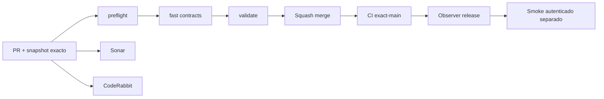

# GrindFlow — Último deploy

> **Snapshot v0.1.22: solo el deploy actual.** Base `main` v0.1.21 `b30f088ceefa0b580c6da9ccd7c1f16617e38bc2`. Documentación de negocio, sin implementación nueva ni checkout de Hostinger comprobado.

## Progress convention
- ✅ ~~Completado~~ = verificado; 🚧 Pendiente = en curso; ⛔ bloqueado = dependencia externa.

## Fuentes de verdad
[AGENTS.md](AGENTS.md) · [Especificación](docs/GRINDFLOW-SPEC.md) · [Requisitos](docs/REQUIREMENTS.md) · [Roadmap general #2](https://github.com/pl0n3r/GrindFlow/issues/2)

## Estado del deploy
| Señal | Estado | Evidencia |
| --- | --- | --- |
| Objetivo | 🚧 **v0.1.22** | `config/version.php` |
| Base exacta | ✅ ~~main v0.1.21~~ | `b30f088ceefa0b580c6da9ccd7c1f16617e38bc2` |
| CI del PR | 🚧 Por verificar en head final | [PR #8](https://github.com/pl0n3r/GrindFlow/pull/8) |
| Sonar | 🚧 Por confirmar en head final | [PR #8](https://github.com/pl0n3r/GrindFlow/pull/8) |
| CodeRabbit | 🚧 Revisión no confirmada | [PR #8](https://github.com/pl0n3r/GrindFlow/pull/8) |
| CI del SHA exacto de main | 🚧 Posterior al merge | No inferir del CI del PR |
| Deploy Observer | ⛔ Sin SHA remoto confirmado | No se infiere de la versión |
| Production Smoke | ⛔ Credencial ausente | [Issue #1](https://github.com/pl0n3r/GrindFlow/issues/1) |
| Producción v0.1.22 | ⛔ Sin verificar | No se declara validada |
| Migraciones | ✅ ~~Sin cambios de esquema~~ | PR documental |

## Huella del cambio
<!-- grindflow:git-delta -->
| Archivos | Inserciones | Eliminaciones | Neto |
| ---: | ---: | ---: | ---: |
| **3** | **+0** | **−0** | **+0** |

## Calidad y entrega
<!-- grindflow:gate-plan -->
| Control | Estado / contrato |
| --- | --- |
| Gates seleccionados | **preflight · fast[contracts]** |
| Alcance | Documentación y metadata de release; no código, datos ni servicios externos |
| Revisiones | CI/Sonar/CodeRabbit y exact-main independientes |

## Flujo de entrega

## Qué se hizo
- Se añadió a la especificación la visión de gestión del ciclo de vida del contenido, los tres segmentos de cliente y el modelo principal SaaS por suscripción.
- Se documentó el piloto gratuito con cinco creadoras y sus métricas; 30 días y dos redes quedan como prueba comercial propuesta, no aprobada definitivamente.
- Se señaló el fragmento de origen incompleto «No se ha aprobado» sin inventar su continuación.

## Archivos modificados en este deploy
- `README.md` — snapshot de esta entrega.
- `config/version.php` — versión humana v0.1.22.
- `docs/GRINDFLOW-SPEC.md` — especificación complementaria acordada.

## Validación
- [PR #8](https://github.com/pl0n3r/GrindFlow/pull/8): gates sobre head final pendientes al crear el snapshot.
- El PR no modifica funcionalidades, esquema ni credenciales; no demuestra despliegue en Hostinger.

## Qué sigue
| Lane | Trabajo |
| --- | --- |
| **NOW** | 🚧 Validar y fusionar [PR #8](https://github.com/pl0n3r/GrindFlow/pull/8) |
| **NEXT** | 🚧 Completar piloto y evaluar términos comerciales con [roadmap #2](https://github.com/pl0n3r/GrindFlow/issues/2) |
| **LATER** | 🚧 Definir precios y límites según evidencia del piloto |
| **BLOCKED / EXTERNAL** | ⛔ Producción/Hostinger y smoke autenticado sin validación |

## Panorama general pendiente
| Lane | Frente | Estado |
| --- | --- | --- |
| **DONE** | ✅ ~~Visión y modelo SaaS documentados~~ | ✅ ~~Especificación en PR #8~~ |
| **NOW** | 🚧 CI y PR documental | 🚧 Por cerrar |
| **NEXT** | 🚧 Piloto comercial | 🚧 Sin ejecutar |
| **LATER** | 🚧 Precios y paquetes definitivos | 🚧 Sujetos al piloto |
| **BLOCKED / EXTERNAL** | ⛔ Producción verificada | ⛔ Sin evidencia |
