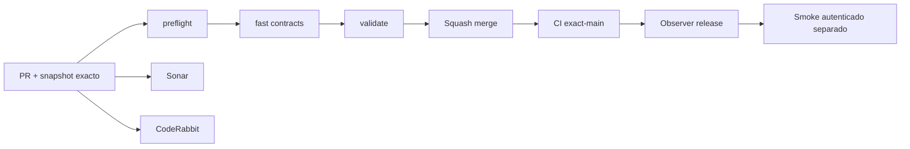

# GrindFlow — Último deploy

> **Snapshot v0.1.34: solo el deploy actual, aún sin despliegue Symfony.** Base exacta `main` v0.1.33 `1a923542151da0897d0b883815c5cf4145663a34`. S1 añade administración React privada y API que revalida tenant/rol al consultar y modificar el nombre de la organización. Laravel sigue como runtime en Hostinger. **Symfony no se ha desplegado ni se han importado cuentas.**

## Progress convention
- ✅ ~~Completado~~ = verificado; 🚧 Pendiente = en curso; ⛔ bloqueado = dependencia externa.

## Fuentes de verdad
[AGENTS.md](AGENTS.md) · [Spec](docs/GRINDFLOW-SPEC.md) · [Requisitos](docs/REQUIREMENTS.md) · [Transición](docs/STACK-TRANSITION-SYMFONY.md) · [Roadmap #2](https://github.com/pl0n3r/GrindFlow/issues/2)

## Estado del deploy
| Señal | Estado | Evidencia |
| --- | --- | --- |
| Version objetivo | 🚧 **v0.1.34** | `config/version.php` |
| Base exacta | ✅ ~~main v0.1.33~~ | `1a923542151da0897d0b883815c5cf4145663a34` |
| CI del PR | 🚧 Head final pendiente | `GrindFlow CI / validate` |
| Sonar | 🚧 Pendiente | SonarCloud PR |
| CodeRabbit | 🚧 Revisión por comprobar | PR |
| CI del SHA exacto de main | 🚧 Después del merge | CI PR no lo sustituye |
| Deploy Observer | 🚧 Release humano por observar | No prueba Symfony en remoto |
| Production Smoke | ⛔ Credencial E2E productiva pendiente | [Issue #1](https://github.com/pl0n3r/GrindFlow/issues/1) |
| Symfony S1 en Hostinger | ⛔ NO desplegado | Solo entorno aislado CI |
| Migraciones | ✅ ~~Ningún esquema productivo modificado~~ | DB Symfony descartable |

## Huella del cambio
<!-- grindflow:git-delta -->
| Archivos | Inserciones | Eliminaciones | Neto |
| ---: | ---: | ---: | ---: |
| **16** | **+498** | **−43** | **+455** |

## Calidad y entrega
<!-- grindflow:gate-plan -->
| Control | Estado / contrato |
| --- | --- |
| Gates seleccionados | **preflight · fast[contracts] · symfony-preview** |
| Alcance | Symfony Admin React, API live tenant/rol, renombrado admin + CSRF, pruebas negativas |
| Revisiones | CI/Sonar/CodeRabbit, exact-main y Hostinger son independientes |

## Flujo de entrega

## Qué se hizo
- Panel React privado con API JSON y revalidación de tenant y rol por petición.
- Membresía admin puede renombrar únicamente su organización activa; CSRF y actualización SQL revalidan acceso.
- API anónima 401; sin selección 409; sin permiso 403; entrada inválida 422. Laravel sigue siendo el runtime productivo.

## Archivos modificados en este deploy
- `AGENTS.md`
- `README.md`
- `config/version.php`
- `symfony/frontend/admin/admin.tsx`
- `symfony/frontend/admin/preview.css`
- `symfony/public/assets/grindflow.css`
- `symfony/README.md`
- `symfony/src/Http/AssetManifest.php`
- `symfony/src/Http/Controller/AdminContextController.php`
- `symfony/src/Http/Controller/AdminController.php`
- `symfony/templates/base.html.twig`
- `symfony/templates/identity/admin.html.twig`
- `symfony/tests/contract/smoke.sh`
- `symfony/tests/e2e/preview.spec.mjs`
- `symfony/tests/php/AdminContextTest.php`
- `symfony/vite.config.ts`

## Validación
- PHPUnit aislado: admin/tenant/CSRF/rol; Playwright: API anónima cerrada sin redirect.
- CI, Sonar, exact-main y observación Hostinger son controles separados. No hay migraciones productivas.

## Qué sigue
| Lane | Trabajo |
| --- | --- |
| **NOW** | 🚧 Validar S1 React/API v0.1.34, [roadmap #2](https://github.com/pl0n3r/GrindFlow/issues/2) |
| **NEXT** | 🚧 Onboarding/roles y Vault móvil S2 |
| **LATER** | 🚧 Vault móvil → reglas → distribución autorizada → piloto |
| **BLOCKED / EXTERNAL** | ⛔ Cutover sin paridad/datos migrados; Smoke sin credencial |

## Panorama general pendiente
| Lane | Frente | Estado |
| --- | --- | --- |
| **DONE** | ✅ ~~Dashboard Laravel v0.1.30~~ | ✅ ~~Esquema Symfony S1 v0.1.31~~ |
| **NOW** | 🚧 Login/selector S1 v0.1.33 | 🚧 Validación y revisión |
| **NEXT** | 🚧 Admin React con autorización | 🚧 S1 continuación |
| **LATER** | 🚧 Automatización de contenido | 🚧 S2–S5 |
| **BLOCKED / EXTERNAL** | ⛔ Sin cutover Symfony | ⛔ Sin credencial Smoke |
