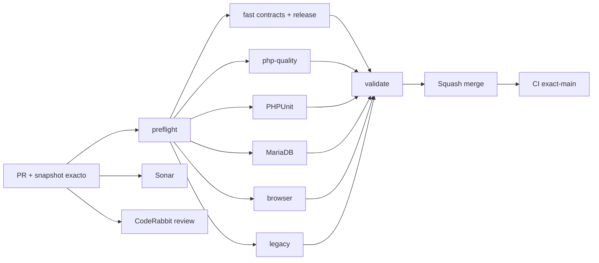

# GrindFlow — Último deploy

  
  
  

> **Snapshot del PR candidato v0.1.4; NO es evidencia de deploy.** El contrato «solo el deploy actual» aplica al publicarse. `main` v0.1.3 esta validado; produccion requiere evidencia separada.

## Progress convention
- ✅ ~~Completado~~ = concluido y verificado por las compuertas aplicables.
- 🚧 Pendiente = por hacer o en curso, sin tachado.

## Estado del deploy
| Señal | Estado | Evidencia |
| --- | --- | --- |
| Work line | 🚧 **GF-OPS · Media runtime readiness** | [Roadmap #88](https://github.com/drpipe1098-commits/GrindFlow/issues/88) |
| Base exacta | ✅ **v0.1.3 · PR #92 fusionado** | `main` `78b796746eb880367de9fccda3b9703e68846d9d` |
| Version | 🚧 **v0.1.4** | patch de prerequisites multimedia |
| CI del PR | 🚧 **revalidando** | head anterior fallo por plantilla Blade y lookup de ruta absoluta; correcciones en el candidato actual |
| Sonar | 🚧 **pendiente** | no extrapolar Quality Gate de otro SHA |
| CodeRabbit | 🚧 **revalidando** | hallazgo de atributos HTML duplicados corregido; requiere revision del head estable |
| CI del SHA exacto de main | ✅ **v0.1.3 validado** | validate #35446099005 + Sonar Quality Gate passed |
| Production Smoke | 🚧 **schema bloqueado** | migraciones pendientes; no implica fallo de codigo |
| Migraciones | 🚧 **no ejecutadas** | backup restaurable + aprobacion expresa |

## Huella del cambio
<!-- grindflow:git-delta -->
| Archivos | Inserciones | Eliminaciones | Neto |
| ---: | ---: | ---: | ---: |
| **10** | **+375** | **−65** | **+310** |

## Calidad y entrega
<!-- grindflow:gate-plan -->
| Control | Estado / contrato |
| --- | --- |
| Gates seleccionados | **preflight · fast[contracts] · php-quality · PHPUnit · MariaDB · browser · legacy** |
| Runtime | presencia de FFmpeg/FFprobe, sin ejecutar subprocesses ni codecs |
| Parser | allowlist completa: 5 modulos + 2 herramientas o fallo cerrado |
| Seguridad | sin rutas binarias, HTML crudo, cookies, CSRF ni secretos en output |
| Produccion | diagnostico y Smoke de solo lectura; nunca migra ni ejecuta FFmpeg |

## Flujo de entrega

## Qué se hizo
- Admin > System muestra FFmpeg y FFprobe como `disabled`, `binary-found` o `binary-missing` sin ejecutar comandos ni exponer rutas.
- `MediaToolReadiness` respeta flags, comprueba rutas configuradas con `is_file`/`is_executable` y convierte fallos en estado seguro.
- Production Smoke extrae cinco estados de modulo y dos de media mediante parser con allowlist; inventarios incompletos, duplicados o falsificados fallan cerrados.
- Contrato Python cubre inventario valido, estados invalidos, faltantes, duplicados incluso en el mismo elemento, extras, payload falsificado, HTML sobredimensionado y no filtracion de secretos.
- Fast CI compila ambos scripts Python y ejecuta el contrato antes del contrato Production Smoke.
- Tests PHP cubren herramientas desactivadas, ejecutable encontrado/ausente y ausencia de paths controlados por operador en la UI.

## Archivos modificados en este deploy propuesto (v0.1.4; no desplegado)
- `.github/workflows/grindflow-ci.yml` — compila y ejecuta contratos runtime.
- `README.md` — snapshot exacto del candidato v0.1.4.
- `app/Http/Controllers/Admin/SystemController.php` — inyecta readiness multimedia.
- `app/Support/Operations/MediaToolReadiness.php` — deteccion segura sin subprocesses.
- `config/version.php` — version humana v0.1.4.
- `resources/views/admin/system.blade.php` — panel read-only de prerequisites.
- `scripts/production-runtime-readiness-contract.py` — regresiones del parser.
- `scripts/production-runtime-readiness.py` — parser allowlist de runtime.
- `tests/Feature/AdminSystemTest.php` — UI y no exposicion de rutas.
- `tests/Feature/MediaToolReadinessTest.php` — estados de herramientas.

## Validación
- `main` v0.1.3 exacto `78b796746eb880367de9fccda3b9703e68846d9d`: CI `validate` #35446099005 y Sonar Quality Gate completaron en success.
- v0.1.4 corrige el fallo CI observado en el head previo (vista Blade y ruta absoluta del ejecutable) y el hallazgo de CodeRabbit sobre atributos duplicados. CI, Sonar y review del nuevo head siguen pendientes; no hay merge.
- Ninguna migracion, deploy, FFmpeg, SQL ni accion sensible de produccion forma parte de esta entrega.

## Qué sigue
| Lane | Trabajo |
| --- | --- |
| **NOW** | 🚧 Validar y entregar v0.1.4; [roadmap #88](https://github.com/drpipe1098-commits/GrindFlow/issues/88). |
| **NEXT** | 🚧 Storage S3/CORS #40 y readiness operativo, sin secretos. |
| **LATER** | 🚧 Auditoria append-only de intentos de proveedor y browser de modulos. |
| **BLOCKED / EXTERNAL** | 🚧 Migraciones productivas: backup restaurable + aprobacion expresa. |

## Panorama general pendiente
| Lane | Frente | Estado |
| --- | --- | --- |
| **DONE** | ✅ ~~Workflow #87, navegacion #90/#91 y diagnostico #92~~ | ✅ ~~fusionados; main v0.1.3 validado~~ |
| **NOW** | 🚧 Runtime multimedia seguro | 🚧 v0.1.4 |
| **NEXT** | 🚧 Storage y schema productivo | 🚧 #40 · #69 |
| **LATER** | 🚧 Finance y paridad legado | 🚧 despues del esquema |
| **BLOCKED / EXTERNAL** | 🚧 Produccion | 🚧 backup/aprobacion y deploy verificable |
