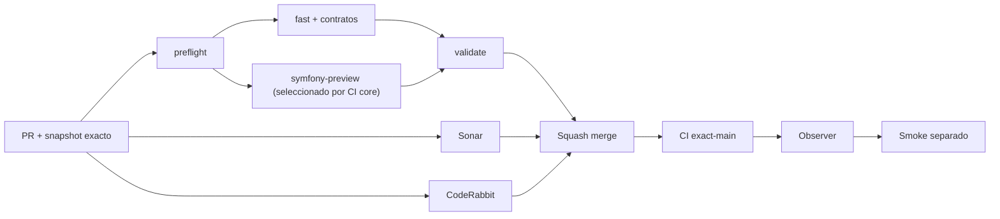

# GrindFlow — Último deploy

> **Candidato apilado v0.1.122: reducir llamadas repetidas a GitHub y tormentas de eventos.** Base candidata PR #122 v0.1.121 `3a3d1c3862e57fd45d244cde3753e188fe3880de`; `main` sigue v0.1.120. No fusionado ni desplegado.

## Progress convention
- ✅ ~~Completado~~ = verificado; 🚧 Pendiente = en curso; ⛔ bloqueado = dependencia externa.

## Fuentes de verdad
[AGENTS.md](AGENTS.md) · [Spec](docs/GRINDFLOW-SPEC.md) · [Requisitos](docs/REQUIREMENTS.md) · [Transición](docs/STACK-TRANSITION-SYMFONY.md) · [Roadmap #2](https://github.com/pl0n3r/GrindFlow/issues/2)

## Estado del deploy
| Señal | Estado | Evidencia |
| --- | --- | --- |
| Version objetivo | 🚧 **v0.1.122** | `config/version.php`; candidata apilada, no publicada |
| Base exacta | 🚧 PR #122 v0.1.121 | `3a3d1c38…`; no reemplaza a main v0.1.120 |
| CI del PR | 🚧 Pendiente | `validate` sobre HEAD final |
| Sonar del PR | 🚧 Pendiente | Quality Gate del futuro HEAD de v0.1.122 |
| CodeRabbit del PR | 🚧 Pendiente | Revisión terminada del mismo SHA |
| CI del SHA exacto de main | ✅ ~~success~~ | #35917304166 sobre `cd871630…` (v0.1.120) |
| Deploy Observer base | ✅ ~~Release observado~~ | #35917304167; no acredita SHA remoto |
| Production Smoke | ⛔ Bloqueo externo #73 | #35917304261 failure |
| Symfony en Hostinger | ⛔ NO desplegado | Sin cutover |
| Datos productivos | ✅ ~~No tocados~~ | Solo CI, script local, tests, docs y versión |

## Huella del cambio
<!-- grindflow:git-delta -->
| Archivos | Inserciones | Eliminaciones | Neto |
| ---: | ---: | ---: | ---: |
| **6** | **+200** | **−33** | **+167** |

## Calidad y entrega
<!-- grindflow:gate-plan -->
| Control | Estado / contrato |
| --- | --- |
| Gates seleccionados | **preflight · fast[operational contracts + automation syntax + README dashboard] · php-quality · PHPUnit · MariaDB · browser · real-stack · legacy · symfony-preview** |
| Gate agregador obligatorio | **validate**: todos los seleccionados; Sonar y CodeRabbit aparte |
| Alcance | Issue #123: reintentos limitados de API GitHub y concurrencia Sonar relay |
| Revisiones | CI/Sonar/CodeRabbit HEAD; exact-main, Observer y Smoke separados |

## Flujo de entrega

## Qué se hizo
- El relay de Sonar cancela ejecuciones obsoletas por PR y limita el job a cinco minutos; mantiene el filtro de checks de Sonar a nivel job.
- Las consultas GitHub GET y actualizaciones idempotentes PATCH respetan `Retry-After` y `X-RateLimit-Reset` con máximo dos reintentos. POST no se repite; espera mayor de 30 segundos falla cerrado.
- Diez pruebas offline fijan respuestas 403/429, cuotas, presupuesto de intentos e idempotencia. CI `fast` ejecuta las pruebas.

## Archivos modificados en esta entrega candidata
Inventario de esta entrega candidata, no prueba publicación:
<!-- grindflow:changed-files -->
- `.github/workflows/grindflow-ci.yml`
- `.github/workflows/sonar-pr-details.yml`
- `README.md`
- `config/version.php`
- `scripts/sonar-pr-comment.py`
- `tests/test_sonar_pr_comment_retry.py`

## Validación
- La PR #122 sigue independiente con CI/Sonar aprobados sobre v0.1.121 y revisión CodeRabbit pendiente. Esta entrega debe rebasarse sobre `main` cuando #122 se fusione.
- Al tocar workflow CI core, ejecutar suites completas, Sonar y revisión terminal CodeRabbit sobre el HEAD final antes de fusionar.
- No modifica producción, secretos, usuarios ni datos del smoke #73.

## Qué sigue
[Roadmap canónico #2](https://github.com/pl0n3r/GrindFlow/issues/2)

## Panorama general pendiente
| Lane | Frente | Estado |
| --- | --- | --- |
| **NOW** | 🚧 Revisar PR #122; v0.1.122 prepara defensa de carga GitHub | 🚧 candidata apilada |
| **NEXT** | 🚧 Completar #123 y después investigar smoke #73/#121 | 🚧 pendiente |
| **BLOCKED / EXTERNAL** | ⛔ Smoke autenticado Laravel | ⛔ #73 |
| **LATER** | 🚧 Cutover Symfony por módulo | 🚧 sin deploy |
