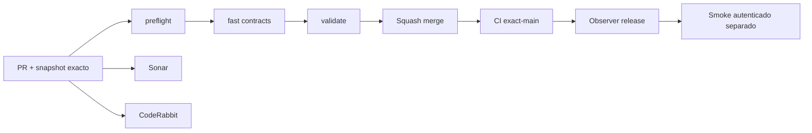

# GrindFlow — Último deploy

> **Snapshot v0.1.28: solo el deploy actual.** Base `main` v0.1.27 `773eb4b6fc12ca0ecb43ce1800713867fa01e0fb`. Las tarjetas de cada organización tienen contadores de contenido listo y publicaciones programadas con datos propios. Laravel atiende el sitio actual; Symfony S0 está aislado. **CI ≠ deploy en Hostinger**.

## Progress convention
- ✅ ~~Completado~~ = verificado; 🚧 Pendiente = en curso; ⛔ bloqueado = dependencia externa.

## Fuentes de verdad
[AGENTS.md](AGENTS.md) · [Spec](docs/GRINDFLOW-SPEC.md) · [Requisitos](docs/REQUIREMENTS.md) · [Transición](docs/STACK-TRANSITION-SYMFONY.md) · [Roadmap #2](https://github.com/pl0n3r/GrindFlow/issues/2)

## Estado del deploy
| Señal | Estado | Evidencia |
| --- | --- | --- |
| Version objetivo | 🚧 **v0.1.28** | `config/version.php` |
| Base exacta | ✅ ~~main v0.1.27~~ | `773eb4b6fc12ca0ecb43ce1800713867fa01e0fb` |
| CI del PR | 🚧 Head final pendiente | `GrindFlow CI / validate` |
| Sonar | 🚧 Pendiente | SonarCloud PR |
| CodeRabbit | 🚧 Revisión por comprobar | PR |
| CI del SHA exacto de main | 🚧 Después del merge | Sin inferir del PR |
| Deploy Observer | ⛔ Release remoto no observado | #7 regresó HTTP 404 en `/_deployment` |
| Production Smoke | ⛔ Credencial E2E de solo lectura pendiente | [Issue #1](https://github.com/pl0n3r/GrindFlow/issues/1) |
| Producción v0.1.28 | ⛔ Sin verificar | CI ≠ Hostinger |
| Migraciones | ✅ ~~Sin cambios de esquema~~ | Solo lecturas SQL agrupadas |

## Huella del cambio
<!-- grindflow:git-delta -->
| Archivos | Inserciones | Eliminaciones | Neto |
| ---: | ---: | ---: | ---: |
| **7** | **+0** | **−0** | **+0** |

## Calidad y entrega
<!-- grindflow:gate-plan -->
| Control | Estado / contrato |
| --- | --- |
| Gates seleccionados | **preflight · fast[contracts] · php-quality · PHPUnit · MariaDB · browser · real-stack** |
| Alcance | Backend por organización, HTML responsive, CSS versionado y pruebas multi-tenant/Chromium |
| Revisiones | CI/Sonar/CodeRabbit y exact-main independientes |

## Flujo de entrega

## Qué se hizo
- Dos recuentos por tarjeta de organización desde filas reales de su tenant. No se muestran organizaciones ajenas ni se hacen consultas por tarjeta.
- Totales globales reutilizan la misma consulta agrupada: no inconsistencias ni N+1. Estado no disponible muestra «—», no cero falso.
- Footer y CSS versionados desde fuente única `config/version.php`: **0.1.27 → 0.1.28**.

## Archivos modificados en este deploy
- `README.md`
- `app/Http/Controllers/DashboardController.php`
- `config/version.php`
- `public/css/grindflow.css`
- `resources/views/dashboard.blade.php`
- `scripts/browser-smoke.sh`
- `tests/Feature/OrganizationVisibilityTest.php`

## Validación
- CI y Sonar de PR, CI exact-main, observación Hostinger y smoke autenticado son comprobaciones distintas.
- No se ha tocado public_html, datos productivos ni migraciones.

## Qué sigue
| Lane | Trabajo |
| --- | --- |
| **NOW** | 🚧 Validar resumen por organización v0.1.28, [roadmap #2](https://github.com/pl0n3r/GrindFlow/issues/2) |
| **NEXT** | 🚧 S1 identidad y tenant Symfony |
| **LATER** | 🚧 Vault móvil → reglas → distribución autorizada → piloto |
| **BLOCKED / EXTERNAL** | ⛔ Hostinger: marcador 404; Smoke: credencial ausente |

## Panorama general pendiente
| Lane | Frente | Estado |
| --- | --- | --- |
| **DONE** | ✅ ~~Home SaaS, footers y CSS versionado~~ | ✅ ~~Dashboard operativo v0.1.27~~ |
| **NOW** | 🚧 Detalle por organización v0.1.28 | 🚧 CI/Hostinger |
| **NEXT** | 🚧 Identidad Symfony | 🚧 S1 |
| **LATER** | 🚧 Automatización | 🚧 S2–S5 |
| **BLOCKED / EXTERNAL** | ⛔ Producción no observada | ⛔ Release marker 404 |
