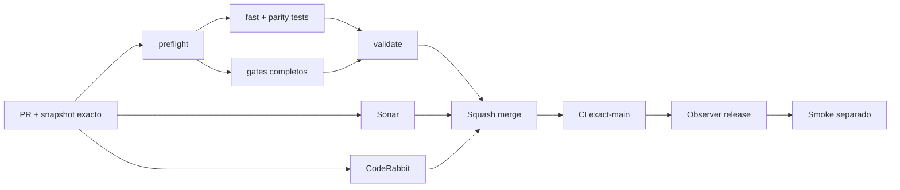

# GrindFlow — Último deploy

> **Candidato v0.1.105: errores de acceso accesibles en Symfony.** Base exacta `main` v0.1.104 `ad136a0018aa05ff99eaa5d1498577b750bdde02`; los campos explican un rechazo genérico a tecnología asistiva sin revelar datos de cuentas.

## Progress convention
- ✅ ~~Completado~~ = verificado; 🚧 Pendiente = en curso; ⛔ bloqueado = dependencia externa.

## Fuentes de verdad
[AGENTS.md](AGENTS.md) · [Spec](docs/GRINDFLOW-SPEC.md) · [Requisitos](docs/REQUIREMENTS.md) · [Transición](docs/STACK-TRANSITION-SYMFONY.md) · [Roadmap #2](https://github.com/pl0n3r/GrindFlow/issues/2)

## Estado del deploy
| Señal | Estado | Evidencia |
| --- | --- | --- |
| Version objetivo | 🚧 **v0.1.105** | `config/version.php`; no publicada |
| Base exacta | ✅ ~~main v0.1.104~~ | `ad136a0018aa05ff99eaa5d1498577b750bdde02` |
| CI del PR | 🚧 Pendiente | Exigir `validate` del HEAD final |
| Sonar del PR | 🚧 Pendiente | Exigir Quality Gate del HEAD final |
| CodeRabbit del PR | 🚧 Pendiente | Exigir full review del HEAD final |
| CI del SHA exacto de main | ✅ **VALIDATED IN CODE** | `35829054550` success sobre `ad136a0018aa05ff99eaa5d1498577b750bdde02` |
| Deploy Observer | ✅ ~~Marcador humano observado~~ | `35829054510` success; SHA remoto no observado |
| Production Smoke | ⛔ Login E2E no validado | `35829054568` failure, #73; independiente de esta mejora |
| Symfony en Hostinger | ⛔ NO desplegado | Sin cutover |
| Datos productivos | ✅ ~~No tocados~~ | Pruebas en Symfony/MariaDB descartable; sin cambio de cuentas reales |

## Huella del cambio
<!-- grindflow:git-delta -->
| Archivos | Inserciones | Eliminaciones | Neto |
| ---: | ---: | ---: | ---: |
| **7** | **+88** | **−26** | **+62** |

## Calidad y entrega
<!-- grindflow:gate-plan -->
| Control | Estado / contrato |
| --- | --- |
| Gates seleccionados | **preflight · fast[operational contracts + automation syntax + README dashboard] · symfony-preview** |
| Gate agregador obligatorio | **validate**: todos los seleccionados; Sonar y CodeRabbit aparte |
| Alcance | GF-UX-004: error genérico de acceso perceptible a 360/820 px |
| Revisiones | CI/Sonar/CodeRabbit HEAD; exact-main, Observer y Smoke separados |

## Flujo de entrega

## Qué se hizo
- El rechazo del login Symfony conserva mensaje genérico `role="alert"` con ID estable; correo y contraseña señalan el error con `aria-describedby` y `aria-invalid` solo mientras existe.
- Estado inválido visible en ambos campos sin revelar causa, contraseñas ni estado interno de las cuentas.
- PHPUnit HTTP cubre formulario limpio, error de cuenta inactiva sintética, correo conservado, contraseña no reflejada y recuperación de estado limpio; Chromium aislado valida accesibilidad computada y ausencia de overflow a 360/820 px.
- GF-UX-004 documentado sin modificar Symfony Security, Laravel, datos productivos, Hostinger ni cutover.

## Archivos modificados en esta entrega candidata
Inventario de solo esta entrega candidata: no constituye evidencia de publicación:
<!-- grindflow:changed-files -->
- `README.md`
- `config/version.php`
- `docs/REQUIREMENTS.md`
- `symfony/public/assets/grindflow.css`
- `symfony/templates/identity/login.html.twig`
- `symfony/tests/e2e/login-accessibility.spec.mjs`
- `symfony/tests/php/IdentityLoginTest.php`

## Validación
- Exigir `validate`, Sonar y full review CodeRabbit sobre el HEAD final; después CI exact-main.
- `symfony-preview` valida PHP, MariaDB descartable, TypeScript/Vite y Chromium a 360 y 820 px sobre build aislado.
- El release no demuestra deployment Symfony ni resuelve Production Smoke #73 del Laravel operativo.

## Qué sigue
[Roadmap canónico #2](https://github.com/pl0n3r/GrindFlow/issues/2)

| Lane | Trabajo | Estado |
| --- | --- | --- |
| **NOW** | 🚧 Accesibilidad del acceso Symfony | 🚧 v0.1.105 candidata |
| **NEXT** | 🚧 Verificación autorizada de cuenta E2E | 🚧 #2 |
| **LATER** | 🚧 Conmutación Symfony por módulo | 🚧 Sin deploy |
| **BLOCKED / EXTERNAL** | ⛔ Resolver login E2E productivo | ⛔ #73 |

## Panorama general pendiente
| Lane | Frente | Estado |
| --- | --- | --- |
| **DONE** | ✅ ~~v0.1.104 fusionada~~ | ✅ ~~navegación responsive Symfony~~ |
| **NOW** | 🚧 Error de autenticación accesible | 🚧 GF-UX-004, v0.1.105 |
| **NEXT** | 🚧 Evidencia revisada fuera de banda + autorización separada | 🚧 GF-ARCH-002 sin cutover |
| **LATER** | 🚧 Symfony en Hostinger | 🚧 No desplegado |
| **BLOCKED / EXTERNAL** | ⛔ Smoke autenticado Laravel | ⛔ #73 |
