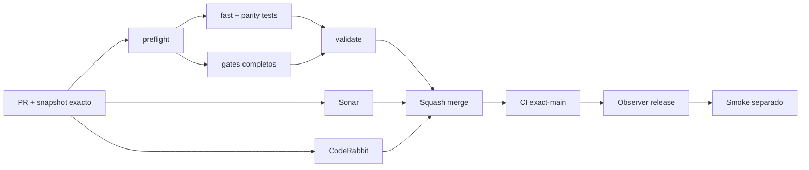

# GrindFlow — Último deploy

> **Candidato v0.1.103: contrato JSON uniforme para cambios de cuenta y organización.** Base exacta `main` v0.1.102 `2e6f6f9fc21aa5ea50a9eacea22361e52e2e3b11`; conserva las compuertas de seguridad y centraliza la lectura acotada.

## Progress convention
- ✅ ~~Completado~~ = verificado; 🚧 Pendiente = en curso; ⛔ bloqueado = dependencia externa.

## Fuentes de verdad
[AGENTS.md](AGENTS.md) · [Spec](docs/GRINDFLOW-SPEC.md) · [Requisitos](docs/REQUIREMENTS.md) · [Transición](docs/STACK-TRANSITION-SYMFONY.md) · [Roadmap #2](https://github.com/pl0n3r/GrindFlow/issues/2)

## Estado del deploy
| Señal | Estado | Evidencia |
| --- | --- | --- |
| Version objetivo | 🚧 **v0.1.103** | `config/version.php`; no publicada |
| Base exacta | ✅ ~~main v0.1.102~~ | `2e6f6f9fc21aa5ea50a9eacea22361e52e2e3b11` |
| CI del PR | 🚧 Pendiente | Exigir `validate` del HEAD final |
| Sonar del PR | 🚧 Pendiente | Exigir Quality Gate del HEAD final |
| CodeRabbit del PR | 🚧 Pendiente | Exigir full review del HEAD final |
| CI del SHA exacto de main | ✅ **VALIDATED IN CODE** | `35807307343` success sobre `2e6f6f9fc21aa5ea50a9eacea22361e52e2e3b11` |
| Deploy Observer | 🚧 Pendiente | No inferir checkout remoto |
| Production Smoke | ⛔ Login E2E no validado | `35807307398` failure, #73; independiente de esta mejora |
| Symfony en Hostinger | ⛔ NO desplegado | Sin cutover |
| Datos productivos | ✅ ~~No tocados~~ | Pruebas en Symfony/MariaDB descartable; sin cambio de cuentas reales |

## Huella del cambio
<!-- grindflow:git-delta -->
| Archivos | Inserciones | Eliminaciones | Neto |
| ---: | ---: | ---: | ---: |
| **7** | **+121** | **−39** | **+82** |

## Calidad y entrega
<!-- grindflow:gate-plan -->
| Control | Estado / contrato |
| --- | --- |
| Gates seleccionados | **preflight · fast[operational contracts + automation syntax + README dashboard] · symfony-preview** |
| Gate agregador obligatorio | **validate**: todos los seleccionados; Sonar y CodeRabbit aparte |
| Alcance | GF-SEC-005 / GF-SEC-007: lector compartido y cuerpo estricto de organización |
| Revisiones | CI/Sonar/CodeRabbit HEAD; exact-main, Observer y Smoke separados |

## Flujo de entrega

## Qué se hizo
- El cambio de contraseña Symfony reutiliza `BoundedJsonBody`: control de tamaño real y declarado (máximo 4.096 bytes), lectura máxima 4.097 y profundidad JSON 16, **después** de autenticar, validar CSRF y consumir su limiter.
- Renombrar organización rechaza ahora cualquier clave adicional a `name`, igual que renombrar perfil; no se ignoran silenciosamente campos extra.
- Regresión HTTP en MariaDB descartable: payload de organización con `unexpected_flag` no cambia ni la organización propia ni la ajena.
- Nueva suite PHPUnit directa para el lector compartido: frontera 4.096/4.097 bytes, cabecera falsa o no numérica, profundidad con clave duplicada, JSON malformado y escalares.
- GF-SEC-007 actualizado; sin cambios de secretos, migraciones, cuentas reales, Hostinger ni login Laravel.

## Archivos modificados en esta entrega candidata
Inventario de solo esta entrega candidata: no constituye evidencia de publicación:
<!-- grindflow:changed-files -->
- `README.md`
- `config/version.php`
- `docs/REQUIREMENTS.md`
- `symfony/src/Http/Controller/AccountSecurityController.php`
- `symfony/src/Http/Controller/AdminContextController.php`
- `symfony/tests/php/BoundedJsonBodyTest.php`
- `symfony/tests/php/OrganizationSettingsTest.php`

## Validación
- Requerir `validate`, Sonar y full review CodeRabbit en el HEAD final; después, CI del SHA exacto de `main`.
- `symfony-preview` incluye PHPUnit unitario y HTTP sobre MariaDB descartable y Chromium aislado.
- El release no demuestra deployment Symfony ni resuelve Production Smoke #73 del Laravel operativo.

## Qué sigue
[Roadmap canónico #2](https://github.com/pl0n3r/GrindFlow/issues/2)

| Lane | Trabajo | Estado |
| --- | --- | --- |
| **NOW** | 🚧 Contrato JSON consistente de cuenta y organización | 🚧 v0.1.103 candidata |
| **NEXT** | 🚧 Verificación autorizada de cuenta E2E | 🚧 #2 |
| **LATER** | 🚧 Conmutación Symfony por módulo | 🚧 Sin deploy |
| **BLOCKED / EXTERNAL** | ⛔ Resolver login E2E productivo | ⛔ #2 |

## Panorama general pendiente
| Lane | Frente | Estado |
| --- | --- | --- |
| **DONE** | ✅ ~~v0.1.102 fusionada~~ | ✅ ~~lector JSON acotado en renombres~~ |
| **NOW** | 🚧 Unificar lectura y validar claves de organización | 🚧 v0.1.103 |
| **NEXT** | 🚧 Evidencia revisada fuera de banda + autorización separada | 🚧 GF-ARCH-002 sin cutover |
| **LATER** | 🚧 Symfony en Hostinger | 🚧 No desplegado |
| **BLOCKED / EXTERNAL** | ⛔ Smoke autenticado Laravel | ⛔ #2 |
