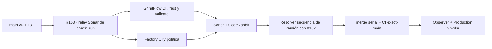

# GrindFlow — Último deploy

> **Candidata v0.1.132, PR #163 en draft.** Deduplica el relay de Sonar por check individual; la publicación sigue condicionada a resolver la secuencia con PR #162 y Factory. No se modifican datos ni producción.

## Progress convention
- ✅ ~~Completado~~ = verificado; 🚧 Pendiente = en curso; ⛔ bloqueado = dependencia externa.

## Fuentes de verdad
[AGENTS.md](AGENTS.md) · [Spec](docs/GRINDFLOW-SPEC.md) · [Requisitos](docs/REQUIREMENTS.md) · [Roadmap #2](https://github.com/pl0n3r/GrindFlow/issues/2)

## Estado del deploy
| Señal | Estado | Evidencia |
| --- | --- | --- |
| SHA exacto de main (base) | ✅ **f5f2a00e5bfed2669b01a204cc2be475f9db5387** | v0.1.131 fusionada en #161 |
| Versión observada en producción (base) | ✅ **v0.1.131** | Production Smoke `36086540476`; no confirma SHA remoto |
| CI del SHA exacto de main (base) | ✅ **success** | GrindFlow CI `36086540475`, intento 2 |
| Deploy Observer base | ✅ **success** | run `36086540472`; sin SHA remoto verificado |
| Production Smoke base | ✅ **success** | run `36086540476` |
| Versión candidata | 🚧 **v0.1.132** | PR #163, no fusionada |
| CI/Sonar/CodeRabbit del PR | 🚧 pendiente | HEAD final PR #163 |
| Producción candidata | 🚧 pendiente | bloqueada hasta secuenciar #162/#163 y verificar merge/deploy |

## Huella del cambio
<!-- grindflow:git-delta -->
| Archivos | Inserciones | Eliminaciones | Neto |
| ---: | ---: | ---: | ---: |
| **7** | **+197** | **−33** | **+164** |

## Calidad y entrega
<!-- grindflow:gate-plan -->
| Control | Estado / contrato |
| --- | --- |
| Gates seleccionados | **preflight · fast[operational contracts + automation syntax + README dashboard] · php-quality · PHPUnit · MariaDB · browser · real-stack · legacy · symfony-preview** |
| PR + snapshot exacto | **PR #163 / Issue #123 · candidata v0.1.132**; diff y README deben coincidir con el HEAD final |
| Gate agregador obligatorio | **validate** mantiene todos los gates seleccionados + privacy-as-code; Sonar, CodeQL y CodeRabbit separados |
| Política Factory | `politica.yml@v1` sigue validando decisiones; **CI Factory v1** corre además como check paralelo |
| CI local canónico | `GrindFlow CI / validate` permanece obligatorio; Factory CI todavía no lo sustituye |
| Rol del PR | **Infraestructura · SRE · QA** |

## Flujo de entrega

## Qué se hizo
- Conserva el filtro de `check_run.completed` solo para SonarQube Cloud y su check de análisis: eventos ajenos siguen sin asignar runner.
- Limita el relay a cinco minutos y deduplica por `check_run.id`; no cancela comentarios de diferentes PRs.
- Integra test negativo en `fast` para evitar eventos no deseados o concurrencia global.
- No afirma reducción medida de workflow runs; la deduplicación reduce solo procesamientos simultáneos repetidos del mismo check.
- PR #162 v0.1.132 está bloqueada por la segunda cola de Factory: PR #163 permanece draft y no se fusiona con la misma versión.

## Archivos modificados en esta entrega candidata
<!-- grindflow:changed-files -->
- `.github/workflows/grindflow-ci.yml`
- `.github/workflows/sonar-pr-details.yml`
- `README.md`
- `config/version.php`
- `package-lock.json`
- `package.json`
- `tests/test_sonar_event_load.py`

## Validación
- Contrato `tests/test_sonar_event_load.py` integrado en `fast` para filtro Sonar, timeout, grupo por check y mutaciones negativas.
- `GrindFlow CI / validate`, Factory CI, política, privacidad y revisiones siguen siendo puertas obligatorias sobre el HEAD final.
- Integración en rama no equivale a main, release, deploy o validación en producción.

## Qué sigue
[Roadmap canónico #2](https://github.com/pl0n3r/GrindFlow/issues/2)

## Panorama general pendiente
| Lane | Frente | Estado |
| --- | --- | --- |
| **NOW** | 🚧 #123 · relay Sonar; PR #163 draft | 🚧 candidata v0.1.132, aún sin merge |
| **NEXT** | 🚧 #129 · factory/release y secuencia #162/#163 | 🚧 versionado serial y validación exact-main |
| **BLOCKED / EXTERNAL** | ⛔ #139 Dependabot + #146 media storage | ⛔ evidencia/configuración externa |
| **LATER** | 🚧 #122 helper CodeRabbit + #138 Sentry | 🚧 preservados tras TANDA 2 |
