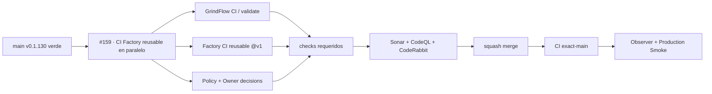

# GrindFlow — Último deploy

> **Candidato v0.1.131: segundo slice de TANDA 2.** Añade el CI reusable Factory v1 en paralelo al CI actual, sin retirar gates ni tocar runtime, datos o producción.

## Progress convention
- ✅ ~~Completado~~ = verificado; 🚧 Pendiente = en curso; ⛔ bloqueado = dependencia externa.

## Fuentes de verdad
[AGENTS.md](AGENTS.md) · [Spec](docs/GRINDFLOW-SPEC.md) · [Requisitos](docs/REQUIREMENTS.md) · [Roadmap #2](https://github.com/pl0n3r/GrindFlow/issues/2)

## Estado del deploy
| Señal | Estado | Evidencia |
| --- | --- | --- |
| SHA exacto de main (base) | ✅ **5c816cc87a0ba4c2d99e992415789090acdb226d** | v0.1.130 fusionada |
| Versión observada en producción (base) | ✅ **v0.1.130** | Production Smoke `36081267633` |
| CI del SHA exacto de main (base) | ✅ **success** | GrindFlow CI `36081267660` |
| Deploy Observer base | ✅ **success** | run `36081267653` |
| Production Smoke base | ✅ **success** | autenticado, checkout exacto |
| Version objetivo | 🚧 **v0.1.131** | `config/version.php` |
| CI/Sonar/CodeRabbit del PR | 🚧 pendiente | HEAD final de PR #160 |
| Producción objetivo | 🚧 pendiente | solo tras merge + exact-main + observer + smoke |

## Huella del cambio
<!-- grindflow:git-delta -->
| Archivos | Inserciones | Eliminaciones | Neto |
| ---: | ---: | ---: | ---: |
| **7** | **+167** | **−33** | **+134** |

## Calidad y entrega
<!-- grindflow:gate-plan -->
| Control | Estado / contrato |
| --- | --- |
| Gates seleccionados | **preflight · fast[operational contracts + automation syntax + README dashboard] · php-quality · PHPUnit · MariaDB · browser · real-stack · legacy · symfony-preview** |
| PR + snapshot exacto | **PR #160 / Issue #159 · v0.1.131**; diff y README deben coincidir con el HEAD final |
| Gate agregador obligatorio | **validate** mantiene todos los gates seleccionados + privacy-as-code; Sonar, CodeQL y CodeRabbit separados |
| Política Factory | `politica.yml@v1` sigue validando decisiones; **CI Factory v1** corre además como check paralelo |
| CI local canónico | `GrindFlow CI / validate` permanece obligatorio; Factory CI todavía no lo sustituye |
| Rol del PR | **Infraestructura · Seguridad · QA** |

## Flujo de entrega

## Qué se hizo
- Añade `.github/workflows/factory-ci.yml` como caller PR-only del reusable `pl0n3r/factory/.github/workflows/ci.yml@v1`.
- Declara inputs reales de GrindFlow: Laravel en raíz, PHP 8.5, Node 24, dominio HTTPS, fase `construccion`, `config/version.php` y `kit_ref: v1`.
- Mantiene permisos de solo lectura y no hereda secretos.
- Añade regresiones que rechazan push/pull_request_target, permisos de escritura, refs flotantes y drift de inputs.
- El CI local exige el nuevo workflow y ejecuta sus tests; `GrindFlow CI / validate` sigue siendo el gate canónico.
- No se retira ningún gate actual, no se mueve Factory `v1` y no se escribe producción.

## Archivos modificados en esta entrega candidata
<!-- grindflow:changed-files -->
- `.github/workflows/factory-ci.yml`
- `.github/workflows/grindflow-ci.yml`
- `README.md`
- `config/version.php`
- `docs/GOVERNANCE.md`
- `phpunit.xml`
- `tests/test_factory_ci_adoption.py`

## Validación
- AC-01/02/03 tienen regresiones offline en `fast`; Factory CI y GrindFlow CI corren como checks paralelos.
- `GrindFlow CI / validate`, política, ownership, privacidad, Sonar, CodeQL y CodeRabbit siguen siendo obligatorios para el HEAD final.
- Merge, deploy y validación productiva permanecen estados separados.

## Qué sigue
[Roadmap canónico #2](https://github.com/pl0n3r/GrindFlow/issues/2)

## Panorama general pendiente
| Lane | Frente | Estado |
| --- | --- | --- |
| **NOW** | 🚧 #159 · CI reusable Factory v1 en paralelo | 🚧 candidata v0.1.131 |
| **NEXT** | 🚧 #129 · siguiente slice Factory | 🚧 coordinación/etiquetas y release/observer |
| **BLOCKED / EXTERNAL** | ⛔ #139 Dependabot + #146 media storage | ⛔ evidencia/configuración externa |
| **LATER** | 🚧 #122 helper CodeRabbit + #138 Sentry | 🚧 preservados tras TANDA 2 |
