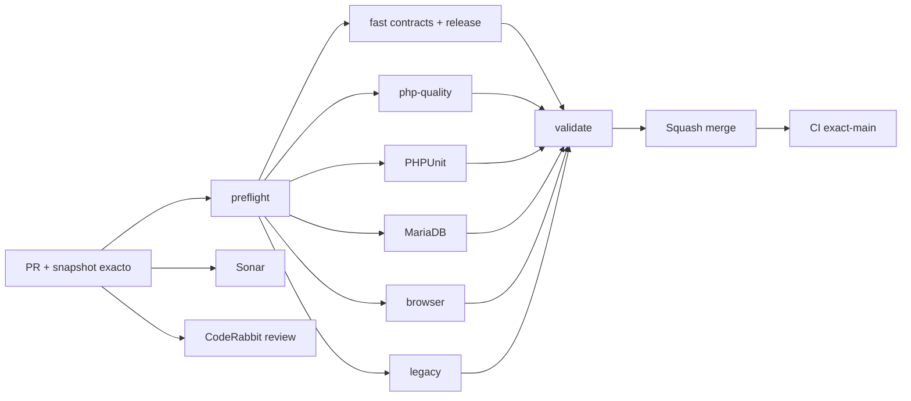

# GrindFlow — Último deploy

  
  
  

> **Snapshot del PR candidato v0.1.6; NO es evidencia de deploy. El contrato «solo el deploy actual» aplica al publicarse. `main` v0.1.5 paso exact-main CI; Production Smoke confirma esquema previo sin pendientes; ledger nuevo aun no migrado.

## Progress convention
- ✅ ~~Completado~~ = concluido y verificado por las compuertas aplicables.
- 🚧 Pendiente = por hacer o en curso, sin tachado.

## Estado del deploy
| Señal | Estado | Evidencia |
| --- | --- | --- |
| Work line | 🚧 **GF-FR-005 · Immutable delivery attempt audit** | [Roadmap #88](https://github.com/drpipe1098-commits/GrindFlow/issues/88) |
| Base exacta | ✅ **v0.1.5 · PR #96 fusionado** | `main` `1109664cb3ef9afd69cf24d415d88c1304021846` |
| Version | 🚧 **v0.1.6** | audit de transiciones de distribucion |
| CI del PR | 🚧 **head rebasado pendiente** | candidato anterior #35451318697 paso; revalidar |
| Sonar | 🚧 **head rebasado pendiente** | candidato anterior bd05cc9f Quality Gate OK; revalidar |
| CodeRabbit | 🚧 **2 findings abordados** | FK RESTRICT + evidencia; nueva revision pendiente |
| CI del SHA exacto de main | ✅ **v0.1.5 validado** | validate #35451987029 |
| Production Smoke | ✅ **esquema previo actual** | #35451987030; 0 pendientes antes del ledger nuevo |
| Migraciones | 🚧 **ledger nuevo pendiente** | requiere backup + aprobacion expresa |

## Huella del cambio
<!-- grindflow:git-delta -->
| Archivos | Inserciones | Eliminaciones | Neto |
| ---: | ---: | ---: | ---: |
| **12** | **+549** | **−91** | **+458** |

## Calidad y entrega
<!-- grindflow:gate-plan -->
| Control | Estado / contrato |
| --- | --- |
| Gates seleccionados | **preflight · fast[contracts] · php-quality · PHPUnit · MariaDB · browser** |
| Audit | ledger tenant-owned append-only, orden por entrega y error interno seguro |
| Concurrencia | eventos de resultado en la misma transaccion que la transicion cercada |
| UI | timeline por entrega o explicacion de migracion pendiente |
| Produccion | no ejecuta migraciones ni publica externamente |

## Flujo de entrega

## Qué se hizo
- Distribution registra `attempt_started` y resultados aceptados en ledger append-only por organizacion y entrega.
- `event_number` conserva orden determinista aunque rate limits repitan el mismo attempt budget.
- Un worker obsoleto no puede anotar un resultado tras perder su claim.
- MariaDB impide UPDATE/DELETE mediante triggers y RESTRICT evita borrado de padres que suprima historial.
- La vista de Distribution muestra timeline seguro por entrega y sigue funcionando antes de la migracion de auditoria.
- Tests cubren publicacion, rate limit, ausencia de tabla, aislamiento de organizaciones, inmutabilidad ORM/SQL y DELETE del padre rechazado.

## Archivos modificados en este deploy
- `AGENTS.md` — invariantes durables de auditoria.
- `README.md` — snapshot exacto del candidato v0.1.6.
- `app/Http/Controllers/Distribution/DistributionController.php` — eager load del timeline condicionado a schema.
- `app/Models/PublicationDelivery.php` — relacion ordenada de eventos.
- `app/Models/PublicationDeliveryEvent.php` — modelo tenant-owned append-only.
- `app/Services/Distribution/PublicationDeliveryManager.php` — escrituras atomicas y cercadas.
- `config/version.php` — version humana v0.1.6.
- `database/migrations/2026_09_19_160000_create_publication_delivery_events_table.php` — ledger y triggers.
- `docs/GRINDFLOW-SPEC.md` — contrato de audit.
- `docs/REQUIREMENTS.md` — criterios de GF-FR-005.
- `resources/views/distribution/index.blade.php` — historial visible.
- `tests/Feature/DistributionTest.php` — regresiones de eventos y fallback.

## Validación
- `main` v0.1.5 exacto `1109664cb3ef9afd69cf24d415d88c1304021846`: CI `validate` #35451987029 success.
- v0.1.6 esta implementada en rama: CI #35451318697 y Sonar pasaron en head anterior; head rebasado requiere nuevas validaciones.
- Production Smoke #35451987030 confirmo cero migraciones previas pendientes; ledger v0.1.6 aun no migrado.
- Bridge #35452041675 fue no-op (0 previo); ledger nuevo no migrado ni desplegado.

## Qué sigue
| Lane | Trabajo |
| --- | --- |
| **NOW** | 🚧 Validar y entregar audit v0.1.6; [roadmap #88](https://github.com/drpipe1098-commits/GrindFlow/issues/88). |
| **NEXT** | 🚧 Storage S3/CORS #40 y browser coverage en Distribution. |
| **LATER** | 🚧 Adapter externo solo con autorizacion y credenciales aptas. |
| **BLOCKED / EXTERNAL** | 🚧 migracion nueva del ledger: backup restaurable + aprobacion expresa. |

## Panorama general pendiente
| Lane | Frente | Estado |
| --- | --- | --- |
| **DONE** | ✅ ~~Workflow #87, navegacion #90/#91, diagnostico #92 y runtime #94~~ | ✅ ~~main v0.1.5 validado~~ |
| **NOW** | 🚧 Ledger append-only de Distribution | 🚧 v0.1.6 |
| **NEXT** | 🚧 Storage y migracion nueva de audit | 🚧 #40 · audit v0.1.6 |
| **LATER** | 🚧 Finance y paridad legado | 🚧 despues del esquema |
| **BLOCKED / EXTERNAL** | 🚧 Produccion | 🚧 migracion nueva y checkout verificable |
