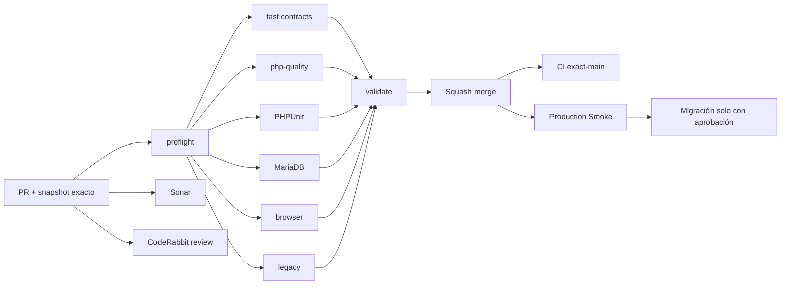

# GrindFlow — Último deploy

  
  
  

> **Development dashboard** · snapshot profesional de **solo el deploy actual**. CI, deploy y validación en producción son evidencias distintas.

## Estado del deploy

| Señal | Estado actual | Evidencia |
| --- | --- | --- |
| Work line | 🟠 **GF-OPS · Migration manifest read-only** | rama `feat/safe-production-migration-manifest` |
| Base exacta | ✅ **main** | `04de9f1aba5be44558b04b40433ad43ed7048e64` |
| Diagnóstico | ✅ **seis migraciones pendientes en producción** | Smoke #35422829857 / issue #69 |
| CI del PR | ⚪ **por validar** | ejecutar sobre head final |
| Sonar / CodeRabbit | ⚪ **por validar** | evidencias del head final |
| CI del SHA exacto de main | ⚪ **sin evidencia confirmada** | independiente del CI de PR |
| Production Smoke | 🟠 **bloqueado por esquema** | el cambio añade manifiesto en el próximo Smoke |
| Migraciones | 🟠 **no ejecutadas** | requieren backup externo restaurable y aprobación explícita |

## Huella del cambio

<!-- grindflow:git-delta -->

| Archivos | Inserciones | Eliminaciones | Neto |
| ---: | ---: | ---: | ---: |
| **5** | **+0** | **−0** | **+0** |

La huella se calcula con `git diff --numstat`; CI rechaza este dashboard si queda desactualizado.

## Calidad y entrega

<!-- grindflow:gate-plan -->

| Control | Estado / contrato |
| --- | --- |
| Gates seleccionados | **preflight · fast[contracts] · php-quality · PHPUnit · MariaDB · browser · legacy** |
| GrindFlow CI | compila parser Python, prueba offline seis escenarios y valida dashboard |
| Sonar / CodeRabbit | evaluación independiente sobre el head exacto |
| Migración | el manifiesto es solo lectura; CI/Smoke no migran |
| Producción | la evidencia del nuevo manifiesto requiere Smoke sobre el SHA fusionado |

## Flujo de entrega

## Qué se hizo

- Extrae del HTML autenticado de Admin > System el nombre exacto de cada migración pendiente y el SHA-256 del lote, sin un request HTTP adicional.
- Valida sintaxis de nombres, conteo, duplicados y fingerprint antes de emitir líneas `MIGRATION_NAME` / `MIGRATION_BATCH_SHA256`.
- Si el manifiesto no es verificable, escribe `MIGRATION_INVENTORY_STATUS=unavailable` sin datos parciales, conservando el bloqueo del Smoke.
- Mantiene el issue público con solo el conteo; el manifiesto detallado queda en el artefacto de diagnóstico de tres días, accesible a colaboradores autorizados.
- Prueba extracción válida, ausencia, discrepancia, contenido no permitido y fingerprint inválido con curl simulado. Nunca ejecuta migraciones.

## Archivos modificados en este deploy

- `.github/workflows/grindflow-ci.yml` — compila el parser en fast.
- `README.md` — dashboard del deploy actual.
- `scripts/production-migration-inventory.py` — extrae manifiesto con lista permitida.
- `scripts/production-smoke-contract.sh` — regresiones sin red ni DB.
- `scripts/production-smoke.sh` — incorpora manifiesto al diagnóstico bloqueado.

## Validación

- En el último Smoke de `main` se informó `Pending migration count: 6` (run #35422829857); no se conocen aún los seis nombres por ese run previo.
- El nuevo parser se ejecuta únicamente al observar count positivo y verifica la misma respuesta System usada por Smoke.
- Las pruebas offline cubren seis escenarios: inventario válido, faltante, conteo distinto, nombre rechazado, fingerprint inválido y schema actual; el inventario desconocido conserva su prueba.
- No hay evidencia aquí de respaldo restaurable, ejecución de migraciones ni recuperación de producción.

## Qué sigue

| Lane | Trabajo |
| --- | --- |
| **NOW** | Validar PR / Sonar / CodeRabbit y fusionar tras gates aprobados. |
| **NEXT** | Consultar el artefacto Smoke exact-main para leer los seis nombres y el fingerprint sin SSH. |
| **NEXT** | Verificar backup externo restaurable y obtener aprobación explícita antes de ejecutar el lote revisado. |
| **BLOCKED / EXTERNAL** | Migración productiva, storage S3 y FFmpeg. |
| **LATER** | Providers reales en sandbox y conciliación Finance. |

## Panorama general pendiente

| Lane | Frente | Estado |
| --- | --- | --- |
| **NOW** | Manifiesto de migraciones | parser + Smoke en PR |
| **NEXT** | Migraciones productivas | seis pendientes; nombres/backup/aprobación |
| **NEXT** | Scheduling/Distribution/Traffic/Finance | confirmar schema productivo tras migración |
| **BLOCKED / EXTERNAL** | Hosting/storage | S3 + FFmpeg |
| **LATER** | Provider adapters | sandbox y credenciales cifradas |
| **LATER** | Legacy retirement | tras GF-MIG |
