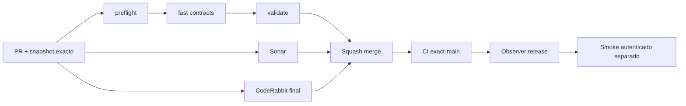

# GrindFlow — Último deploy

> **Candidato v0.1.78: recuperación de trabajo inactivo sin duplicar ramas ni PRs.** Base exacta `main` v0.1.77 `4b5ebeba23e535b845caec943e1b713dd5379165`. Solo reglas de colaboración; Symfony continúa aislado y sin cutover.

## Progress convention
- ✅ ~~Completado~~ = verificado; 🚧 Pendiente = en curso; ⛔ bloqueado = dependencia externa.

## Fuentes de verdad
[AGENTS.md](AGENTS.md) · [Spec](docs/GRINDFLOW-SPEC.md) · [Requisitos](docs/REQUIREMENTS.md) · [Transición](docs/STACK-TRANSITION-SYMFONY.md) · [Roadmap #2](https://github.com/pl0n3r/GrindFlow/issues/2)

## Estado del deploy
| Señal | Estado | Evidencia |
| --- | --- | --- |
| Version objetivo | 🚧 **v0.1.78** | `config/version.php` |
| Base exacta | ✅ ~~main v0.1.77~~ | `4b5ebeba23e535b845caec943e1b713dd5379165` |
| CI del PR | ✅ ~~VALIDATED IN CODE v0.1.78~~ | `GrindFlow CI / validate` run `35671057434`; confirmar gates del nuevo HEAD antes de merge |
| Sonar | ✅ ~~Quality Gate de v0.1.78 success~~ | SonarCloud PR, sin issues nuevos; revalidar nuevo HEAD antes del merge |
| CodeRabbit | ⛔ Revisión final obligatoria pendiente tras rate limit | PR #78; no fusionar hasta review completa |
| CI del SHA exacto de main | ✅ ~~v0.1.77 success~~ | run `35667874191` |
| Deploy Observer | ✅ ~~v0.1.77 release observada~~ | run `35667874090`; versión humana, NO SHA Hostinger |
| Production Smoke | ⛔ Autenticación productiva pendiente | [Issue #73](https://github.com/pl0n3r/GrindFlow/issues/73); no lo corrige esta entrega de gobierno |
| Symfony en Hostinger | ⛔ NO desplegado | Solo entorno aislado CI |
| Migraciones | ✅ ~~Sin cambios de esquema~~ | Solo reglas, README y versión humana |

## Huella del cambio
<!-- grindflow:git-delta -->
| Archivos | Inserciones | Eliminaciones | Neto |
| ---: | ---: | ---: | ---: |
| **4** | **+49** | **−40** | **+9** |

## Calidad y entrega
<!-- grindflow:gate-plan -->
| Control | Estado / contrato |
| --- | --- |
| Gates seleccionados | **preflight · fast[contracts]** |
| Alcance | [Issue #77](https://github.com/pl0n3r/GrindFlow/issues/77): prioridad de recuperar trabajos tras 30 min sin actividad humana útil; no duplicar rama/PR |
| Revisiones | CI + Sonar + **CodeRabbit terminado sobre head final ANTES de merge**; exact-main y Hostinger separados |

## Flujo de entrega

## Qué se hizo
- Se prioriza recuperar una tarea/PR existente si lleva más de 30 minutos sin commit ni comentario humano útil, antes de iniciar otro frente disponible.
- Eventos de bots, CI, Sonar, CodeRabbit, etiquetas, metadatos o `updated_at` no reinician artificialmente el reloj; se conserva la rama, el issue y el PR originales.
- Un Issue con dependencia explícitamente bloqueada no se recupera hasta desbloquearse. La regla complementa, sin reemplazar, los gates obligatorios de CI, Sonar y revisión CodeRabbit final.
- Este cambio es de gobierno, no cambia autorización, runtime ni datos productivos; [PR #75](https://github.com/pl0n3r/GrindFlow/pull/75) sigue separada y tendrá que reconciliar versión tras este release.

## Archivos modificados en este deploy
Inventario de **solo el deploy actual** candidato, no prueba checkout SHA remoto en Hostinger.
- `AGENTS.md`
- `README.md`
- `config/version.php`
- `docs/GOVERNANCE.md`

## Validación
- CI #35671057434 pasó tras corregir versión y título; esta actualización del snapshot requiere validar el SHA final de nuevo antes de fusionar.
- Verificar CI `validate`, Sonar y la revisión final explícita CodeRabbit sobre el mismo HEAD definitivo antes del merge.
- Sin despliegue Symfony, migraciones, escrituras productivas ni declaración de smoke autenticado en verde.

## Qué sigue
[Roadmap canónico #2](https://github.com/pl0n3r/GrindFlow/issues/2)

| Lane | Trabajo | Estado |
| --- | --- | --- |
| **NOW** | 🚧 Integrar gobierno anti-starvation #77; continuar seguridad del smoke #73 por PR separada | 🚧 Gate CodeRabbit final obligatorio |
| **NEXT** | 🚧 Reconciliar versión PR #75 si v0.1.78 se fusiona antes; investigar #73 | 🚧 Merges seriales |
| **LATER** | 🚧 S4/S5 Symfony y paridad previa a cutover | 🚧 Sin datos productivos |
| **BLOCKED / EXTERNAL** | ⛔ #73: smoke autenticado; Symfony Hostinger sin desplegar | ⛔ No confundir CI con producción |

## Panorama general pendiente
| Lane | Frente | Estado |
| --- | --- | --- |
| **DONE** | ✅ ~~v0.1.77 navegación/identidad y gate CodeRabbit~~ | ✅ ~~Exact-main #35667874191 success; Observer release observado~~ |
| **NOW** | 🚧 Integrar gobierno anti-starvation #77; continuar seguridad del smoke #73 por PR separada | 🚧 Gate CodeRabbit final obligatorio |
| **NEXT** | 🚧 Reconciliar versión PR #75 si v0.1.78 se fusiona antes; investigar #73 | 🚧 Merges seriales |
| **LATER** | 🚧 S4/S5 Symfony y paridad previa a cutover | 🚧 Sin datos productivos |
| **BLOCKED / EXTERNAL** | ⛔ #73: smoke autenticado; Symfony Hostinger sin desplegar | ⛔ No confundir CI con producción |
