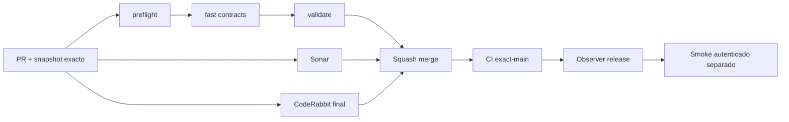

# GrindFlow — Último deploy

> **Candidato v0.1.82: preflight privado de continuidad CSRF antes del login E2E (#73).** Base exacta `main` v0.1.81 `ace5f942211dfd262765eaf2b1f246dfb7c462eb`; no altera usuarios, secretos, base productiva ni despliega Symfony.

## Progress convention
- ✅ ~~Completado~~ = verificado; 🚧 Pendiente = en curso; ⛔ bloqueado = dependencia externa.

## Fuentes de verdad
[AGENTS.md](AGENTS.md) · [Spec](docs/GRINDFLOW-SPEC.md) · [Requisitos](docs/REQUIREMENTS.md) · [Transición](docs/STACK-TRANSITION-SYMFONY.md) · [Roadmap #2](https://github.com/pl0n3r/GrindFlow/issues/2)

## Estado del deploy
| Señal | Estado | Evidencia |
| --- | --- | --- |
| Version objetivo | 🚧 **v0.1.82** | `config/version.php` |
| Base exacta | ✅ ~~main v0.1.81~~ | `ace5f942211dfd262765eaf2b1f246dfb7c462eb` |
| CI del PR | 🚧 Sin evidencia aún para este candidato | Comprobar sobre HEAD final |
| Sonar / CodeRabbit | 🚧 Pendientes | Full review explícita y Quality Gate sobre HEAD final |
| CI del SHA exacto de main | ✅ ~~v0.1.81 success~~ | run `35684392266` |
| Deploy Observer | ✅ ~~v0.1.81 observado~~ | run `35684392307`, release humano, NO SHA Hostinger |
| Production Smoke | ⛔ Vuelve a `/login` | artifact run `35684392252`, [#73](https://github.com/pl0n3r/GrindFlow/issues/73) |
| Symfony en Hostinger | ⛔ NO desplegado | Solo CI aislado |
| Migraciones | ✅ ~~Sin cambios de esquema~~ | Producción intacta |

## Huella del cambio
<!-- grindflow:git-delta -->
| Archivos | Inserciones | Eliminaciones | Neto |
| ---: | ---: | ---: | ---: |
| **4** | **+000** | **−000** | **+0** |

## Calidad y entrega
<!-- grindflow:gate-plan -->
| Control | Estado / contrato |
| --- | --- |
| Gates seleccionados | **preflight · fast[contracts]** |
| Gate agregador obligatorio | **validate**: todos los seleccionados, Sonar por separado |
| Alcance | Dos GET de `/login` con mismo cookie jar, comparan CSRF solo localmente antes de un POST |
| Revisiones | CI/Sonar/CodeRabbit del mismo HEAD, exact-main y producción separados |

## Flujo de entrega

## Qué se hizo
- El smoke v0.1.81 observó de forma saneada un único POST de login con `LOGIN_REDIRECT_PATH=/login`; no permite distinguir credenciales, rate limit o estado de sesión sin más señales. No repetir intentos ciegos.
- Un **segundo GET anónimo**, antes de enviar credenciales, reutiliza el mismo cookie jar y compara internamente tokens CSRF de las dos respuestas. Ante rotación inesperada, emite solo `LOGIN_SESSION_PREFLIGHT=inconsistent` y **no envía ningún POST**. Si es estable, `consistent` y continúa con un solo POST; consistencia CSRF **no prueba** credencial ni login correcto.
- Nunca se imprimen tokens CSRF, cookies, body ni header remoto; se utilizan archivos privados 0600, trap de limpieza y allowlist de `incident_id`. El redirect de autenticación sigue fail-fast.
- Contrato sintético: continuidad positiva en flujos existentes y caso negativo con rotación artificial de CSRF; asserts prueban 2 GET, 0 POST, exit 7, sin secretos y sin reintentos.

## Archivos modificados en este deploy
Inventario del candidato v0.1.82, no evidencia de publicación. «solo el deploy actual» conserva el snapshot README.
- `README.md`
- `config/version.php`
- `scripts/production-smoke-contract.sh`
- `scripts/production-smoke.sh`

## Validación
- CI y Sonar del candidato v0.1.82 pendientes; la CI exact-main `35684392266` success corresponde exclusivamente a v0.1.81. Los contratos del PR usan solo curl simulado, nunca credenciales E2E reales.
- El primer smoke tras merge puede distinguir inestabilidad CSRF pre-login de un redirect `/login` después de POST, **sin determinar automáticamente si la contraseña es incorrecta**. No ajustar sesiones ni cuentas productivas sin evidencia adicional.

## Qué sigue
[Roadmap canónico #2](https://github.com/pl0n3r/GrindFlow/issues/2)

| Lane | Trabajo | Estado |
| --- | --- | --- |
| **NOW** | 🚧 Preflight seguro de sesión v0.1.82 | 🚧 CI/Sonar/CodeRabbit |
| **NEXT** | 🚧 Diagnosticar auth E2E #73 con señales de solo lectura | 🚧 No cambiar credenciales |
| **LATER** | 🚧 Paridad Symfony y Traffic | 🚧 Sin cutover |
| **BLOCKED / EXTERNAL** | ⛔ Smoke autenticado #73 | ⛔ Causa exacta pendiente |

## Panorama general pendiente
| Lane | Frente | Estado |
| --- | --- | --- |
| **DONE** | ✅ ~~S5 v0.1.80 y hardening v0.1.81~~ | ✅ ~~PR #79/#80 fusionadas; CI exact-main success~~ |
| **NOW** | 🚧 Preflight seguro de sesión | 🚧 v0.1.82 candidato |
| **NEXT** | 🚧 Aislar causa #73 | 🚧 Preflight sin exponer secretos |
| **LATER** | 🚧 Distribution y Traffic Symfony | 🚧 Sin cutover |
| **BLOCKED / EXTERNAL** | ⛔ Smoke autenticado | ⛔ Symfony no desplegado |
