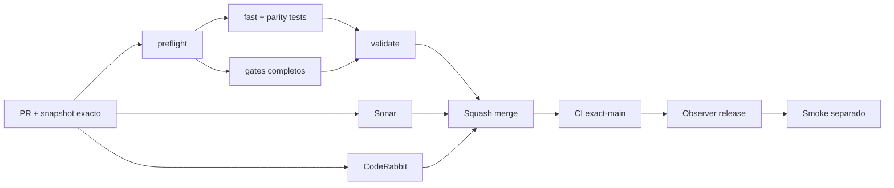

# GrindFlow — Último deploy

> **Candidato v0.1.98: verificador offline de evidencia redacted aportada por operador para GF-ARCH-002.** Base exacta `main` v0.1.97 `cc39bc13b377ce6fa2b2f23e9144cd712a0db294`; valida referencias de inventario metadata-only autorizado y restore real observado sin conectarse a producción ni autorizar cutover.

## Progress convention
- ✅ ~~Completado~~ = verificado; 🚧 Pendiente = en curso; ⛔ bloqueado = dependencia externa.

## Fuentes de verdad
[AGENTS.md](AGENTS.md) · [Spec](docs/GRINDFLOW-SPEC.md) · [Requisitos](docs/REQUIREMENTS.md) · [Transición](docs/STACK-TRANSITION-SYMFONY.md) · [Roadmap #2](https://github.com/pl0n3r/GrindFlow/issues/2)

## Estado del deploy
| Señal | Estado | Evidencia |
| --- | --- | --- |
| Version objetivo | 🚧 **v0.1.98** | `config/version.php`; no publicada |
| Base exacta | ✅ ~~main v0.1.97~~ | `cc39bc13b377ce6fa2b2f23e9144cd712a0db294` |
| CI del PR | 🚧 Pendiente | Revalidar HEAD final |
| Sonar del PR | 🚧 Pendiente | Revalidar HEAD final |
| CodeRabbit del PR | 🚧 Pendiente | Revalidar HEAD final |
| CI del SHA exacto de main | 🚧 No observado para v0.1.97 | Production Smoke separado y rojo |
| Deploy Observer | 🚧 Pendiente | No inferir checkout remoto |
| Production Smoke | ⛔ Login E2E no validado | #73 sigue independiente |
| Symfony en Hostinger | ⛔ NO desplegado | Sin cutover |
| Datos productivos | ✅ ~~No tocados~~ | Verificador offline; solo hashes/timestamps redacted |

## Huella del cambio
<!-- grindflow:git-delta -->
| Archivos | Inserciones | Eliminaciones | Neto |
| ---: | ---: | ---: | ---: |
| **6** | **+532** | **−30** | **+502** |

## Calidad y entrega
<!-- grindflow:gate-plan -->
| Control | Estado / contrato |
| --- | --- |
| Gates seleccionados | **preflight · fast[operational contracts + automation syntax + README dashboard] · php-quality · PHPUnit · MariaDB · browser · real-stack · legacy · symfony-preview** |
| Gate agregador obligatorio | **validate**: todos los seleccionados; Sonar y CodeRabbit aparte |
| Alcance | GF-ARCH-002: receipts redacted de metadata autorizada + restore observado |
| Revisiones | CI/Sonar/CodeRabbit HEAD; exact-main, Observer y Smoke separados |

## Flujo de entrega

## Qué se hizo
- Nuevo `scripts/operator-evidence-verifier.py`: valida offline referencias redacted a evidencia externa de GF-ARCH-002.
- Solo admite módulos ya mapeados por ownership (`identity` y `vault`) y vuelve a cotejar el ownership report contra las migraciones del mismo checkout.
- Exige exactamente dos receipts: `authorized_metadata_inventory` y `real_backup_restore_rehearsal`.
- Cada receipt conserva únicamente SHA-256, timestamp UTC, módulo, huella del inventario y entorno esperado; inventario y restore deben usar digests distintos.
- Requiere `operator_observed=true`, `contains_row_data=false` y `contains_secrets=false`; campos adicionales como URL, path, usuario, nota o credencial se rechazan.
- La entrada está limitada a 1.000.000 bytes, exige UTF-8 y falla cerrado ante JSON recursivo o malformado sin reproducir el payload.
- La suite instala una audit barrier para detectar sockets, subprocesses u operaciones externas y comprueba que `DATABASE_URL` no se filtra.
- El reporte declara `scope=redacted_references_only` y `receipt_content_verified=false`; mantiene siempre `production_ready=false` y `production_authorized=false`.
- Siguen pendientes y separados: evidencia de single-writer/freeze, autorización del owner y Production Smoke.
- `fast` compila y ejecuta la suite del nuevo contrato; no se toca Hostinger, MariaDB productiva, cuentas ni blobs reales.

## Archivos modificados en esta entrega candidata
Inventario de solo esta entrega candidata: no constituye evidencia de publicación:
<!-- grindflow:changed-files -->
- `.github/workflows/grindflow-ci.yml`
- `README.md`
- `config/version.php`
- `docs/DATA-CUTOVER-INVENTORY.md`
- `scripts/operator-evidence-verifier.py`
- `tests/test_operator_evidence_verifier.py`

## Validación
- La rama debe pasar `validate`, Sonar y revisión final CodeRabbit sobre el mismo HEAD.
- Por modificar `.github/workflows/grindflow-ci.yml`, el scope es completo e incluye `symfony-preview`.
- Los receipts de `identity` y `vault` deben coincidir con el ownership report reconstruido desde las migraciones actuales.
- El CLI no debe abrir sockets, procesos externos, archivos del caller ni conexiones a base de datos.
- Incluso con ambos receipts válidos, el reporte debe mantener `production_ready=false` y `production_authorized=false`.
- Exact-main, Deploy Observer y Production Smoke siguen siendo señales separadas.
- Esta entrega no valida el contenido de backups/snapshots, RPO/RTO, freeze, autorización del owner ni producción saludable.

## Qué sigue
[Roadmap canónico #2](https://github.com/pl0n3r/GrindFlow/issues/2)

| Lane | Trabajo | Estado |
| --- | --- | --- |
| **NOW** | 🚧 Verificar receipts externos redacted | 🚧 v0.1.98 candidata |
| **NEXT** | 🚧 Revisión humana de receipts + evidencia single-writer | 🚧 GF-ARCH-002 |
| **LATER** | 🚧 Conmutación Symfony por módulo | 🚧 Sin deploy |
| **BLOCKED / EXTERNAL** | ⛔ Resolver login E2E productivo | ⛔ #73 |

## Panorama general pendiente
| Lane | Frente | Estado |
| --- | --- | --- |
| **DONE** | ✅ ~~v0.1.97 fusionada~~ | ✅ ~~evidencia de rehearsal descartable~~ |
| **NOW** | 🚧 Operator evidence verifier | 🚧 v0.1.98 |
| **NEXT** | 🚧 Evidencia single-writer + autorización separada | 🚧 Sin cutover |
| **LATER** | 🚧 Symfony en Hostinger | 🚧 No desplegado |
| **BLOCKED / EXTERNAL** | ⛔ Smoke autenticado Laravel | ⛔ #73 |
