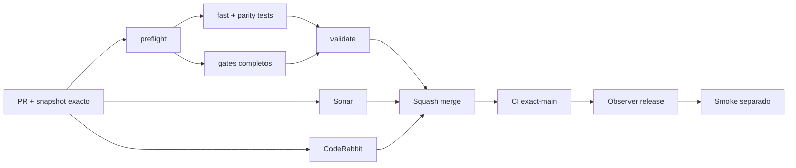

# GrindFlow — Último deploy

> **Candidato v0.1.91: captura controlada de metadatos MariaDB + paridad end-to-end descartable.** Base exacta `main` v0.1.90 `4c57314c913811be8c0a6aa9d864ca97b2842b3f`; consulta solo `information_schema`, no filas de aplicación y no ejecuta cutover.

## Progress convention
- ✅ ~~Completado~~ = verificado; 🚧 Pendiente = en curso; ⛔ bloqueado = dependencia externa.

## Fuentes de verdad
[AGENTS.md](AGENTS.md) · [Spec](docs/GRINDFLOW-SPEC.md) · [Requisitos](docs/REQUIREMENTS.md) · [Transición](docs/STACK-TRANSITION-SYMFONY.md) · [Roadmap #2](https://github.com/pl0n3r/GrindFlow/issues/2)

## Estado del deploy
| Señal | Estado | Evidencia |
| --- | --- | --- |
| Version objetivo | 🚧 **v0.1.91** | `config/version.php`; no publicada |
| Base exacta | ✅ ~~main v0.1.90~~ | `4c57314c913811be8c0a6aa9d864ca97b2842b3f` |
| CI / Sonar / CodeRabbit del PR | 🚧 Pendiente | Revalidar HEAD final |
| CI del SHA exacto de main | 🚧 No observado para v0.1.90 | Señal post-merge separada |
| Deploy Observer | 🚧 Pendiente | No inferir checkout remoto |
| Production Smoke | ⛔ Login E2E no validado | #73 sigue independiente |
| Symfony en Hostinger | ⛔ NO desplegado | Sin cutover |
| Datos productivos | ✅ ~~No tocados~~ | Captura CI solo sobre MariaDB descartable |

## Huella del cambio
<!-- grindflow:git-delta -->
| Archivos | Inserciones | Eliminaciones | Neto |
| ---: | ---: | ---: | ---: |
| **6** | **+459** | **−26** | **+433** |

## Calidad y entrega
<!-- grindflow:gate-plan -->
| Control | Estado / contrato |
| --- | --- |
| Gates seleccionados | **preflight · fast[contracts] · php-quality · PHPUnit · MariaDB · browser · real-stack · legacy · symfony-preview** |
| Gate agregador obligatorio | **validate**: todos los seleccionados; Sonar y CodeRabbit aparte |
| Alcance | Captura `information_schema` de `gf_*` + comparación estructural automática |
| Revisiones | CI/Sonar/CodeRabbit HEAD; exact-main, Observer y Smoke separados |

## Flujo de entrega

## Qué se hizo
- Nuevo `scripts/mariadb-structure-snapshot.php`: captura tablas `gf_*`, columnas, índices, FKs y triggers desde `information_schema`.
- Exige `GF_METADATA_SNAPSHOT_APPROVED=1` y `DATABASE_URL`; sin aprobación explícita falla cerrado antes de conectar.
- La captura inicia transacción read-only, no selecciona filas de aplicación y no imprime credenciales, esquema ni errores de conexión.
- Nuevo contrato `scripts/mariadb-structure-snapshot-contract.sh` verifica que el opt-in y la URL sean obligatorios y que stdout quede vacío al rechazar.
- `symfony-preview` migra la MariaDB descartable, captura el snapshot y lo compara automáticamente contra el estado final reconstruido desde Doctrine.
- El pipeline no versiona snapshots reales ni ejecuta esta herramienta contra Hostinger/producción.

## Archivos modificados en este deploy
Inventario de solo el deploy actual: candidato, no evidencia de publicación:
<!-- grindflow:changed-files -->
- `.github/workflows/grindflow-ci.yml`
- `README.md`
- `config/version.php`
- `docs/DATA-CUTOVER-INVENTORY.md`
- `scripts/mariadb-structure-snapshot-contract.sh`
- `scripts/mariadb-structure-snapshot.php`

## Validación
- La rama debe pasar la matriz completa seleccionada por el cambio del workflow, `validate`, Sonar y revisión final CodeRabbit sobre el mismo HEAD.
- La captura integrada se ejecuta **solo sobre MariaDB descartable de CI**. No acredita esquema productivo, defaults/check constraints, conteos, contenido, backup restaurable, tenant isolation productivo ni SHA Hostinger.
- Ningún snapshot real se incluye en el repositorio por esta entrega.

## Qué sigue
[Roadmap canónico #2](https://github.com/pl0n3r/GrindFlow/issues/2)

| Lane | Trabajo | Estado |
| --- | --- | --- |
| **NOW** | 🚧 Capturar y cotejar metadata `gf_*` en MariaDB descartable | 🚧 v0.1.91 candidata |
| **NEXT** | 🚧 Restore drill MariaDB+blobs en entorno descartable | 🚧 GF-ARCH-002 |
| **LATER** | 🚧 Conmutación Symfony por módulo | 🚧 Sin deploy |
| **BLOCKED / EXTERNAL** | ⛔ Resolver login E2E productivo | ⛔ #73 |

## Panorama general pendiente
| Lane | Frente | Estado |
| --- | --- | --- |
| **DONE** | ✅ ~~v0.1.90 fusionada~~ | ✅ ~~paridad estructural Symfony `gf_*`~~ |
| **NOW** | 🚧 Metadata capture + parity E2E | 🚧 v0.1.91 |
| **NEXT** | 🚧 Captura real autorizada + restore drill | 🚧 Sin cutover |
| **LATER** | 🚧 Symfony en Hostinger | 🚧 No desplegado |
| **BLOCKED / EXTERNAL** | ⛔ Smoke autenticado Laravel | ⛔ #73 |
