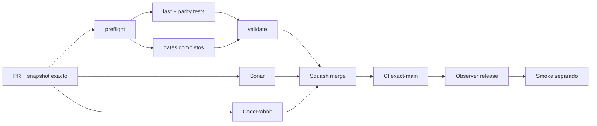

# GrindFlow — Último deploy

> **Candidato v0.1.89: paridad reproducible contra snapshots de esquema read-only.** Base exacta `main` v0.1.88 `5a7b379e557367dc6105b3c98dbd30d4045dfc69`; el comparador no conecta MariaDB, no contiene datos de filas y no realiza cutover.

## Progress convention
- ✅ ~~Completado~~ = verificado; 🚧 Pendiente = en curso; ⛔ bloqueado = dependencia externa.

## Fuentes de verdad
[AGENTS.md](AGENTS.md) · [Spec](docs/GRINDFLOW-SPEC.md) · [Requisitos](docs/REQUIREMENTS.md) · [Transición](docs/STACK-TRANSITION-SYMFONY.md) · [Roadmap #2](https://github.com/pl0n3r/GrindFlow/issues/2)

## Estado del deploy
| Señal | Estado | Evidencia |
| --- | --- | --- |
| Version objetivo | 🚧 **v0.1.89** | `config/version.php`; no publicada |
| Base exacta | ✅ ~~main v0.1.88~~ | `5a7b379e557367dc6105b3c98dbd30d4045dfc69` |
| CI / Sonar / CodeRabbit del PR | 🚧 Pendiente | Revalidar HEAD final |
| CI del SHA exacto de main | 🚧 No observado para v0.1.88 | Señal post-merge separada |
| Deploy Observer | 🚧 Pendiente | No inferir checkout remoto |
| Production Smoke | ⛔ Login E2E no validado | #73 sigue independiente |
| Symfony en Hostinger | ⛔ NO desplegado | Sin cutover |
| Datos productivos | ✅ ~~No tocados~~ | Comparación offline de JSON |

## Huella del cambio
<!-- grindflow:git-delta -->
| Archivos | Inserciones | Eliminaciones | Neto |
| ---: | ---: | ---: | ---: |
| **8** | **+539** | **−60** | **+479** |

## Calidad y entrega
<!-- grindflow:gate-plan -->
| Control | Estado / contrato |
| --- | --- |
| Gates seleccionados | **preflight · fast[contracts] · php-quality · PHPUnit · MariaDB · browser · real-stack · legacy · symfony-preview** |
| Gate agregador obligatorio | **validate**: todos los seleccionados; Sonar y CodeRabbit aparte |
| Alcance | Comparador offline de tablas declaradas vs snapshot de metadatos |
| Revisiones | CI/Sonar/CodeRabbit HEAD; exact-main, Observer y Smoke separados |

## Flujo de entrega

## Qué se hizo
- Nuevo `scripts/data-schema-parity.py`: compara el inventario de migraciones con un snapshot JSON de metadatos, sin código de conexión a base de datos.
- El contrato `gf-arch-002-db-snapshot-v1` exige `metadata_only=true` y `contains_row_data=false`.
- La validación falla cerrado ante tablas fuente ausentes, nombres duplicados o tablas `gf_*` desconocidas; extras no Symfony quedan informativos.
- Siete pruebas unitarias cubren éxito, faltantes, drift Symfony, duplicados y rechazo explícito de snapshots con datos de filas.
- El gate `fast` compila el comparador y ejecuta sus tests; al modificar el workflow, el selector exige la matriz completa de CI.
- `scripts/readme-dashboard.py --update` regenera huella, gates y lista de archivos; CI ejecuta el generador y muestra el diff exacto si alguien deja el README stale.
- `docs/DATA-CUTOVER-INVENTORY.md` documenta formato, límites y flujo reproducible. Sigue sin existir autorización de cutover productivo.

## Archivos modificados en este deploy
Inventario de solo el deploy actual: candidato, no evidencia de publicación:
<!-- grindflow:changed-files -->
- `.github/workflows/grindflow-ci.yml`
- `AGENTS.md`
- `README.md`
- `config/version.php`
- `docs/DATA-CUTOVER-INVENTORY.md`
- `scripts/data-schema-parity.py`
- `scripts/readme-dashboard.py`
- `tests/test_data_schema_parity.py`

## Validación
- La rama debe pasar la matriz completa seleccionada por el cambio del workflow, `validate`, Sonar y revisión final CodeRabbit sobre el mismo HEAD.
- El reporte de paridad es **solo a nivel de nombres de tabla**. No acredita columnas, índices, FKs, triggers, conteos, contenido, backup restaurable, tenant isolation productivo ni SHA Hostinger.
- Ningún snapshot real se incluye en el repositorio por esta entrega.

## Qué sigue
[Roadmap canónico #2](https://github.com/pl0n3r/GrindFlow/issues/2)

| Lane | Trabajo | Estado |
| --- | --- | --- |
| **NOW** | 🚧 Validar paridad offline contra snapshot seguro | 🚧 v0.1.89 candidata |
| **NEXT** | 🚧 Ampliar metadatos a columnas/índices/FKs + restore drill | 🚧 GF-ARCH-002 |
| **LATER** | 🚧 Conmutación Symfony por módulo | 🚧 Sin deploy |
| **BLOCKED / EXTERNAL** | ⛔ Resolver login E2E productivo | ⛔ #73 |

## Panorama general pendiente
| Lane | Frente | Estado |
| --- | --- | --- |
| **DONE** | ✅ ~~v0.1.88 fusionada~~ | ✅ ~~inventario source-only + frontera de escritores~~ |
| **NOW** | 🚧 Snapshot parity table-level | 🚧 v0.1.89 |
| **NEXT** | 🚧 Paridad estructural + backup restaurado | 🚧 Sin cutover |
| **LATER** | 🚧 Symfony en Hostinger | 🚧 No desplegado |
| **BLOCKED / EXTERNAL** | ⛔ Smoke autenticado Laravel | ⛔ #73 |
