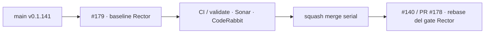

# GrindFlow — Último deploy

> **Candidata v0.1.142 · Issue #179.** Primer saneamiento conservador de Rector sobre Laravel; prepara el gate de #140 / PR #178 sin activarlo aquí.

## Progress convention
- ✅ ~~Completado~~ = verificado; 🚧 Pendiente = en curso; ⛔ bloqueado = dependencia externa.

## Fuentes de verdad
[AGENTS.md](AGENTS.md) · [Spec](docs/GRINDFLOW-SPEC.md) · [Requisitos](docs/REQUIREMENTS.md) · [Roadmap #2](https://github.com/pl0n3r/GrindFlow/issues/2)

## Estado del deploy
| Señal | Estado | Evidencia |
| --- | --- | --- |
| SHA exacto de main (base) | ✅ **de7df78c48eabb01391c0eb55ee38b5dd87d3119** | v0.1.141 |
| CI del SHA exacto de main (base) | ✅ **success** | GrindFlow CI / validate |
| Deploy Observer / Production Smoke base | ✅ **success / success** | Checks exact-main |
| Version objetivo | 🚧 **v0.1.142** | PHP, npm y lock en paridad |
| CI/Sonar/CodeRabbit del PR | 🚧 pendiente | Issue #179 · HEAD candidata |
| Producción objetivo | 🚧 no validada | Runtime Laravel; sin escritura productiva |

## Huella del cambio
<!-- grindflow:git-delta -->
| Archivos | Inserciones | Eliminaciones | Neto |
| ---: | ---: | ---: | ---: |
| **57** | **+209** | **−205** | **+4** |

## Calidad y entrega
<!-- grindflow:gate-plan -->
| Control | Estado / contrato |
| --- | --- |
| Gates seleccionados | **preflight · fast[operational contracts + automation syntax + README dashboard] · php-quality · PHPUnit · MariaDB · browser · real-stack · legacy** |
| PR + snapshot exacto | **Issue #179 · v0.1.142**; README debe coincidir con HEAD final |
| Gate agregador obligatorio | **validate** mantiene los gates seleccionados, con Sonar y CodeRabbit independientes |
| Alcance | Rector inicial sobre `app/` y `routes/`, más versión/README |
| CI local canónico | **GrindFlow CI / validate** |
| Rol del PR | **Ingeniería de software · QA** |

## Flujo de entrega

## Qué se hizo
- Aplicó solo los cambios detectados por Rector 2.6.7 / rector-laravel 2.6.2 en 52 archivos `app/` y `routes/`, reproducidos desde el log de `php-quality` del PR #178.
- Normaliza atributos `Override`, tipos de constantes, helpers, redirecciones y cierres simples sin migraciones ni cambios de dependencias.
- Conserva #178 separado: este PR no activa el dry-run ni cambia el toolchain Rector.
- No modificó secretos, base de datos, Hostinger o producción.

## Archivos modificados en esta entrega candidata
<!-- grindflow:changed-files -->
- `README.md`
- `app/Console/Commands/ProvisionSmokeUser.php`
- `app/Http/Controllers/Admin/RunMigrationsController.php`
- `app/Http/Controllers/Auth/AuthenticatedSessionController.php`
- `app/Http/Controllers/Distribution/DistributionController.php`
- `app/Http/Controllers/Finance/FinanceController.php`
- `app/Http/Controllers/Operations/ProductionSmokeBootstrapController.php`
- `app/Http/Controllers/Scheduling/SchedulerController.php`
- `app/Http/Controllers/Traffic/TrafficController.php`
- `app/Http/Controllers/Vault/VaultController.php`
- `app/Jobs/DispatchScheduledPublication.php`
- `app/Jobs/IngestMediaObject.php`
- `app/Jobs/ProcessMediaAsset.php`
- `app/Jobs/ScanMediaConnection.php`
- `app/Models/Concerns/BelongsToOrganization.php`
- `app/Models/MediaAsset.php`
- `app/Models/MediaBlob.php`
- `app/Models/MediaConnection.php`
- `app/Models/MediaIngestion.php`
- `app/Models/Membership.php`
- `app/Models/Organization.php`
- `app/Models/PublicationDelivery.php`
- `app/Models/PublicationDeliveryEvent.php`
- `app/Models/PublishingDestination.php`
- `app/Models/RevenueAllocation.php`
- `app/Models/ScheduledPublication.php`
- `app/Models/ScheduledPublicationLink.php`
- `app/Models/Scopes/TenantScope.php`
- `app/Models/TrackedLink.php`
- `app/Models/TrackedLinkDailyMetric.php`
- `app/Models/User.php`
- `app/Services/Distribution/DistributionProviderException.php`
- `app/Services/Distribution/PublicationDeliveryManager.php`
- `app/Services/Media/Connections/DropboxOAuthClient.php`
- `app/Services/Media/Connections/GoogleDriveScanCursor.php`
- `app/Services/Media/Connections/GoogleOAuthClient.php`
- `app/Services/Media/Connections/MediaConnectionScheduler.php`
- `app/Services/Media/Connections/OAuthConnectionCoordinator.php`
- `app/Services/Media/Connectors/DropboxMediaAdapter.php`
- `app/Services/Media/Connectors/GoogleDriveMediaAdapter.php`
- `app/Services/Media/DirectMediaUpload.php`
- `app/Services/Media/FilesystemMediaIngestor.php`
- `app/Services/Media/MediaIngestionCoordinator.php`
- `app/Services/Media/MediaIngestor.php`
- `app/Services/Media/MediaProcessingCoordinator.php`
- `app/Services/Traffic/TrackedLinkManager.php`
- `app/Services/Traffic/TrafficAttributionRecorder.php`
- `app/Support/Deployment/GitHubActionsOidcVerifier.php`
- `app/Support/Deployment/ReleaseCacheGuard.php`
- `app/Support/Diagnostics/DiagnosticLog.php`
- `app/Support/Security/SecretCipher.php`
- `config/version.php`
- `package-lock.json`
- `package.json`
- `routes/console.php`
- `routes/web.php`
- `tests/Feature/PrivacyAsCodeTest.php`

## Validación
- Cada bloque de Rector coincidió de forma única con el archivo exacto de main; no se improvisaron transformaciones adicionales.
- La matriz se selecciona por la unión de modelos/jobs, controladores/rutas y metadata legacy.
- El merge requiere CI, Sonar y revisión del HEAD estable; el dry-run de #178 se volverá a comprobar tras integrar #179.

## Qué sigue
[Roadmap canónico #2](https://github.com/pl0n3r/GrindFlow/issues/2)

## Panorama general pendiente
| Lane | Frente | Estado |
| --- | --- | --- |
| **NOW** | 🚧 #179 · primer baseline Rector | 🚧 validando v0.1.142 |
| **NEXT** | 🚧 #140 / PR #178 · habilitar dry-run conservador | 🚧 tras #179 |
| **BLOCKED / EXTERNAL** | ⛔ #139 Dependabot y #146 media storage | ⛔ dependencias externas |
| **LATER** | 🚧 transición Symfony y roadmap producto | 🚧 preservado |
