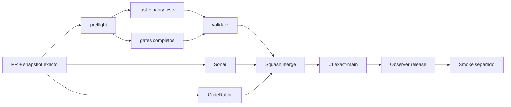

# GrindFlow — Último deploy

> **Candidato v0.1.107: defensa de clickjacking compatible en Symfony.** Base exacta `main` v0.1.106 `609809d877efe765ee6206a0634c5a2ad9937200`; se prohíbe enmarcar páginas en navegadores modernos y antiguos.

## Progress convention
- ✅ ~~Completado~~ = verificado; 🚧 Pendiente = en curso; ⛔ bloqueado = dependencia externa.

## Fuentes de verdad
[AGENTS.md](AGENTS.md) · [Spec](docs/GRINDFLOW-SPEC.md) · [Requisitos](docs/REQUIREMENTS.md) · [Transición](docs/STACK-TRANSITION-SYMFONY.md) · [Roadmap #2](https://github.com/pl0n3r/GrindFlow/issues/2)

## Estado del deploy
| Señal | Estado | Evidencia |
| --- | --- | --- |
| Version objetivo | 🚧 **v0.1.107** | `config/version.php`; no publicada |
| Base exacta | ✅ ~~main v0.1.106~~ | `609809d877efe765ee6206a0634c5a2ad9937200` |
| CI del PR | 🚧 Pendiente | Exigir `validate` del HEAD final |
| Sonar del PR | 🚧 Pendiente | Exigir Quality Gate del HEAD final |
| CodeRabbit del PR | 🚧 Pendiente | Exigir full review del HEAD final |
| CI del SHA exacto de main | ✅ **VALIDATED IN CODE** | `35832037326` success sobre `609809d877efe765ee6206a0634c5a2ad9937200` |
| Deploy Observer | ✅ ~~Marcador humano observado~~ | `35832037334` success; no acredita SHA remoto |
| Production Smoke | ⛔ Login E2E no validado | `35832037355` failure, #73; independiente de esta mejora |
| Symfony en Hostinger | ⛔ NO desplegado | Sin cutover |
| Datos productivos | ✅ ~~No tocados~~ | Pruebas en Symfony/MariaDB descartable; sin cambio de cuentas reales |

## Huella del cambio
<!-- grindflow:git-delta -->
| Archivos | Inserciones | Eliminaciones | Neto |
| ---: | ---: | ---: | ---: |
| **6** | **+155** | **−25** | **+130** |

## Calidad y entrega
<!-- grindflow:gate-plan -->
| Control | Estado / contrato |
| --- | --- |
| Gates seleccionados | **preflight · fast[operational contracts + automation syntax + README dashboard] · symfony-preview** |
| Gate agregador obligatorio | **validate**: todos los seleccionados; Sonar y CodeRabbit aparte |
| Alcance | GF-SEC-008: X-Frame-Options DENY con CSP frame-ancestors 'none' |
| Revisiones | CI/Sonar/CodeRabbit HEAD; exact-main, Observer y Smoke separados |

## Flujo de entrega

## Qué se hizo
- Symfony añade `X-Frame-Options: DENY` a su CSP existente con `frame-ancestors 'none'`, para clientes que no aplican esta última directiva.
- La regla compartida de respuesta se aplica en páginas públicas y privadas, redirecciones y errores sin excepciones para el login.
- PHPUnit HTTP verifica la defensa contra enmarcado y `nosniff` en respuestas 200, 302, 401 y 404; GF-SEC-008 documentado sin alterar Laravel, Hostinger ni producción.

## Archivos modificados en esta entrega candidata
Inventario exclusivo de esta entrega candidata; no prueba publicación:
<!-- grindflow:changed-files -->
- `README.md`
- `config/version.php`
- `docs/REQUIREMENTS.md`
- `symfony/src/Infrastructure/Http/SecurityHeadersSubscriber.php`
- `symfony/tests/php/PreviewTest.php`

## Validación
- Exigir `validate`, Sonar y full review CodeRabbit sobre el HEAD final; después CI exact-main.
- `symfony-preview` valida cabeceras PHP/Symfony en rutas aisladas con MariaDB descartable, TypeScript/Vite y Chromium.
- El release no demuestra despliegue Symfony ni resuelve Production Smoke #73 del Laravel operativo.

## Qué sigue
[Roadmap canónico #2](https://github.com/pl0n3r/GrindFlow/issues/2)

| Lane | Trabajo | Estado |
| --- | --- | --- |
| **NOW** | 🚧 Cabeceras antienmarcado Symfony | 🚧 v0.1.107 candidata |
| **NEXT** | 🚧 Verificación autorizada de cuenta E2E | 🚧 #2 |
| **LATER** | 🚧 Conmutación Symfony por módulo | 🚧 Sin deploy |
| **BLOCKED / EXTERNAL** | ⛔ Resolver login E2E productivo | ⛔ #73 |

## Panorama general pendiente
| Lane | Frente | Estado |
| --- | --- | --- |
| **DONE** | ✅ ~~v0.1.106 fusionada~~ | ✅ ~~selector multiorganización accesible~~ |
| **NOW** | 🚧 Defensa de clickjacking Symfony | 🚧 GF-SEC-008, v0.1.107 |
| **NEXT** | 🚧 Evidencia revisada fuera de banda + autorización separada | 🚧 GF-ARCH-002 sin cutover |
| **LATER** | 🚧 Symfony en Hostinger | 🚧 No desplegado |
| **BLOCKED / EXTERNAL** | ⛔ Smoke autenticado Laravel | ⛔ #73 |
