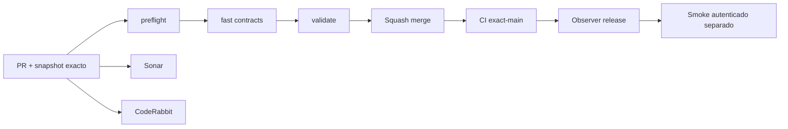

# GrindFlow — Último deploy

> **Candidato v0.1.55: ubicación privada externa opcional para los originales, todavía no desplegado.** La lectura «solo el deploy actual» corresponde al runtime Laravel observado; Symfony permanece aislado. Base `main` v0.1.54 `68cd47a0356211bf99434fc7d962d3b7774e747a`, CI exact-main success. No se copian bytes, cambian credenciales ni ejecutan migraciones productivas.

## Progress convention
- ✅ ~~Completado~~ = verificado; 🚧 Pendiente = en curso; ⛔ bloqueado = dependencia externa.

## Fuentes de verdad
[AGENTS.md](AGENTS.md) · [Spec](docs/GRINDFLOW-SPEC.md) · [Requisitos](docs/REQUIREMENTS.md) · [Transición](docs/STACK-TRANSITION-SYMFONY.md) · [Roadmap #2](https://github.com/pl0n3r/GrindFlow/issues/2)

## Estado del deploy
| Señal | Estado | Evidencia |
| --- | --- | --- |
| Version objetivo | 🚧 **v0.1.55** | `config/version.php` |
| Base exacta | ✅ ~~main v0.1.54~~ | `68cd47a0356211bf99434fc7d962d3b7774e747a` |
| CI del PR | 🚧 Validación del nuevo head pendiente | `GrindFlow CI / validate` |
| Sonar | 🚧 Pendiente | SonarCloud PR |
| CodeRabbit | 🚧 Revisión pendiente | PR |
| CI del SHA exacto de main | 🚧 Después del merge | CI PR no lo sustituye |
| Deploy Observer | 🚧 Release humano por observar | No prueba Symfony en remoto |
| Production Smoke | ⛔ Credencial E2E productiva pendiente | [Issue #1](https://github.com/pl0n3r/GrindFlow/issues/1) |
| Symfony S2 en Hostinger | ⛔ NO desplegado | Solo entorno aislado CI |
| Migraciones | ✅ ~~Ningún esquema productivo modificado~~ | DB Symfony descartable |

## Huella del cambio
<!-- grindflow:git-delta -->
| Archivos | Inserciones | Eliminaciones | Neto |
| ---: | ---: | ---: | ---: |
| **8** | **+242** | **−32** | **+210** |

## Calidad y entrega
<!-- grindflow:gate-plan -->
| Control | Estado / contrato |
| --- | --- |
| Gates seleccionados | **preflight · fast[contracts] · symfony-preview** |
| Alcance | S2: raíz privada configurable fuera de la carpeta del release, manteniendo modo local por defecto |
| Revisiones | CI/Sonar/CodeRabbit, exact-main y Hostinger son independientes |

## Flujo de entrega

## Qué se hizo
- Servicio de storage privado Symfony compartido por cargas, descargas, vistas previas, diagnóstico y restauración; `GRINDFLOW_VAULT_ROOT` es opcional y por defecto conserva `symfony/var/vault`.
- La ruta externa exige padre existente y ubicación absoluta fuera del release. Bloquea directorios simbólicos, travesías y webroot, crea solo el directorio final con permisos 0700.
- PHPUnit prueba la raíz original, ruta externa y rechazos; guía operativa explica cómo preservar catálogo/blobs, persistencia y recuperación, sin prometer backup automático, mover datos ni activar Hostinger.
## Archivos modificados en este deploy
Este inventario corresponde al **cambio candidato en el PR**, no a archivos desplegados en Hostinger.
- `README.md`
- `config/version.php`
- `docs/SYMFONY-VAULT-STORAGE.md`
- `symfony/README.md`
- `symfony/config/services.yaml`
- `symfony/src/Http/Controller/VaultController.php`
- `symfony/src/Infrastructure/Storage/PrivateVaultDirectory.php`
- `symfony/tests/php/PrivateVaultDirectoryTest.php`
## Validación
- PHP/MariaDB y contratos Symfony se comprueban en CI del PR; sin checkout local de este repositorio en esta sesión.
- CI exact-main v0.1.54 success; CI/Sonar/CodeRabbit del head v0.1.55 y Hostinger son señales separadas. No se tocó producción.

## Qué sigue
[Roadmap canónico #2](https://github.com/pl0n3r/GrindFlow/issues/2)

| Lane | Trabajo | Estado |
| --- | --- | --- |
| **NOW** | 🚧 Validar raíz privada configurable v0.1.55 | 🚧 CI y revisión |
| **NEXT** | 🚧 Verificar volumen persistente y plan de backup/restore | 🚧 Pendiente operación y política de retención |
| **LATER** | 🚧 Vault móvil → reglas → distribución autorizada → piloto | 🚧 Planificado |
| **BLOCKED / EXTERNAL** | ⛔ Cutover sin paridad/datos migrados; Smoke sin credencial | ⛔ Dependencia externa |

## Panorama general pendiente
| Lane | Frente | Estado |
| --- | --- | --- |
| **DONE** | ✅ ~~Dashboard Laravel v0.1.30~~ | ✅ ~~Esquema Symfony S1 v0.1.31~~ |
| **NOW** | 🚧 Validar almacenamiento privado externo v0.1.55 | 🚧 CI y revisión |
| **NEXT** | 🚧 Backups coherentes BD + blobs y restauración | 🚧 Pendiente de definir política de retención y backup |
| **LATER** | 🚧 Automatización de contenido | 🚧 S2–S5 |
| **BLOCKED / EXTERNAL** | ⛔ Sin cutover Symfony | ⛔ Sin credencial Smoke |
