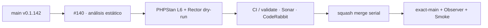

# GrindFlow — Último deploy

> **Candidata v0.1.143 · Issue #140.** PHPStan/Larastan nivel 6 se conserva como gate y Rector entra en dry-run conservador para PHP 8.5/Laravel sin baseline artificial.

## Progress convention
- ✅ ~~Completado~~ = verificado; 🚧 Pendiente = en curso; ⛔ bloqueado = dependencia externa.

## Fuentes de verdad
[AGENTS.md](AGENTS.md) · [Spec](docs/GRINDFLOW-SPEC.md) · [Requisitos](docs/REQUIREMENTS.md) · [Roadmap #2](https://github.com/pl0n3r/GrindFlow/issues/2)

## Estado del deploy
| Señal | Estado | Evidencia |
| --- | --- | --- |
| SHA exacto de main (base) | ✅ **104b91657daaa4681cad31316f4f3b99a9271e71** | v0.1.142 |
| CI del SHA exacto de main (base) | ✅ **success** | GrindFlow CI 36211838271 |
| Deploy Observer / Production Smoke base | ✅ **success / success** | 36211838221 / 36211838235 |
| Version objetivo | 🚧 **v0.1.143** | PHP, npm y lock en paridad |
| CI/Sonar/CodeRabbit del PR | 🚧 pendiente | PR #178 · Issue #140 · v0.1.143 |
| Producción objetivo | ✅ sin cambio runtime | calidad/CI solamente |

## Huella del cambio
<!-- grindflow:git-delta -->
| Archivos | Inserciones | Eliminaciones | Neto |
| ---: | ---: | ---: | ---: |
| **13** | **+504** | **−42** | **+462** |

## Calidad y entrega
<!-- grindflow:gate-plan -->
| Control | Estado / contrato |
| --- | --- |
| Gates seleccionados | **matriz completa** por cambio al core CI; php-quality exige PHPStan + Rector dry-run |
| PR + snapshot exacto | **PR #178 · Issue #140 · v0.1.143**; README debe coincidir con HEAD final |
| Gate agregador obligatorio | **validate** exige php-quality seleccionado; Sonar y CodeRabbit separados |
| Static analysis | PHPStan/Larastan nivel 6; baseline solo para deuda reproducible y sin ignores obsoletos · Rector PHP 8.5 + dead-code/code-quality nivel 0 + Laravel code quality |
| CI local canónico | **GrindFlow CI / validate** |
| Rol del PR | **Ingeniería de software · Infraestructura · QA** |

## Flujo de entrega

## Qué se hizo
- Conserva PHPStan nivel 6 con Larastan ya instalado; main no muestra deuda, por eso no se crea baseline. Si aparece deuda reproducible, el contrato exige baseline no vacío/configurado y `reportUnmatchedIgnoredErrors: true`.
- Añade Rector 2.6.7 + rector-laravel 2.6.2 como toolchain aislado de CI, sin dependencia runtime.
- Rector usa PHP sets, dead-code/code-quality nivel 0 y Laravel code quality, siempre en `--dry-run`.
- `php-quality` instala/cachea el toolchain, ejecuta PHPStan y luego Rector; `validate` sigue exigiendo el gate cuando el scope lo selecciona.
- Contratos fallan si Rector deja de seleccionar php-quality o si desaparece PHPStan/Rector del workflow.
- AGENTS documenta los comandos locales y prohíbe baseline vacío o autoescritura de Rector en CI.

## Archivos modificados en esta entrega candidata
<!-- grindflow:changed-files -->
- `.github/workflows/grindflow-ci.yml`
- `AGENTS.md`
- `README.md`
- `config/version.php`
- `package-lock.json`
- `package.json`
- `phpstan.neon.dist`
- `rector.php`
- `scripts/ci-scope-contract.sh`
- `scripts/ci-scope.sh`
- `scripts/static-analysis-contract.sh`
- `tools/rector/composer.json`
- `tools/rector/composer.lock`

## Validación
- `scripts/static-analysis-contract.sh` comprueba Larastan/nivel 6, toolchain fijado, Rector conservador y comandos obligatorios del gate.
- `scripts/ci-scope-contract.sh` demuestra que `rector.php` y el manifest del toolchain seleccionan php-quality + tests + MariaDB + browser + real-stack.
- Por tocar `grindflow-ci.yml`, el clasificador fuerza la matriz completa; no se reduce cobertura.
- No cambia Laravel/Symfony runtime, DB, Hostinger, permisos, secretos ni datos productivos.
- Estado final exige CI/Sonar/CodeRabbit del mismo HEAD y exact-main + Observer + Smoke tras merge.

## Qué sigue
[Roadmap canónico #2](https://github.com/pl0n3r/GrindFlow/issues/2)

## Panorama general pendiente
| Lane | Frente | Estado |
| --- | --- | --- |
| **NOW** | 🚧 #140 · PHPStan/Rector en CI | 🚧 candidata v0.1.143 |
| **NEXT** | 🚧 #129 · cierre adopción Factory | 🚧 tras #140/#125 |
| **BLOCKED / EXTERNAL** | ⛔ #125 branch protection + #139 Dependabot + #146 media storage | ⛔ dependencias externas |
| **LATER** | 🚧 roadmap de producto | 🚧 preservado |

