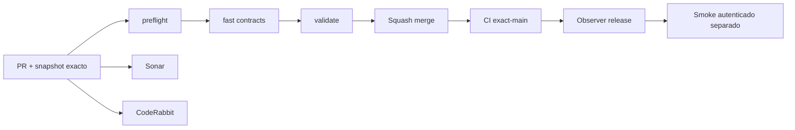

# GrindFlow — Último deploy

> **Candidato v0.1.66: preview semanal S3 con bloqueos explícitos.** El runtime desplegado sigue siendo Laravel en Hostinger; Symfony continúa aislado. Base exacta `main` v0.1.65 `ef4ed47636c040243ba008310308be18f658682f`. El preview es read-only, tenant-safe y no publica ni llama plataformas externas.

## Progress convention
- ✅ ~~Completado~~ = verificado; 🚧 Pendiente = en curso; ⛔ bloqueado = dependencia externa.

## Fuentes de verdad
[AGENTS.md](AGENTS.md) · [Spec](docs/GRINDFLOW-SPEC.md) · [Requisitos](docs/REQUIREMENTS.md) · [Transición](docs/STACK-TRANSITION-SYMFONY.md) · [Roadmap #2](https://github.com/pl0n3r/GrindFlow/issues/2)

## Estado del deploy
| Señal | Estado | Evidencia |
| --- | --- | --- |
| Version objetivo | 🚧 **v0.1.66** | `config/version.php` |
| Base exacta | ✅ ~~main v0.1.65~~ | `ef4ed47636c040243ba008310308be18f658682f` |
| CI del PR | 🚧 Head v0.1.66 por validar | `GrindFlow CI / validate` |
| Sonar | 🚧 Pendiente | SonarCloud PR |
| CodeRabbit | 🚧 Pendiente | PR |
| CI del SHA exacto de main | 🚧 Después del merge | CI PR no lo sustituye |
| Deploy Observer | 🚧 Release humano por observar | No prueba Symfony remoto |
| Production Smoke | ⛔ Credencial E2E productiva pendiente | [Issue #1](https://github.com/pl0n3r/GrindFlow/issues/1) |
| Symfony S3 en Hostinger | ⛔ NO desplegado | Solo entorno aislado CI |
| Migraciones | ✅ ~~Ningún esquema productivo modificado~~ | Nueva tabla solo en DB Symfony descartable al validar |

## Huella del cambio
<!-- grindflow:git-delta -->
| Archivos | Inserciones | Eliminaciones | Neto |
| ---: | ---: | ---: | ---: |
| **5** | **+277** | **−18** | **+259** |

## Calidad y entrega
<!-- grindflow:gate-plan -->
| Control | Estado / contrato |
| --- | --- |
| Gates seleccionados | **preflight · fast[contracts] · symfony-preview** |
| Alcance | S3: preview read-only de hasta 30 recursos activos con bloqueos explícitos y total tenant-safe |
| Revisiones | CI/Sonar/CodeRabbit, exact-main y Hostinger independientes |

## Flujo de entrega

## Qué se hizo
- Nuevo `GET /api/admin/rules/weekly/preview`: cruza la regla semanal con recursos activos del Vault del tenant sin aceptar IDs de organización desde el cliente.
- Cada recurso expone `eligible=false` y razones estables de bloqueo (`weekly_rule_missing`, `classification_missing`, `internal_only`, `content_review_required`, `distribution_authorization_missing`).
- El preview devuelve total completo y una ventana acotada de 30 recursos; papelera y otros tenants quedan fuera.
- La clasificación nunca se convierte en permiso: hasta implementar autorización de distribución, `can_publish=false` y el modo permanece `review_only`.

## Archivos modificados en este deploy
Inventario de solo el deploy actual: cambio candidato en PR, NO prueba de deploy de Symfony en Hostinger.
- `README.md`
- `config/version.php`
- `docs/GRINDFLOW-SPEC.md`
- `symfony/src/Http/Controller/ContentRuleController.php`
- `symfony/tests/php/WeeklyRulePreviewTest.php`

## Validación
- CI/Sonar/CodeRabbit del candidato v0.1.66 por verificar; la base v0.1.65 ya está fusionada en `main`.
- Sin checkout local de PHP/MariaDB/Chromium; GitHub Actions debe validar migración, PHP y contratos. Producción intacta.

## Qué sigue
[Roadmap canónico #2](https://github.com/pl0n3r/GrindFlow/issues/2)

| Lane | Trabajo | Estado |
| --- | --- | --- |
| **NOW** | 🚧 Validar preview semanal review-only v0.1.66 | 🚧 CI y revisión |
| **NEXT** | 🚧 Contrato explícito de autorización de distribución y slots semanales | 🚧 Sin publicación externa |
| **LATER** | 🚧 Scheduler Symfony + distribución autorizada + Traffic | 🚧 S3–S5 |
| **BLOCKED / EXTERNAL** | ⛔ Cutover sin paridad/datos migrados; Smoke sin credencial | ⛔ Dependencia externa |

## Panorama general pendiente
| Lane | Frente | Estado |
| --- | --- | --- |
| **DONE** | ✅ ~~Dashboard Laravel v0.1.30~~ | ✅ ~~Vault Symfony clasificación v0.1.63~~ |
| **NOW** | 🚧 Preview semanal S3 v0.1.66 | 🚧 CI y revisión |
| **NEXT** | 🚧 Autorización de distribución + slots | 🚧 S3 |
| **LATER** | 🚧 Paridad del monolito modular | 🚧 S3–S5 |
| **BLOCKED / EXTERNAL** | ⛔ Sin cutover Symfony | ⛔ Sin credencial Smoke |
