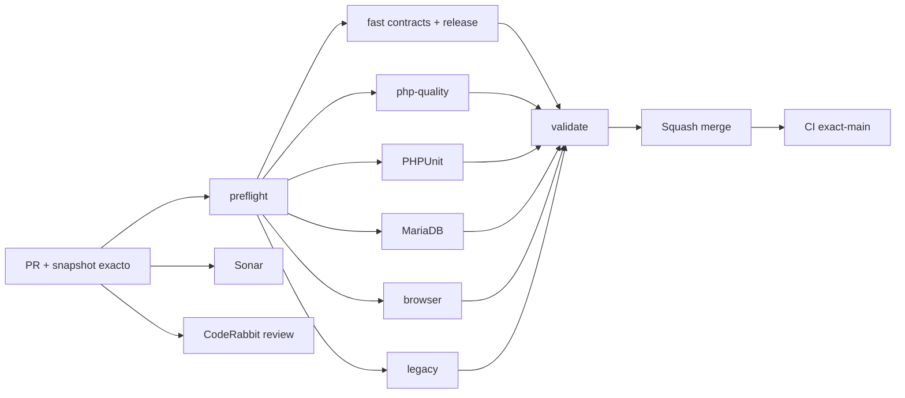

# GrindFlow — Último deploy

  
  
  

> **Snapshot PR v0.1.16: solo el deploy actual.** Base `main` v0.1.15 `c8eb382937ccdc75203d0791f8d6504184ce3daa`: CI exact-main #35462651485 success; Production Smoke #35462651478 **falló**, incidente [#106](https://github.com/drpipe1098-commits/GrindFlow/issues/106). No afirmar validación de v0.1.15 en producción ni inferir SHA checkout Hostinger.

## Progress convention
- ✅ ~~Completado~~ = concluido y verificado por las compuertas aplicables.
- 🚧 Pendiente = por hacer o en curso, sin tachado.
- ⛔ Bloqueado = dependencia externa real.

## Fuentes de verdad
[AGENTS.md](AGENTS.md) · [Gobierno](docs/GOVERNANCE.md) · [Especificaciones](docs/GRINDFLOW-SPEC.md) · [Glosario](GLOSARIO.md) · [Roadmap #88](https://github.com/drpipe1098-commits/GrindFlow/issues/88)

## Estado del deploy
| Señal | Estado | Evidencia |
| --- | --- | --- |
| Work line | 🚧 **Gobierno compartido Condor → GrindFlow** | Roadmap [#88](https://github.com/drpipe1098-commits/GrindFlow/issues/88) |
| Base exacta | ✅ **main v0.1.15** | `c8eb382937ccdc75203d0791f8d6504184ce3daa` |
| Version | 🚧 **v0.1.16 objetivo** | gobierno y validación |
| Version desplegada | ⚠️ **v0.1.15 no comprobada** | último Smoke falló; ver #106 |
| CI del PR | 🚧 **pendiente** | validar head final |
| Sonar | 🚧 **pendiente** | Quality Gate |
| CodeRabbit | 🚧 **pendiente** | full review head estable |
| CI del SHA exacto de main | ✅ **base v0.1.15** | #35462651485 |
| Production Smoke | ⚠️ **base v0.1.15 falló** | #35462651478 · #106 |
| Deploy v0.1.16 | 🚧 **no confirmado** | Smoke post-merge requerido |
| Migraciones | ✅ **sin SQL nuevo** | gobierno de repo solamente |

## Huella del cambio
<!-- grindflow:git-delta -->
| Archivos | Inserciones | Eliminaciones | Neto |
| ---: | ---: | ---: | ---: |
| **18** | **+0** | **−0** | **+0** |

## Calidad y entrega
<!-- grindflow:gate-plan -->
| Control | Estado / contrato |
| --- | --- |
| Gates seleccionados | **preflight · fast[contracts] · php-quality · PHPUnit · MariaDB · browser · legacy** |
| Version | Nuevo titulo de PR `(V X.Y.Z)` validado contra version.php |
| Idioma | Nuevo contenido humano español es-CO, contratos tecnicos sin traducir |
| Fuentes | AGENTS operativo; GOVERNANCE duradero; #88 trabajo; README snapshot |
| Gobierno GitHub | Plantillas y labels españoles, sincronizacion **solo aditiva** |
| Validacion | Títulos, archivos, links, etiquetas; casos positivos/negativos |
| Seguridad | Sin migracion, cambios de permisos ni writes de produccion |

## Flujo de entrega

## Qué se hizo
- Comparadas reglas de Condor: separación entre operación/especificación/progreso, títulos versionados, español es-CO progresivo, glosario y plantillas.
- Roadmap #88 preservado como historia; ROADMAP.md enlaza sin duplicar.
- Preflight valida versión objetivo en título de PR; fast comprueba archivos, enlaces, templates, labels y regresiones del validador.
- Etiquetas GitHub se sincronizan aditivamente, sin borrar etiquetas ni títulos anteriores ni crear milestones por patch.
- CodeRabbit recibe instrucciones en español; Copilot corrige DB canónica a MariaDB.
- Sin importar nombre, dominio, código o moneda predeterminada de Condor.
- Smoke de v0.1.15 **fallido** señalado por separado: CI verde no lo reemplaza.

## Archivos modificados en este deploy
- `.coderabbit.yaml` — gobierno.
- `.github/ISSUE_TEMPLATE/config.yml` — plantilla.
- `.github/ISSUE_TEMPLATE/error.yml` — plantilla.
- `.github/ISSUE_TEMPLATE/mejora.yml` — plantilla.
- `.github/ISSUE_TEMPLATE/tarea.yml` — plantilla.
- `.github/copilot-instructions.md` — gobierno.
- `.github/labels.json` — gobierno.
- `.github/pull_request_template.md` — gobierno.
- `.github/workflows/grindflow-ci.yml` — gobierno.
- `.github/workflows/sincronizar-gobierno.yml` — gobierno.
- `AGENTS.md` — gobierno.
- `GLOSARIO.md` — gobierno.
- `README.md` — snapshot del deploy.
- `ROADMAP.md` — gobierno.
- `config/version.php` — gobierno.
- `docs/DEVELOPMENT-MODEL.md` — gobierno.
- `docs/GOVERNANCE.md` — decisiones.
- `scripts/validate-governance.py` — gobierno.

## Validación
- Base v0.1.15: CI #35462651485 success; Production Smoke #35462651478 failure, Issue #106.
- v0.1.16: CI/Sonar/CodeRabbit y exact-main/Smoke requieren evidencia posterior.
- Smoke es read-only, no prueba labels ni demuestra SHA remoto.

## Qué sigue
| Lane | Trabajo |
| --- | --- |
| **NOW** | 🚧 Gobierno Condor → GrindFlow v0.1.16. [Roadmap #88](https://github.com/drpipe1098-commits/GrindFlow/issues/88) |
| **NEXT** | 🚧 Incidente Production Smoke [#106](https://github.com/drpipe1098-commits/GrindFlow/issues/106) |
| **LATER** | 🚧 Storage/FFmpeg [#40](https://github.com/drpipe1098-commits/GrindFlow/issues/40) |
| **BLOCKED / EXTERNAL** | 🚧 SHA checkout Hostinger y object storage |

## Panorama general pendiente
| Lane | Frente | Estado |
| --- | --- | --- |
| **DONE** | ✅ ~~Browser E2E funcional v0.1.15 en CI~~ | ✅ ~~main CI verde~~ |
| **NOW** | 🚧 Gobierno/plantillas/validacion Condor | 🚧 v0.1.16 |
| **NEXT** | 🚧 Smoke produccion #106 | 🚧 investigar |
| **LATER** | 🚧 Media Storage/FFmpeg | 🚧 #40 |
| **BLOCKED / EXTERNAL** | 🚧 Git SHA checkout Hostinger | 🚧 no demostrado |
