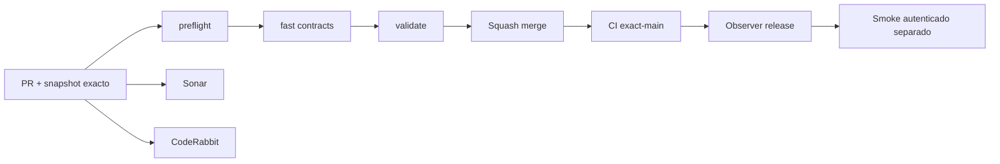

# GrindFlow — Último deploy

> **Candidato v0.1.75: resiliencia de CI.** Base exacta `main` v0.1.74 `351cdeba9f9f23914b5c271453afa765dd3467ff`; la entrega añade reintentos seguros para dependencias externas sin ocultar fallos de producto.

## Progress convention
- ✅ ~~Completado~~ = verificado; 🚧 Pendiente = en curso; ⛔ bloqueado = dependencia externa.

## Fuentes de verdad
[AGENTS.md](AGENTS.md) · [Spec](docs/GRINDFLOW-SPEC.md) · [Requisitos](docs/REQUIREMENTS.md) · [Transición](docs/STACK-TRANSITION-SYMFONY.md) · [Roadmap #2](https://github.com/pl0n3r/GrindFlow/issues/2)

## Estado del deploy
| Señal | Estado | Evidencia |
| --- | --- | --- |
| Version objetivo | 🚧 **v0.1.75** | `config/version.php` |
| Base exacta | ✅ ~~main v0.1.73~~ | `97dd3018e1c6b478217353455de6e203c6337c51` |
| CI del PR | 🚧 Head v0.1.75 por validar | `GrindFlow CI / validate` |
| Sonar | 🚧 Pendiente | SonarCloud PR |
| CodeRabbit | 🚧 Pendiente | PR |
| CI del SHA exacto de main | ✅ ~~v0.1.73 success~~ | run `35643400862` |
| Deploy Observer | ✅ ~~v0.1.73 observado~~ | run `35643400887`; versión humana, no prueba Symfony ni SHA remoto |
| Production Smoke | ⛔ Credencial E2E productiva pendiente | run `35643400895`; [Issue #1](https://github.com/pl0n3r/GrindFlow/issues/1) |
| Symfony S3 en Hostinger | ⛔ NO desplegado | Solo entorno aislado CI |
| Migraciones | 🚧 Catálogo de destinos + FK de handoff + invariantes SQL en MariaDB descartable | Producción intacta |

## Huella del cambio
<!-- grindflow:git-delta -->
| Archivos | Inserciones | Eliminaciones | Neto |
| ---: | ---: | ---: | ---: |
| **6** | **+120** | **−35** | **+85** |

## Calidad y entrega
<!-- grindflow:gate-plan -->
| Control | Estado / contrato |
| --- | --- |
| Gates seleccionados | **preflight · fast[contracts] · php-quality · PHPUnit · MariaDB · browser · real-stack · legacy · symfony-preview** |
| Alcance | S4: destinos internos explícitos + cola humana tenant-safe; sin proveedor real |
| Revisiones | CI/Sonar/CodeRabbit, exact-main y Hostinger independientes |

## Flujo de entrega

## Qué se hizo
- Catálogo tenant-owned de destinos manuales, con alta, desactivación/reactivación, nombre inmutable y DELETE bloqueado en MariaDB.
- Cada `prepare` posterior a la migración exige un destino activo del mismo tenant; `complete`/`fail` heredan ese destino y cambiarlo requiere fallo + nuevo intento.
- Compatibilidad expand-before-migrate: mientras la tabla nueva aún no exista, el endpoint conserva temporalmente el contrato v0.1.73; un `prepare` legado sin destino puede ganar destino después sin borrar su evento original.
- Cola interna GET deriva hasta 30 handoffs `prepared/failed`, ordena vencidos primero y expone total tenant-scoped. React móvil administra destinos, exige selección por borrador y muestra trabajo pendiente.
- Todos los contratos permanecen sin proveedor: `provider_calls=false`; no hay delivery, exportación de media ni publicación automática.

## Archivos modificados en este deploy
Inventario de solo el deploy actual de mejora continua; no prueba despliegue Symfony en Hostinger.
- `.github/workflows/grindflow-ci.yml`
- `AGENTS.md`
- `README.md`
- `config/version.php`
- `scripts/ci_retry.py`
- `tests/test_ci_retry.py`

## Validación
- CI/Sonar/CodeRabbit del candidato v0.1.75 por verificar; la base v0.1.74 tiene CI exact-main success.
- El gate Symfony debe probar migración reversible, PHPUnit/MariaDB, TypeScript/Vite y Chromium móvil. Producción permanece intacta.

## Qué sigue
[Roadmap canónico #2](https://github.com/pl0n3r/GrindFlow/issues/2)

| Lane | Trabajo | Estado |
| --- | --- | --- |
| **NOW** | 🚧 Validar resiliencia CI v0.1.75 | 🚧 CI y revisión |
| **NEXT** | 🚧 S4 salida manual con evidencia interna más rica / preparación operativa | 🚧 Sin proveedor real |
| **LATER** | 🚧 Distribución autorizada + Traffic Symfony | 🚧 S4–S5 |
| **BLOCKED / EXTERNAL** | ⛔ Cutover sin paridad/datos migrados; Smoke sin credencial | ⛔ Dependencia externa |

## Panorama general pendiente
| Lane | Frente | Estado |
| --- | --- | --- |
| **DONE** | ✅ ~~Dashboard Laravel v0.1.30~~ | ✅ ~~Vault Symfony clasificación v0.1.63~~ |
| **NOW** | 🚧 Reintentos seguros de CI v0.1.75 | 🚧 CI y revisión |
| **NEXT** | 🚧 Preparación operativa S4 | 🚧 Sin proveedor real |
| **LATER** | 🚧 Distribución + Traffic Symfony | 🚧 S4–S5 |
| **BLOCKED / EXTERNAL** | ⛔ Sin cutover Symfony | ⛔ Sin credencial Smoke |
