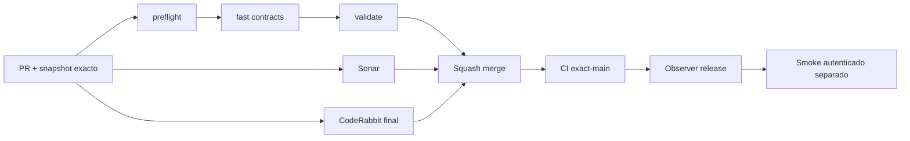

# GrindFlow — Último deploy

> **Candidato v0.1.77: navegación continua de acceso + compuerta CodeRabbit obligatoria.** Base exacta `main` v0.1.76 `10da41703359bc3455bb5939be08e371e60f1293`. Symfony aislado, NO desplegado ni migrado en Hostinger.

## Progress convention
- ✅ ~~Completado~~ = verificado; 🚧 Pendiente = en curso; ⛔ bloqueado = dependencia externa.

## Fuentes de verdad
[AGENTS.md](AGENTS.md) · [Spec](docs/GRINDFLOW-SPEC.md) · [Requisitos](docs/REQUIREMENTS.md) · [Transición](docs/STACK-TRANSITION-SYMFONY.md) · [Roadmap #2](https://github.com/pl0n3r/GrindFlow/issues/2)

## Estado del deploy
| Señal | Estado | Evidencia |
| --- | --- | --- |
| Version objetivo | 🚧 **v0.1.77** | `config/version.php` |
| Base exacta | ✅ ~~main v0.1.76~~ | `10da41703359bc3455bb5939be08e371e60f1293` |
| CI del PR | 🚧 Head v0.1.77 por validar | `GrindFlow CI / validate` |
| Sonar | 🚧 Pendiente del head estable | SonarCloud PR |
| CodeRabbit | 🚧 Pendiente del head estable | PR |
| CI del SHA exacto de main | ✅ ~~v0.1.76 success~~ | run `35664374136` |
| Deploy Observer | ✅ ~~v0.1.76 release observado~~ | run `35664374124`; versión humana, NO SHA Hostinger |
| Production Smoke | ⛔ Credencial ya configurada; autenticación no verificada | run `35664937043` falló: `/dashboard` HTTP 302 tras POST; [Issue #73](https://github.com/pl0n3r/GrindFlow/issues/73). #1 cerrado |
| Symfony en Hostinger | ⛔ NO desplegado | Solo entorno aislado CI |
| Migraciones | ✅ ~~Sin migraciones nuevas en el candidato~~ | Producción intacta |

## Huella del cambio
<!-- grindflow:git-delta -->
| Archivos | Inserciones | Eliminaciones | Neto |
| ---: | ---: | ---: | ---: |
| **11** | **+144** | **−48** | **+96** |

## Calidad y entrega
<!-- grindflow:gate-plan -->
| Control | Estado / contrato |
| --- | --- |
| Gates seleccionados | **preflight · fast[contracts] · symfony-preview** |
| Alcance | GF-UX-002: misma cabecera login/organizaciones Symfony, navegación 360/820 px y CSRF; regla bloqueante CodeRabbit |
| Revisiones | CI + Sonar + **CodeRabbit terminado sobre head final ANTES de merge**; exact-main y Hostinger separados |

## Flujo de entrega

## Qué se hizo
- Cabecera Symfony compartida entre login y selección de organización; enlaces reales a inicio/vista previa y sección actual accesible, sin duplicar marca ni exponer funciones privadas.
- CSS acotado para la cabecera de identidad, enlaces y tarjetas a 360/820 px; CSRF y membresías sin cambios.
- Regresión PHPUnit del selector autenticado y Chromium del ingreso responsive, CSRF y ausencia de desbordamiento.
- **Regla dura en AGENTS.md + docs/GOVERNANCE.md:** si CodeRabbit no finaliza sobre el SHA último, el merge permanece bloqueado; PR #72 documentada como incidente de proceso.
- La configuración del secreto E2E cerró #1, pero el smoke de producción v0.1.76 falló con HTTP 302 en Dashboard; diagnóstico registrado en #73. Sin publicación externa, deploy de Symfony ni migraciones productivas.

## Archivos modificados en este deploy
Inventario de solo el deploy actual candidato; no prueba despliegue Symfony en Hostinger.
- `AGENTS.md`
- `README.md`
- `config/version.php`
- `docs/GOVERNANCE.md`
- `docs/REQUIREMENTS.md`
- `symfony/public/assets/grindflow.css`
- `symfony/templates/identity/_header.html.twig`
- `symfony/templates/identity/login.html.twig`
- `symfony/templates/identity/organizations.html.twig`
- `symfony/tests/e2e/preview.spec.mjs`
- `symfony/tests/php/IdentityLoginTest.php`

## Validación
- CI/Sonar/CodeRabbit del candidato v0.1.77 pendientes; **sin aprobación ni merge hasta revisión final explícita de CodeRabbit**.
- `symfony-preview` debe ejecutar PHPUnit/MariaDB, Vite y Chromium a 360/820 px. No hubo pruebas locales; la rama aún requiere CI de PR.
- El smoke v0.1.76 detectó 15 redirecciones HTTP 302 al consultar el dashboard, pero no distingue aún contraseña inválida de sesión no conservada. #73 registra diagnóstico.

## Qué sigue
[Roadmap canónico #2](https://github.com/pl0n3r/GrindFlow/issues/2)

| Lane | Trabajo | Estado |
| --- | --- | --- |
| **NOW** | 🚧 Acceso visual v0.1.77 + gate CodeRabbit final; diagnosticar #73 | 🚧 PR/revisión y producción separados |
| **NEXT** | 🚧 Corregir origen del 302 E2E sin reintentos de autenticación innecesarios; seguir S4 | 🚧 Con evidencia de diagnóstico |
| **LATER** | 🚧 Distribution + Traffic Symfony | 🚧 Sin cutover |
| **BLOCKED / EXTERNAL** | ⛔ Smoke autenticado #73 y cutover Symfony pendiente de paridad | ⛔ No declarar producción validada |

## Panorama general pendiente
| Lane | Frente | Estado |
| --- | --- | --- |
| **DONE** | ✅ ~~Navegación workspace v0.1.76, secreto E2E configurado #1~~ | ✅ ~~CI exact-main v0.1.76; release observado~~ |
| **NOW** | 🚧 Acceso visual v0.1.77 + gate CodeRabbit final; diagnosticar #73 | 🚧 PR/revisión y producción separados |
| **NEXT** | 🚧 Corregir origen del 302 E2E sin reintentos de autenticación innecesarios; seguir S4 | 🚧 Con evidencia de diagnóstico |
| **LATER** | 🚧 Distribution + Traffic Symfony | 🚧 Sin cutover |
| **BLOCKED / EXTERNAL** | ⛔ Smoke autenticado #73 y cutover Symfony pendiente de paridad | ⛔ No declarar producción validada |
