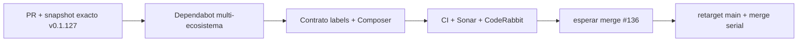

# GrindFlow — Último deploy

> **Candidato apilado v0.1.128: Dependabot agrupado y gobernado.** Base exacta v0.1.127 `7442fd114adb1b05515e5600b18eb34cb2b2f021` de PR #136. La candidata no puede fusionarse antes de #136; adelanta configuración y validación sin alterar el orden serial de releases.

## Progress convention
- ✅ ~~Completado~~ = verificado; 🚧 Pendiente = en curso; ⛔ bloqueado = dependencia externa.

## Fuentes de verdad
[AGENTS.md](AGENTS.md) · [Spec](docs/GRINDFLOW-SPEC.md) · [Requisitos](docs/REQUIREMENTS.md) · [Roadmap #2](https://github.com/pl0n3r/GrindFlow/issues/2)

## Estado del deploy
| Señal | Estado | Evidencia |
| --- | --- | --- |
| Version objetivo | 🚧 **v0.1.128** | `config/version.php`; candidata apilada |
| Base exacta | ✅ ~~PR #136 · v0.1.127~~ | `7442fd114adb1b05515e5600b18eb34cb2b2f021` |
| CI/Sonar/CodeRabbit del PR | 🚧 pendiente | HEAD final de #137 |
| Producción base | ✅ ~~v0.1.126 verde~~ | Smoke/Observer exact-main previos |
| Predecesora | ⛔ #136 | revisión terminal CodeRabbit pendiente |
| Producción objetivo | 🚧 pendiente | solo después de merge serial #136 → #137 |

## Huella del cambio
<!-- grindflow:git-delta -->
| Archivos | Inserciones | Eliminaciones | Neto |
| ---: | ---: | ---: | ---: |
| **5** | **+166** | **−34** | **+132** |

## Calidad y entrega
<!-- grindflow:gate-plan -->
| Control | Estado / contrato |
| --- | --- |
| Gates seleccionados | **preflight · fast[operational contracts + automation syntax + README dashboard]** |
| Gate agregador obligatorio | **validate**: todos los seleccionados; Sonar y CodeRabbit aparte |
| Alcance | #123: Dependabot semanal y agrupado; Composer raíz+Symfony; npm; Actions; pip workers |
| Rol del PR | **DevOps · Release Engineering · Governance** |
| Revisiones | primero CI/Sonar/CodeRabbit; merge solo después de #136 |

## Flujo de entrega

## Qué se hizo
- Dependabot revisa Composer en `/` y `/symfony`, npm en raíz, GitHub Actions y pip en `/workers`.
- Agrupa actualizaciones minor/patch semanales y limita a 3 PRs abiertos por ecosistema.
- Declara en `.github/labels.json` las etiquetas usadas por Dependabot que ya existen en GitHub.
- El contrato de gobierno falla si esas etiquetas dejan de estar declaradas o Composer deja de cubrir raíz y Symfony.

## Archivos modificados en esta entrega candidata
Inventario del diff exacto:
<!-- grindflow:changed-files -->
- `.github/dependabot.yml`
- `.github/labels.json`
- `README.md`
- `config/version.php`
- `scripts/validate-governance.py`

## Validación
- `validate-governance.py --self-test` incluye casos válidos e inválidos del contrato Dependabot.
- La PR permanece apilada y bloqueada por #136; CI verde en esta rama no autoriza merge fuera de orden.
- Tras fusionar #136 se retargetea #137 a `main` y se exige nueva evidencia exacta antes de merge.

## Qué sigue
[Roadmap canónico #2](https://github.com/pl0n3r/GrindFlow/issues/2)

## Panorama general pendiente
| Lane | Frente | Estado |
| --- | --- | --- |
| **NOW** | 🚧 #136 · Pillow 12.3.0 | ⛔ CodeRabbit externo |
| **NEXT** | 🚧 #137 · Dependabot multi-ecosistema | 🚧 v0.1.128 apilada |
| **BLOCKED / EXTERNAL** | ⛔ #137 depende de #136 | ⛔ merge serial |
| **LATER** | 🚧 #139 · vulnerabilidades npm | 🚧 después de Pillow/Dependabot |
