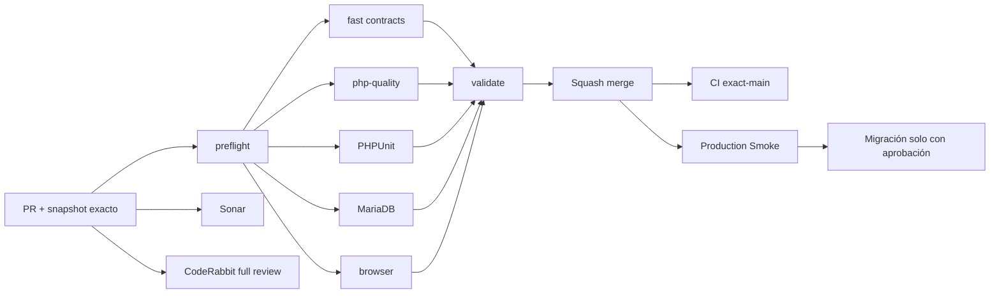

# GrindFlow — Último deploy

  
  
  

> **Development dashboard** · snapshot profesional de **solo el deploy actual**. CI, deploy y validación en producción son evidencias distintas.

## Estado del deploy

| Señal | Estado actual | Evidencia |
| --- | --- | --- |
| Work line | 🟠 **GF-OPS · Production Smoke migration blocker** | rama enfocada |
| Base exacta | ✅ **main** | `6464a8a0be5f364aa61b05e61cdcfd0b1d6e9930` |
| Diagnóstico anterior | ✅ **schema drift identificado** | issue #69 / Smoke `75a81c31…`; no se atribuye al nuevo main |
| CI del SHA exacto de main | ⚪ **sin evidencia confirmada** | CI de PR y main son evidencias separadas |
| Production Smoke | 🟠 **requiere verificación exact-main** | esta PR mejora el diagnóstico, no prueba un despliegue |
| Migraciones | 🟠 **sin ejecutar desde este cambio** | aprobación + backup externo verificado son acciones del operador |

## Huella del cambio

<!-- grindflow:git-delta -->

| Archivos | Inserciones | Eliminaciones | Neto |
| ---: | ---: | ---: | ---: |
| **1** | **+37** | **−43** | **-6** |

La huella se calcula con `git diff --numstat`; CI rechaza este dashboard si queda desactualizado.

## Calidad y entrega

<!-- grindflow:gate-plan -->

| Control | Estado / contrato |
| --- | --- |
| Gates seleccionados | **preflight · fast[contracts] · php-quality · PHPUnit · MariaDB · browser · legacy** |
| GrindFlow CI | `fast` ejecuta el contrato Smoke usando curl simulado |
| Sonar | revisión separada sobre el head exacto del PR |
| CodeRabbit | revisión separada sobre el head exacto del PR |
| Migración | ningún job del Smoke ejecuta migraciones |
| Producción | no se modifica desde este PR; el Smoke conserva exit no-cero si hay schema drift |

## Flujo de entrega

## Qué se hizo

- Clasifica migraciones pendientes mediante el inventario real de Admin > System, no por HTML textual ambiguo.
- Emite marcador seguro `MIGRATIONS_PENDING=N` y detiene el Smoke tras el primer intento si se requiere acción del operador.
- Los inventarios desconocidos siguen siendo errores genéricos; no se confunden con migraciones pendientes.
- GitHub Actions distingue un bloqueo operativo de un HTTP 500, conserva artefacto corto y registra SHA exacto del run.
- Añade contrato offline de tres escenarios usando curl simulado y lo ejecuta en `fast`.
- Ningún secreto, backup, archivo productivo ni esquema de producción se modifica en esta entrega.

## Archivos modificados en este deploy

- `.github/workflows/grindflow-ci.yml` — ejecutar contrato Smoke en fast.
- `.github/workflows/production-smoke.yml` — clasificación de incidente de migraciones.
- `README.md` — dashboard exacto.
- `scripts/production-smoke-contract.sh` — escenarios offline.
- `scripts/production-smoke.sh` — marcador y salida temprana del bloqueo.

## Validación

- Base exacta: `6464a8a0be5f364aa61b05e61cdcfd0b1d6e9930`.
- El diagnóstico registrado en issue #69 corresponde al SHA `75a81c31…`, no es evidencia de un Smoke nuevo.
- Contrato cubre pending=3 (exit 2, un intento), pending=0 (PASS) e inventario unknown (error sin marcador).
- La migración, verificación del backup, inspección del lote y aprobación siguen fuera de CI.

## Qué sigue

| Lane | Trabajo |
| --- | --- |
| **NOW** | Abrir PR y validar la clasificación de Smoke contra el head exacto. |
| **NEXT** | Fusionar tras CI/revisión y verificar Smoke real del nuevo main. |
| **NEXT** | Inspeccionar el lote pendiente en Admin > System y verificar un backup externo restaurable. |
| **BLOCKED / EXTERNAL** | Aprobación de migraciones, S3, FFmpeg y configuración Hostinger. |
| **LATER** | Providers reales solo tras sandbox y operación estable. |

## Panorama general pendiente

| Lane | Frente | Estado |
| --- | --- | --- |
| **NOW** | Production Smoke | clasificación de schema drift en PR |
| **NEXT** | Migraciones productivas | inventario + backup + aprobación |
| **NEXT** | Scheduling/Distribution/Traffic/Finance | schema pendiente de comprobación productiva |
| **BLOCKED / EXTERNAL** | Hosting/storage | S3 + FFmpeg |
| **LATER** | Provider adapters | sandbox y credenciales cifradas |
| **LATER** | Legacy retirement | tras GF-MIG |
