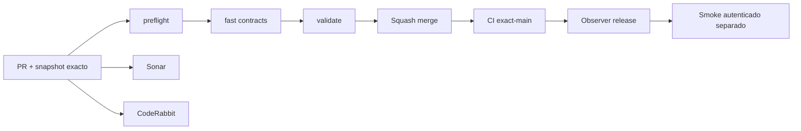

# GrindFlow — Último deploy

> **Snapshot v0.1.40: solo el deploy actual, detalle privado del Vault S2 en código, Symfony aún sin despliegue.** Base `main` v0.1.39 `cc661deb75bd96f7ccf622197ed6b298b4320f95`. Consulta individual de metadatos autorizada por organización y panel de detalles móvil. Laravel sigue como runtime; **Symfony no está desplegado ni se migraron cuentas o archivos**.

## Progress convention
- ✅ ~~Completado~~ = verificado; 🚧 Pendiente = en curso; ⛔ bloqueado = dependencia externa.

## Fuentes de verdad
[AGENTS.md](AGENTS.md) · [Spec](docs/GRINDFLOW-SPEC.md) · [Requisitos](docs/REQUIREMENTS.md) · [Transición](docs/STACK-TRANSITION-SYMFONY.md) · [Roadmap #2](https://github.com/pl0n3r/GrindFlow/issues/2)

## Estado del deploy
| Señal | Estado | Evidencia |
| --- | --- | --- |
| Version objetivo | 🚧 **v0.1.40** | `config/version.php` |
| Base exacta | ✅ ~~main v0.1.39~~ | `cc661deb75bd96f7ccf622197ed6b298b4320f95` |
| CI del PR | 🚧 Head final pendiente | `GrindFlow CI / validate` |
| Sonar | 🚧 Pendiente | SonarCloud PR |
| CodeRabbit | 🚧 Revisión por comprobar | PR |
| CI del SHA exacto de main | 🚧 Después del merge | CI PR no lo sustituye |
| Deploy Observer | 🚧 Release humano por observar | No prueba Symfony en remoto |
| Production Smoke | ⛔ Credencial E2E productiva pendiente | [Issue #1](https://github.com/pl0n3r/GrindFlow/issues/1) |
| Symfony S1 en Hostinger | ⛔ NO desplegado | Solo entorno aislado CI |
| Migraciones | ✅ ~~Ningún esquema productivo modificado~~ | DB Symfony descartable |

## Huella del cambio
<!-- grindflow:git-delta -->
| Archivos | Inserciones | Eliminaciones | Neto |
| ---: | ---: | ---: | ---: |
| **8** | **+117** | **−15** | **+102** |

## Calidad y entrega
<!-- grindflow:gate-plan -->
| Control | Estado / contrato |
| --- | --- |
| Gates seleccionados | **preflight · fast[contracts] · symfony-preview** |
| Alcance | Vault S2: consulta individual tenant-safe, metadatos móviles, prueba de aislamiento y revocación |
| Revisiones | CI/Sonar/CodeRabbit, exact-main y Hostinger son independientes |

## Flujo de entrega

## Qué se hizo
- GET privado de detalle con autorización de sesión, membresía activa y organización, 404 sin filtración entre tenants.
- Panel de metadatos móvil: nombre, tipo, tamaño exacto y fecha; controles accesibles.
- Pruebas PHP de IDOR/revocación y Chromium de detalle en 360 px. Sin migraciones ni cambios productivos.

## Archivos modificados en este deploy
- `README.md`
- `config/version.php`
- `symfony/README.md`
- `symfony/frontend/admin/VaultPanel.tsx`
- `symfony/frontend/admin/admin.css`
- `symfony/src/Http/Controller/VaultController.php`
- `symfony/tests/e2e/preview.spec.mjs`
- `symfony/tests/php/VaultTest.php`

## Validación
- CI Symfony PHP/MariaDB/Chromium y Sonar/CodeRabbit deben verificarse sobre el head final; exact-main y Hostinger son independientes.
- No se acredita despliegue Symfony ni migración productiva.

## Qué sigue
[Roadmap canónico #2](https://github.com/pl0n3r/GrindFlow/issues/2)

| Lane | Trabajo | Estado |
| --- | --- | --- |
| **NOW** | 🚧 Validar detalle privado Vault S2 v0.1.40 | 🚧 CI y revisión |
| **NEXT** | 🚧 Cuotas y gestión segura de archivos | 🚧 Después de validar detalle |
| **LATER** | 🚧 Vault móvil → reglas → distribución autorizada → piloto | 🚧 Planificado |
| **BLOCKED / EXTERNAL** | ⛔ Cutover sin paridad/datos migrados; Smoke sin credencial | ⛔ Dependencia externa |

## Panorama general pendiente
| Lane | Frente | Estado |
| --- | --- | --- |
| **DONE** | ✅ ~~Dashboard Laravel v0.1.30~~ | ✅ ~~Esquema Symfony S1 v0.1.31~~ |
| **NOW** | 🚧 Validar detalle privado Vault S2 v0.1.40 | 🚧 CI y revisión |
| **NEXT** | 🚧 Cuotas de almacenamiento y errores parciales | 🚧 Después de validar detalle |
| **LATER** | 🚧 Automatización de contenido | 🚧 S2–S5 |
| **BLOCKED / EXTERNAL** | ⛔ Sin cutover Symfony | ⛔ Sin credencial Smoke |
